# #1 – Minimum Thickness For Supported Walls

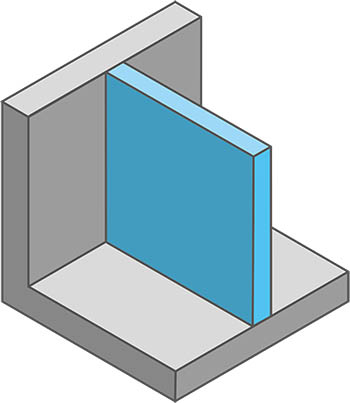

Supported walls are those walls that are connected to at least two other surfaces, such as the floor and a intersecting wall, on two or more sides.

For optimal printing results, the wall thickness should always be a multiple of the nozzle diameter. **The recommended minimum wall thickness for supported walls is at least twice the nozzle diameter.** **So, if the diameter of the nozzle being used is 0.4 mm, then the wall thickness should be at least 0.8 mm.**

But that doesn’t mean that walls with a thickness of only once the nozzle diameter are not possible. However, it is advisable to print these so-called single extrusion walls with a nozzle with a larger diameter,e.g. 0.6 mm or higher. Single extrusion walls with a nozzle diameter of 0.4 mm or thinner are very unstable and fragile.

# #2 – Minimum Thickness For Unsupported Walls

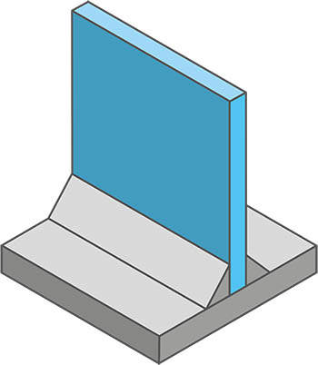

Unsupported walls are those walls that are only connected to the floor. Although these walls are only connected on one side to another surface, essentially the same applies as for supported walls.

For optimal printing results, the wall thickness should always be a multiple of the nozzle diameter: **The recommended minimum wall thickness for supported walls is twice the nozzle diameter. So, if the diameter of the used nozzle is 0.4 mm, the wall thickness should be at least 0.8 mm.**

The same applies here: walls with a thickness of only one nozzle diameter are generally possible but not recommended. If these so-called single extrusion walls must be used, they should be printed with a larger diameter nozzle, such as 0.6 mm or larger. Single extrusion walls with a nozzle diameter of 0.4 mm or less are particularly unstable and fragile, especially in the case of unsupported walls.

# #3 – Minimum Size For Small Details

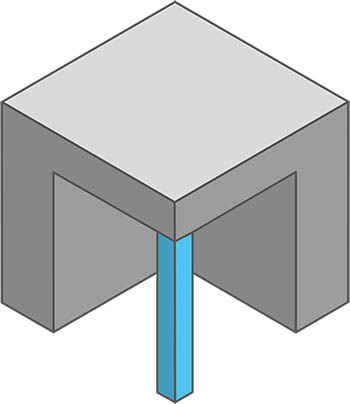

The minimum size for small details means the smallest possible printable parts of an object. Of course, this can also be understood as a general minimum size for objects to be printed.

**To ensure that printing of small details of an object does not fail and can be carried out in the appropriate quality, the recommended minimum size of**  
**2 mm should not be exceeded.**

In general, a ratio of 1:2 should be considered regarding the minimum dimensions for the axes x/y:z. This means that the higher the corresponding segment (z), the wider it must also be (x/y).

Even finer features are hardly feasible to print reasonably. On the one hand, this is due to technical limitations such as acceleration and deceleration during print head movement. On the other hand, such fine features printed using FDM 3D printing process are very fragile.

A factor that should not be underestimated is also which nozzle will be used for the print. If the selected nozzle diameter is too large for the detail to be printed, the slicer software will already optimize away parts of the object, as it recognizes the part as unprintable. [You can find more details about this in the article “First Aid – Small Details Not Printed”.](https://www.ab3d.at/3d-druck-erste-hilfe-feine-details-werden-nicht-gedruckt/)

# #4 – Minimum Diameter For Pins

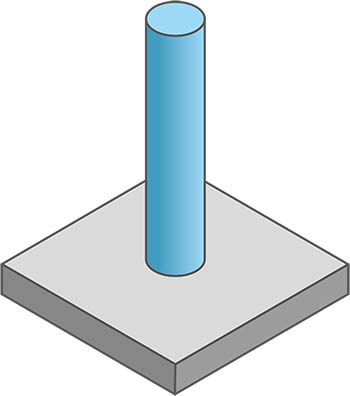

Pins are thin vertical columns on your print object.

**To ensure correct execution of printing and good print quality, the minimum diameter for pins should not be less than 3 mm.**

As with fine features, a ratio of 1:2 should also be considered for minimum dimensions regarding the x/y:z axes. This means that as the pin gets taller (z-axis), its diameter should also increase accordingly.

Of course, thinner diameters are possible. However, as mentioned before with small details, you will quickly reach the technical limit of the printer with a diameter that is too thin. Naturally, the thinner and higher these pins are, the more easily they will break.

Here, too, I would like to mention that pins that are too thin are already optimized away during slicing when using a nozzle that is too large.

# #5 – Holes On a Horizontal Surface

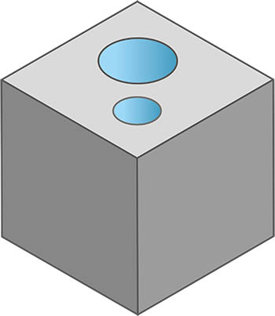

Holes in the vertical are usually printable without any problems. **To ensure a clean print, the minimum diameter of 2 mm for these holes should not be undercut.**

The quality of the print and how round the holes of your object will be, depend on the quality of the input file. If the resolution is too low when exporting the STL file, the hole can appear somewhat jagged. Instead of the now obsolete STL format, it would be better to use other formats that offer higher resolution of the CAD model, such as 3MF.

If you want to learn more about the file formats used and, above all, why you shouldn’t use STLs anymore despite their widespread use, then [this article](https://www.ab3d.at/en/stl-obj-stp-3mf-its-all-a-question-of-file-format/) is just right for you.

# #6 – Holes On a Vertical Surface

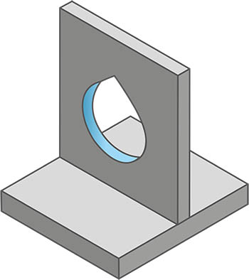

**Holes on a vertical surface should ideally be drawn in a drop-shaped form. As an alternative holes in vertical surfaces could also be drawn as trangles or diamonds.** The advantage is that it avoids too flat overhangs, which may cause the use of support material, and depending on the size of the hole and the layer height, also prevents sagging material.

Drawing drop-shaped holes is of course much more difficult than drawing a conventional hole, which you then cut out of a surface. However, the effort is definitely worth it. With smaller holes, this effect can still be neglected. With larger holes, however, thanks to this design tip, you will achieve significantly better print quality.

# #7 – Arcs On a Vertical Surface

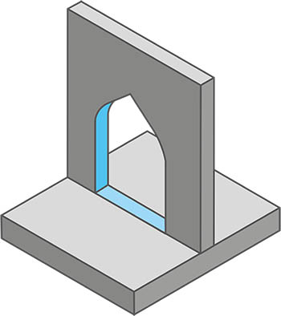

**To avoid too shallow overhangs and thereby sagging material in arches depending on the hole size and layer height, rounded arches should be replaced with pointed arches wherever possible.**

Like with the drop-shaped holes, drawing a pointed arch requires more effort than drawing a simple round arch. But in this case, too, the qualitatively better result justifies the additional effort.

# #8 – Gap For Joints

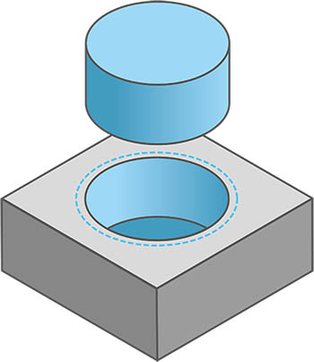

**To ensure a good connection between two movable or fixed parts, the gap size of 0.3 mm should be maintained.**

This value is determined by the tolerances in the movement of the print head, the extrusion settings (a sligth [overextrusion](https://www.ab3d.at/3d-druck-erste-hilfe-uberextrusion/) or [underextrusion](https://www.ab3d.at/3d-druck-erste-hilfe-unterextrusion/)), as well as the shrinkage of the material. The thermally induced shrinkage can vary depending on the material.

Depending on whether you want a smooth, possibly even movable, connection or a really tight and firm snap fit that provides good grip between the two components, you can slightly vary the gap size.

# #9 – Embossing And Engraving

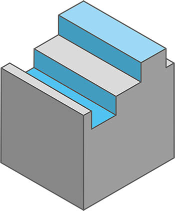

To ensure adequate print quality and to be able to print the embossment or engraving visible, **a minimum width of 0.6 mm or a depth of approximately 1-2 mm should be considered**.

# #10 – Distances For Bridges

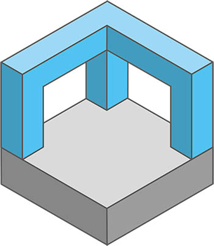

Bridges are sections that are printed more or less in mid-air between two points of the print object. At first, the freshly printed strands of material hang down slightly, but as the material cools, it contracts, tightens the material strand, and thus forms a solid foundation for the next layers.

**Depending on the 3D printer, it is certainly possible to print a several centimeters long bridge.** However, from a distance of 20 mm onwards, the use of support material is recommended for good print quality.

If too long of a distance is printed without support material, the filament strands will no longer be properly tensioned and will sag. Further information on this and how to determine how far bridges can be printed without supports can be found in [this article](https://www.ab3d.at/3d-druck-erste-hilfe-unsauber-gedruckte-brucken/).

Excessive use of support material is also not recommended, as it may lead to [poor surfaces quality above support material](https://www.ab3d.at/3d-druck-erste-hilfe-unsauber-gedruckte-oberflache-uber-stutzstrukturen/).

# #11 – Unsupported Overhangs

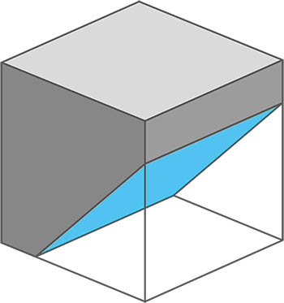

**The maximum angle for printing overhangs without support material is 45°. Depending on the chosen layer height and the printer model used, overhangs up to 55° can also be printed without a doubt.**

A general recommendation for FDM 3D printing is to support overhangs beyond 45° to ensure print success. If you want to know how far you can push your printer with overhangs, you can find [more information on this topic here](https://www.ab3d.at/3d-druck-erste-hilfe-unsaubere-uberhange/).

However, the use of support structures has a negative impact on material consumption, the [printing time ](https://www.ab3d.at/druckdauer-3d-druck-wie-lange-dauert-ein-ausdruck-und-warum/), and can also lead to [poor surface quality above the supported area](https://www.ab3d.at/3d-druck-erste-hilfe-unsauber-gedruckte-oberflache-uber-stutzstrukturen/).

*PRO TIP:  
If you include a 45° overhang along the edges of the bottom for the first two or three layers, you can avoid an [elephant foot](https://www.ab3d.at/3d-druck-erste-hilfe-elefantenfuss/) forming on your print object.*

# #12 – Rounded Corners

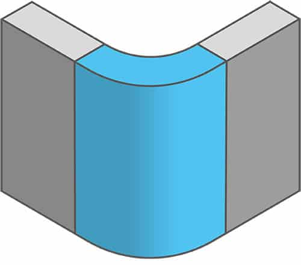

**The use of rounded corners instead of hard edges helps distribute stresses in the material throughout the entire object.**

Furthermore, with almost all printers whose axes are driven by belts, a slight overshoot of the printhead occurs during deceleration if printing is too fast. This effect makes hard edges on finished printed objects look unclean.

For a printer, it makes a difference whether an object has rounded corners or sharp edges. With a sharp edge, the print head must be fully braked to change direction before it can accelerate again in the opposite direction. With rounded corners the print head can change direction with only a very small loss of speed. This results in an optimized printing time on one hand, and a higher print quality on the other.

This example should serve for a better understanding:

| Type                                                                                             | Hard edges  | Rounded Corners (radius 5 mm) |
|--------------------------------------------------------------------------------------------------|-------------|-------------------------------|
|    |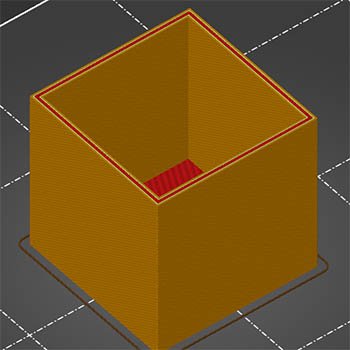 | 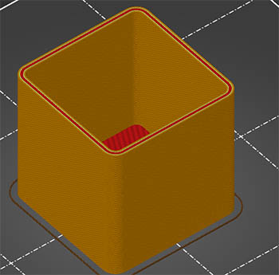 |
| Object size                                                                                      | 50x50x50 mm | 50x50x50 mm                   |
| Print duration                                                                                   | 2:40 hours  | 2:33 hours                    |

Even in this example, using rounded corners in a hollow object with dimensions of 50x50x50 mm, already saves 7 minutes of printing time. This time savings becomes significantly greater as the size of the objects increases.

# #13 – Chamfers At Transitions

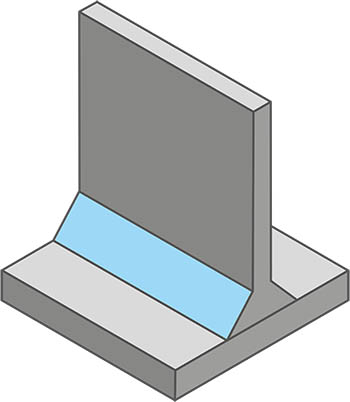

**Chamfers at the transitions between floors and walls reduce stress points in the printed object and provide additional stability.**

The advantage of chamfers over the fillets presented in the next point is that chamfers can also be used on outer walls without requiring special support or the like (see also overhangs).

The use of chamfers at the transition between the floor and walls also helps to prevent the problem of [gaps and holes in the corners of transitions](https://www.ab3d.at/3d-druck-erste-hilfe-lucken-in-den-ecken-von-ubergangen/) between the floor and walls.

# #14 – Fillets At Transitions

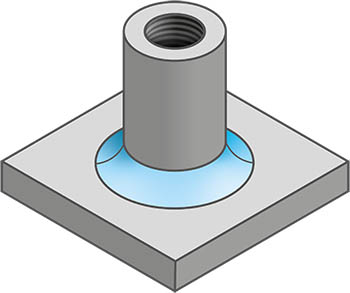

**Like chamfers, fillets reduce stress points at the transitions between floors and walls in the printed object and provide additional stability.**

Like chamfers, fillets are also suitable to prevent the problem of [gaps and holes in the corners of transitions](https://www.ab3d.at/3d-druck-erste-hilfe-lucken-in-den-ecken-von-ubergangen/) between floors and walls.

Additionally, using fillets helps to create a cohesive overall appearance of the model when they are used on the inside in the same places where roundings are used on the outside.

# #15 – Gussets For Stabilization

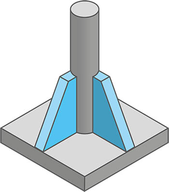

**Gussets are used to support fine features such as pins,** provided it does not affect the pin’s main functionality. By connecting to the bottom and the side surface of the object, gussets provide additional stability.

# #16 – Ribs For Stabilization

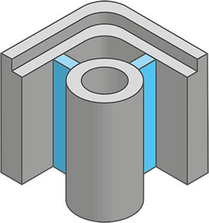

**Ribs are a special type of extrusion with a certain thickness between a wall and another element of the printed object**, such as a raised section for a screw hole in a casing. By providing connections in almost all directions, ribs ensure additional stability in the printed object.

Ideally, the rib should have the same thickness as the two parts of the print object to be joined. If the two parts to be connected are too different, the average value of the walls can be calculated or alternatively, if this value is too high, the smaller of the two values can be used as the strength for the rib.
