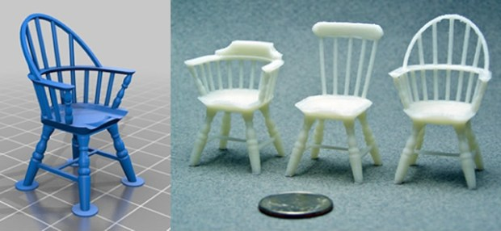
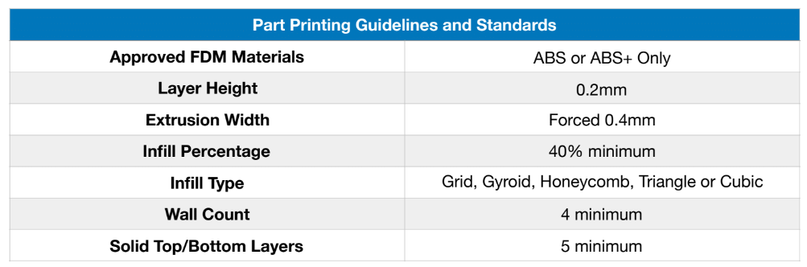

# Design Guide Lines

- **no overhangs** over `45` degrees

- **no supports** (unless they are absolutely needed, and if that's the case they must be built in to the part)

- **`0.4mm` chamfer** on surfaces that touch the print bed, helps the elephant foot.

- **no fillets** on the build surface, which breaks the `45` degree overhang rule

- loose joints generally over sized by `0.3-0.4mm` diameter for loose fit or `0.1mm` for press fit.

  - `3.4mm` for **M3** hardware
  - `5.4mm` for **M5** hardware

- Take note of part orientation to make sure the part is strong in the directions it needs to be.

- Countersunk holes "**overhanging**" the print surface should have a **chamfer** on them or other method like that to prevent issues

- Think about minimum perimeters/shells

- try to avoid really thin features

- Design with common screws/hardware in mind. ie, stick with `M3x6,8,12,16,20,30,40, M5x10,16,30,40` when possible

# Top Tips

- `45` Degree Rule
  
  Remember `45` degree rule, overhangs that are greater than `45` degrees will need support material or you need to use clever modeling tricks to get the model to print. Create your own support / bridging objects (cones and other supports) by designing them into your model.

- Design To Avoid Using Support Material
  
  Although support algorithms are improving all the time, support material can leave ugly marks on the outside of your prints. Support material can also be time consuming to remove. Design your models so that they are 3D printable without support.
  
  

- Add Custom Supports

  Use “**mouse ears**”, helper disks and cones designed into your model to help it print without the use of computer generated supports.  
  
  Tony Buser’s “ [Mouse Eared Rocket Fincan](http://www.thingiverse.com/thing:9241) ” and PrettySmallThings “ [Windsor Chairs](http://www.thingiverse.com/thing:21999) ” are excellent example of this design technique.

- Ditch the raft, it really slows down your prints. Depending on your software / printer configuration rafts can be difficult to remove and also mar the bottom of your prints.

- Know Your Printer’s Limitations

- Know your model details. Are there tiny towers and small features that are too small to be printed in plastic on a desktop 3D printer? An important, but often overlooked, variable in what your printer can achieve is thread width.

- Thread width is determined by the diameter of your printer’s nozzle. Most printers have a 0.4mm or 0.5mm nozzle. Practically, this means that a circle drawn by a 3D printer is always two thread widths deep: `0.8mm` thick with a `0.4mm` nozzle to 1mm thick for a `0.5mm` nozzle. As Kacie states in the video, the rule of thumb is “`The smallest feature you can create is double the thread width.`”

- Fit Tolerances for Interlocking Parts

  For objects with multiple interlocking parts, design in your fit tolerance. Getting tolerances correct can be difficult. Tips for creating correct tolerances:  use a `0.2mm` offset for tight fit (press fit parts, connectors) and use a `0.4mm` offset for lose fit (hinges, box lids). You will have to test it yourself with your particular model to determine what is the right tolerance for the thing you are creating.

- Use Shells Properly

  Don’t use additional shells on fine featured models, like small text. It will obscure the detail.

- Optimize for Thread Width
  
  Use thread width to your advantage. If you are making flexible models or need very thin features, design the walls of your model to be one thread width thick. Check out Hultgren’s collection of “ [Flexible Inspiration](http://www.thingiverse.com/PrettySmallThings/collections/flexible-inspiration) ” model collection on Thingiverse for more examples on utilizing this technique.

- Orient for the Best Resolution

  Always orient your model for the best resolution possible for that particular model.  Models can be sliced into pieces if necessary and then re-assembled. On Fused-Filament Fabrication printers, you can only control the Z resolution. The X and Y resolutions are determined by thread width. If your model has fine features, make sure the model orientation is cable of printing those features.
  
- Orient for Stress

  To keep prints from breaking when force is applied; make sure to orient your model to minimize stress on the part by orienting the model so that the print lines are perpendicular to point of the pressure being applied.

  The same principle applies to ABS, which when used to print large models, can split along the Z-axis as they cool on the build platform during printing.
  
- The “**Holy Grail**”: Print and Place Designs

  Print in place designs that contain multiple integrated parts, are the “**Holy Grail**” of FFF desktop machines. Here are Hultgren’s tips on how to tackle “**print in place designs**”: pull design elements to platform, use bridges for captive parts and gap print carefully.

# Part Printing guide Lines

