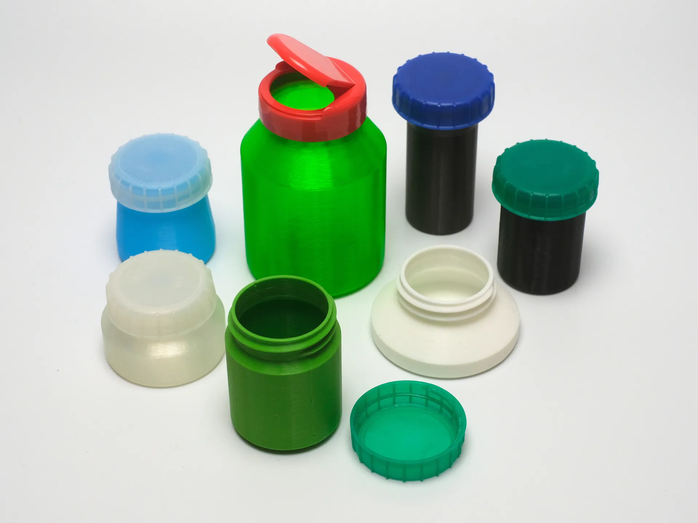

# Design Overview

This is a project to make use of a few of the many milk bottle tops that are otherwise discarded (the 38mm HDPE bottle type that are common in the UK, at least.)  There are lots of other types of bottle cap that are compatible with this.

I didn't initially decide to script the models, but it gave me a good excuse to get more familiar with OpenSCAD.

The scripted design is intended to be easy to print - purely function over form, but has a certain elegance in its simplicity.

# Models

Pre-rendered files to show what the script can do and to help with ideas - some are just examples, while others are purposeful, functional items such as the roll film holders.

# OpenSCAD Script

- If you don't already have the "ub.scad" library - it's available at [https://github.com/UBaer21/UB.scad](https://github.com/UBaer21/UB.scad) - place this in your script's working folder.
- The main parameters are overall height and diameter, while the rest are adjustments to customise the shape to some degree.
- The threaded neck can be modified here to adapt to other cap types, but this was outside the scope of this project and you may have to tweak further parameters in the “Gewinde” thread module to suit your requirements.
- When customising the parameters for a particular item fit or volume, make sure to take into account the thickness of the walls and base and add them to the total.
- The thread module of UB.scad version 022 (current as of this post) generates some warnings in OpenSCAD, but they do not seem to affect this script.

# Examples

`bottle();` Default bottle with an overall height of 50mm and an outer diameter of 40mm.

`bottle(oh=60,bd=45);`  For an overall height of 60mm and an outer diameter of 45mm.

`bottle(oh=60,bd=45,wt=2,ltf=0);`  As above, with 2mm walls and no taper at the base.

`bottle(oh=71.6,bd=26.5,wt=1.25,ltf=0);`  For an internal cylinder fit (excluding additional volume taken by width of top) of 70mm x 25mm, taking into account a wall thickness of 1.25mm, a base thickness of 1.6mm and making sure the base taper does not interfere internally.

# Printing Notes

- With a 0.4mm nozzle, a layer height of 0.2mm or smaller is recommended (at least for the thread region,) as otherwise the thread's underside may lose definition from the resulting overhangs. Thicker layers are fine for the main bottle if variable layer height is used to make the thread layers thinner.
- Two perimeters should be OK, but I think three is preferable for extra water-tightness if you want that. Three also may print a little faster if using Arachne perimeter generation, as this can avoid solid infill on the thread.
- PLA and PETG both work well, but I have not tried others.
- Spiral vase mode can be used with no modification to the normal model, but ideally use a 0.6mm nozzle or larger so the walls can be thick enough (such as 0.8mm thick) for some strength. Otherwise try to avoid taper angles of more than 30 degrees or so.

# Links to Resources

- [UB.scad-main.zip](resource/UB.scad-main.zip)
- [parametric-bottles-for-38mm-caps-model_files.zip](resource/parametric-bottles-for-38mm-caps-model_files.zip)
- [print3d-customizable-screw-cap-master.zip](resource/print3d-customizable-screw-cap-master.zip)

- [http://openscad.org](http://openscad.org/)
- [https://en.wikibooks.org/wiki/OpenSCAD_User_Manual](https://en.wikibooks.org/wiki/OpenSCAD_User_Manual)

