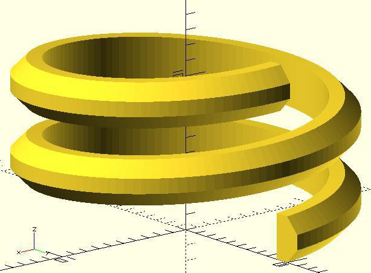
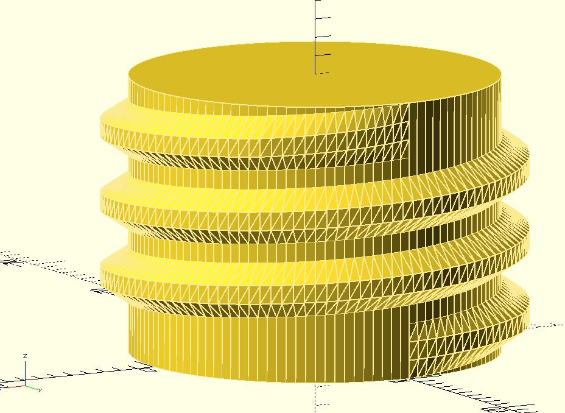
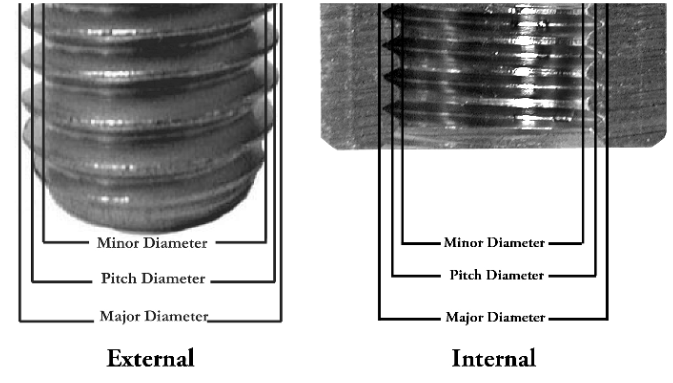

**Ok, then how to?  
**

**Prerequisites:  
**

Now we're basically down to creating geometry from a list of vertices and triangles, having full control over how the surface mesh turns out. Luckily there are two sets of libraries to help us out.

Starting with a recent development snapshot for your platform of choice:

OpenSCAD [http://www.openscad.org/downloads.html](http://www.openscad.org/downloads.html)

and additionally  


scad-utils [https://github.com/openscad/scad-utils](https://github.com/openscad/scad-utils)  


list-comprehension [https://github.com/openscad/list-comprehension-demos](https://github.com/openscad/list-comprehension-demos)  


under Windows, the libraries have to be cloned/copied into your <user>\\Documents\\OpenSCAD\\libraries  folder.

As of this writing there's also a pending modification to skin.scad to make the fancy toroidal geometry part of the example work, see

[https://github.com/openscad/list-comprehension-demos/issues/8](https://github.com/openscad/list-comprehension-demos/issues/8)

but this is disconnected from the initial effort of creating nice threads.

**Download**:

For now I put up **thread_profile.scad** on github. If you've created new thread profile definitions I'd be happy to add them to the library. Just drop me a message.[  
](https://github.com/MisterHW/IoP-satellite)

[https://github.com/MisterHW/IoP-satellite/tree/master/OpenSCAD%20bottle%20threads](https://github.com/MisterHW/IoP-satellite)

**The Approach**:  


With that out of the way, what is being shown is the generation of a helically arranged 1-dimensional array of vertical **polygon()** sections wrapped in a **skin()** made of triangles, the latter being an extension to **polyhedron()**. This thread helix can then be merged with the rest of the geometry via the boolean **union() **operator.  

[](https://cdn.hackaday.io/images/3998681527427097972.jpg)

A radial function is introduced to create tapered ends, the Higbee cut. This is done to let the the threads start / end with a fully formed profile, avoiding galling.

Adding a cylinder and lead-in / lead-out taper this then becomes:
[](https://cdn.hackaday.io/images/8454001527378536093.jpg)

**
<br>

**

**How to create new thread profiles:**  


First you'll need exact thread dimensions, e.g. obtained with a caliper or by gluing a sacraficial neck and cap piece together, cutting it in half and sticking the sanded cross section in a flatbed scanner (along with horizontal and vertical reference objects for scale) or even an official dimenional drawing like this one:[  
](thread-readme/28mm-ISBT-PCO-1881-Finish-3784253-17.pdf)

[http://imajeenyus.com/mechanical/20120508_bottle_top_threads/28mm-ISBT-PCO-1881-Finish-3784253-17.pdf](thread-readme/28mm-ISBT-PCO-1881-Finish-3784253-17.pdf)  


If for a neck finish the cap profile is missing, its complementary profile has to be inferred, including some proper clearances. There's also a bit of leeway for shaping the non-load-bearing side of the thread profiles.  


**Let's go over the code.**

As per [https://en.wikibooks.org/wiki/OpenSCAD_User_Manual/The_OpenSCAD_Language#Special_variables_2](https://en.wikibooks.org/wiki/OpenSCAD_User_Manual/The_OpenSCAD_Language#Special_variables_2)  


which don't seem to work across files it seems function declarations are a generalized way to export constants and lists from libraries, so I'm using the function construct to create parameter sets for individual thread profiles to be fed to the generating module straight_thread(...).

```// PCO-1881 soda bottle neck threadfunction bottle_pco1881_neck_clear_dia()      = 21.74;function bottle_pco1881_neck_thread_dia()     = 24.94;function bottle_pco1881_neck_thread_pitch()   = 2.7;function bottle_pco1881_neck_thread_height()  = 1.15;function bottle_pco1881_neck_thread_profile() = [    [0, 0],    [0, 1.42],    [bottle_pco1881_neck_thread_height(), 1.22],    [bottle_pco1881_neck_thread_height(), 0.22] ];
```

Note the 2D thread profile is defined such that x == 0 is at the minor (major) diameter of the outside (inside) thread because for additive thread forms that's the outside (inside) cylindrical reference surface.  


[](https://cdn.hackaday.io/images/5316521527433333943.PNG)

[](https://hackaday.io/page/undefined)
[https://www.fastenal.com/content/feds/pdf/Article%20-%20Screw%20Threads%20Design.pdf
<br>

](thread-readme/Article%20-%20Screw%20Threads%20Design.pdf)
<br>

Next, we'll look at how module straight_thread() generates the 3D shape:
<br>

```
// helical thread with higbee cut at start and end// to be attached to a cylindrical surface with matching $fnmodule straight_thread(section_profile, pitch = 4, turns = 3, r=10, higbee_arc=45, fn=120){	$fn = fn;	steps = turns\*$fn;	thing =  [ for (i=[0:steps])		transform(			rotation([0, 0, 360\*i/$fn - 90])\*			translation([0, r, pitch\*i/$fn])\*			rotation([90,0,0])\*			rotation([0,90,0])\*			scaling([0.01+0.99\*			lilo_taper(i/turns,steps/turns,(higbee_arc/360)/turns),1,1]),			section_profile			)		];	skin(thing);}
```

In short, a 2D thread profile is passed as section_profile and in a for loop, turns\*$fn copies are positioned in 3D space to then be enveloped with a polygonal **skin()**.  
[  
](thread-readme/Article%20-%20Screw%20Threads%20Design.pdf)The chain of transformation operations create uniaxial scaling, rotate the 2D shape out of its construction plane, translate it to the start of the helix and then parametrically rotate-translate it along the helical path.[  
](thread-readme/Article%20-%20Screw%20Threads%20Design.pdf)

The axes of rotations and the order in which they are applied has been determined so that the section is tilted upright and positioned in a way that matches how **cylinder()** creates faces, the alignment becomes obvious at small facet counts $fn.

In subtractive machining terms, a Higbee cut removes partially formed thread which would otherwise create a ramp of knife edge that could cut into the mating thread at an angle, destroying both sides. It also defines a nice ramp that makes the pieces click as you rotate a loose lid that "falls back down" one turn.

Here, a uniaxial scaling operation affecting the start and end cross sections is applied to the 2D profile. Alternatively, the thread profile would start and end abruptly, creating a stress riser and sharp corners undesirable in FDM printing, or worse one would intersect the thread profile with an inside cone and again end up with partial threads.  

```// radial scaling function for tapered lead-in and lead-outfunction lilo_taper(x,N,tapered_fraction) =     min( min( 1, (1.0/tapered_fraction)\*(x/N) ), (1/tapered_fraction)\*(1-x/N) );
```

Side note: scaling the thread profile down to zero is not permitted per se because it would need special treatment for non-regulatities such as zero-area polygons or just a change in connectivity (all circumferential points would have to map to a line). This is treated below by scaling 1-100% instead of 0-100%.

<br>


Let me again touch on the subject of conversion from polygons / lists of points to valid 3D solids.  


When creating a hull, adjacent sections have to be linked with shells of triangles. As the end product is topologically the same as a block or sphere, the ends have to be closed (it's not a toroid) which is also handled by **skin().** The latter just adds start and end faces and feeds the whole thing to **polyhedron()**.  


**Merging with other geometry  
**  
The outsides generated by sections having [0,a],[0,b] vertical lines are not quadrilaterals but pairs of triangles which \*should\* be co-planar to the faces of cylindrical walls. Depending on the number of facets and overall make-up of the geometry this seems to be a hit-and-miss thing with CGAL. **One way to avoid the butt joint problem and infinitesimal gaps** is to let the parts interfere (approx. -0.05). My preferred way of doing that is to make the minor(major) diameter of the shaft (bore) a tad larger (smaller) to interfere with the thread form.  

**Usage:**

```union(){straight_thread(    section_profile = bottle_pco1881_nut_thread_profile(),    higbee_arc = 20,    r     = bottle_pco1881_nut_thread_major()/2,    turns = nut_turns,    pitch = bottle_pco1881_nut_thread_pitch(),    fn    = $fn);// ... the rest of your geometry here}
```

and that's all folks.

**Other approaches:**

turns out "tornillo" is the spanish word for screw/bolt. If you're looking for ISO metric threads (threadAngle = 30) or ACME (threadAngle = 29), this might be for you:  


[https://github.com/KaliNuska/Curso_2015-2017/blob/master/TIC/Imagen%20Vectorial.md](https://github.com/KaliNuska/Curso_2015-2017/blob/master/TIC/Imagen%20Vectorial.md)  


Part of the purpose to my effort to create nice threads in a generalized way is to become more familiar with OpenSCAD and the ways it wants to be used. If you've done something similar I apologize for not giving credit where due. Please drop a few lines in the comments.

