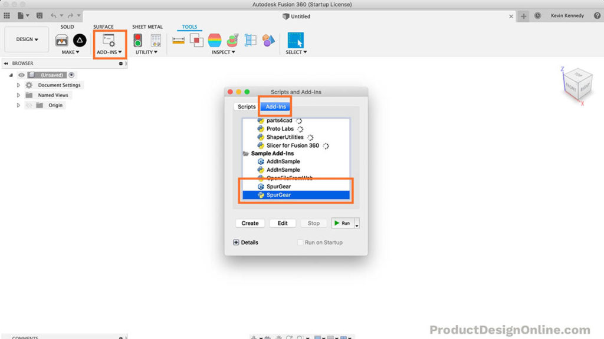
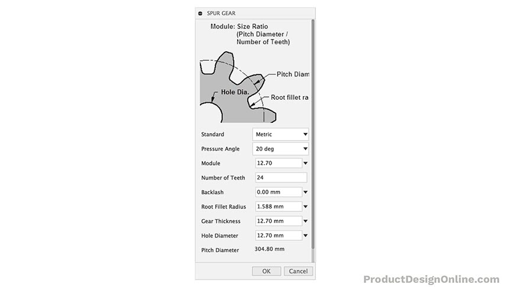
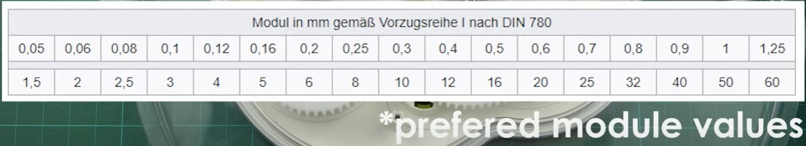
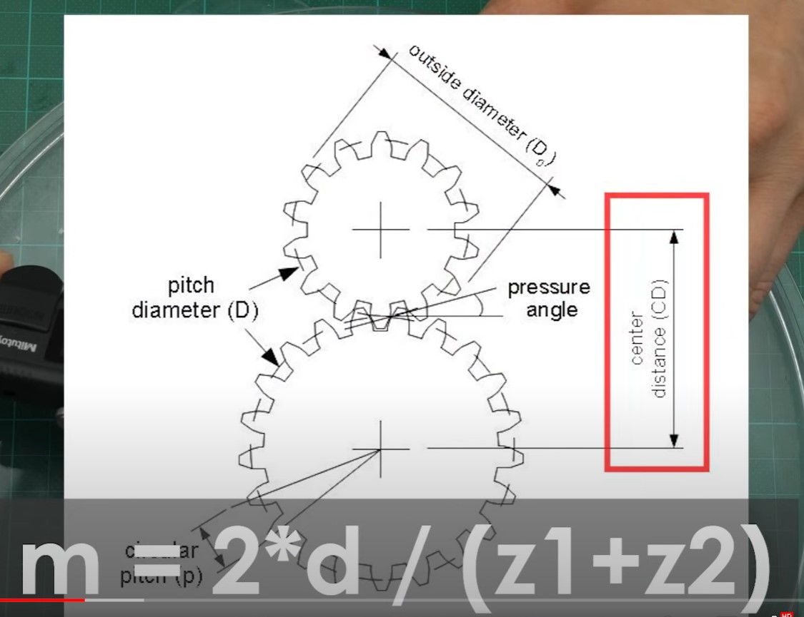
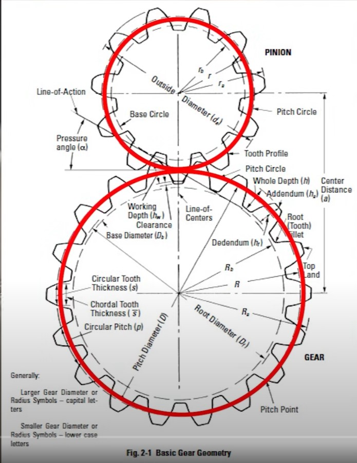

- # Create Custom 3D Printable Gears in Fusion 360 | Practical Prints #1

Each copy of Fusion 360 includes a few sample add-ins. Fortunately, one of the sample add-ins is a Spur Gear generator.

Select the `Tools tab > Scripts & Add-ins > Add-ins Tab > Scroll down` until you can see the `Spur Gear` generator. 

> Note: There are two samples. One written in C++ and one written in Python. Both work the same, so it doesn’t matter which one you choose.



Simply fill out the gear details and the add-in will automatically generate your gear.

You should be familiar with the gear terminology before 3D printing any gears. This will help you avoid common mistakes and errors that prevent the gears from working.

The following gear details are options that can be altered in Fusion 360 (Spur Gear plugin)



The dialog of Fusion 360’s Spur Gear add-in

# Gear Standard

The standard option lets you choose from English or Metric units. This is a personal preference, but note that it will also change one of the options (as noted below).

# Gear Pressure Angle

- The pressure angle of a gear tooth is the angle between the tooth face and the tangent gear wheel.
- It is more precisely the *angle*  at a pitch point between the line of *pressure*  (which is normal to the tooth surface) and the plane tangent to the pitch surface.

> Note: Module and pressure angle for a pair of gears need to be same.

# Gear Module

```
Pitch Diameter = Gear Module * Number of Teeth

Outer Diameter = Gear Module * (Number of Teeth + 2)

Gear Module = (Number of Teeth + 2) / Outer Diameter
```

If we have both gears assembled then

```
Gear Module = (Distance Between Axis) / (Number of Teeth of Gear#1 + Number of Teeth of Gear#2)
```

- The gear module is the unit of size or ratio of the gear’s pitch diameter divided by the number of gear teeth.
- The module is only available when the Standard is set to Metric.
- this parameter approximate to tooth size, larger the value bigger the tooth
- keep this value across the gears same, otherwise the teeth won't match

> Note: Module and pressure angle for a pair of gears need to be same.





# Diametral Pitch

- The diametral pitch is, by definition, the number of teeth divided by the pitch diameter.
- This option will only show up when the Standard is set to English.

# Number of Teeth

- The number of teeth option lets you define how many teeth are placed around the gear.

# Backlash / clearance

- The Backlash option lets you define a clearance between teeth of the mating gear. This is critical to let the gears mesh without binding the gears.
- The clearance prevents overheating and tooth damage. It also provides space or lubricating oil or grease to be applied between the teeth.
- You will want to use a backlash if you’re planning on 3D printing the gears. I’ve found that `.15mm` works well, as that gives a total clearance of `.3mm` (when applied to both gears).

# Root Fillet Radius

- The root fillet radius is the curvature between the tooth surface and the tooth root.
- Your root fillet radius must not surpass the maximum value. You will get a warning message at the bottom of the dialog if your value is higher than allowed.
- You will have to be cautious even when your root fillet radius does not surpass the maximum. **Too large of a radius will produce an undercut.**
- An undercut will prevent the gear teeth from correctly meshing with each other.

# Gear Thickness

- The gear thickness represents the extruded height of the gear. 
- Thankfully, the height can still be altered after using the Spur Gear generator. Simply select the top face of the `gear > right-click > select “press pull” > drag or type out the desired dimensions`.

# Hole Diameter

- The hole diameter is also straightforward. The value entered will determine the diameter of the hole.
- It’s important to note, the hole size can be set to zero. This will omit the creation of the hole when the gear is generated. You can then create a hole with the hole command, which provides more options and makes it easier to alter later on.

# Pitch Diameter

- The pitch diameter, which is read-only, is the diameter of the gear used for spacing the gears. This can be seen in the diagram within the Spur Gear dialog. 
- It’s important to note, this is not the same as the outside diameter of the gear.



# Avoiding Undercut in Gear Teeth

- Undercutting is removing some material from the base of the gear tooth to avoid interference.
- Interference in gears causes material wear and removal during operation, so you can intentionally remove material by undercutting before the gear is used.
- Always make sure you have enough gear teeth. For gears with a 20-degree pressure angle, the minimum amount of recommended teeth is 13. For gears with a 25-degree pressure angle, the minimum amount of recommended teeth is 9.
- Fewer teeth are not recommended because it would produce undercut, which weakens the teeth. This will also make it harder to 3D Print gears that mesh without problems.
- To avoid undercutting you can increase the number of gear teeth or (sometimes) increase the thickness of the tooth.
- I recommend checking out the  [Machinery’s Handbook](https://amzn.to/30gTf1q)  if you have a lot of gear projects (or movable 3D Printing parts). The book has been dubbed the “holy grail” for Engineers and Machinist. There is so much valuable info that applies to not only gears, but clearances, threads, and more.

# 3 Rules When Creating Gears for 3D Printing

1. Never have fewer than 13 teeth on your smallest gear, or you’ll likely end up with an undercut on the gear teeth that will prevent proper rotation.
2. Always include a backlash or tolerance or clearance, based on your 3D printers’ setup. You’ll likely need to print a few test gears to dial in the optimal tolerance.
3. Always consider the thickness and width of your gears, which greatly impacts the strength of the gear. When possible, consider adding a backing to strengthen the gear teeth.

# Reference

- [Learn how to create custom 3D Printable spur gears in Fusion 360](https://youtu.be/B8A_11o7QZ0)
- [3D Printed PLA Gear](https://www.youtube.com/watch?v=vuJmWKsCYcU)


