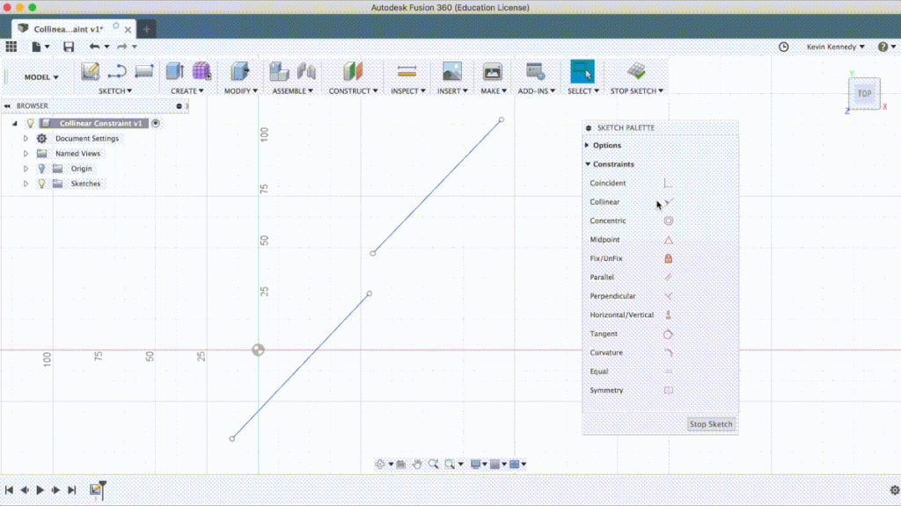

# How to Manually Add Sketch Constraints in Fusion 360

In order to master Fusion 360, it’s important that you have a solid understanding of sketch constraints. In this article, I’ll explain what constraints are and then I’ll explain what each constraint actually does.

If you can grasp the concept of the sketch constraints, then you’ll be in a much better position, especially as you start to 3D model more complex objects.

# What are Sketch Constraints?

Constraints allow you to relate one sketch entity to another sketch entity. If you [look at](https://productdesignonline.com/glossary/look-at/) Re-arranges screen to look at selected object. the constraint icons in the sketch palette you’ll see that the sketch constraints use geometric expressions, with the exception of fix/unfix.

To activate any constraint we’ll have to click on it in the sketch palette, and you’ll notice it shows it’s active by the blue highlight.

# Why Use Sketch Constraints?

Using sketch constraints in Fusion 360 will help ensure that your model updates as expected when you change any sketch dimensions.
Now let’s talk about why to use these sketch constraints. These sketch constraints allow you to maintain certain behaviors when the sketch is updated. Constraints help the sketch stay intact, ensuring that elements don’t [break](https://productdesignonline.com/glossary/break/) Break curve entities into two or more sections. Pause the cursor over the segment to break from the overall curve. Select the curve to break. apart or move to unpredictable areas.

Essentially, you’ll want to use sketch constraints to maintain the shape of your sketch so your sketch stays 100% predictable… with emphasis on the 100%, because if you’re constraining AND dimensioning your sketches correctly then you should always know what is going to happen when you make a change within the sketch.

# Coincident Constraint

To add a coincident constraint we can either [select](https://productdesignonline.com/glossary/select/) The selection mode controls how objects are select when you drag in the canvas. a [point](https://productdesignonline.com/glossary/point/) Creates a sketch point. or a [line](https://productdesignonline.com/glossary/line/) (keyboard shortcut “L”) Creates lines and arcs. Select a start and endpoint to define a line segment. Click and drag the endpoint of a segment to define an arc.. If I select this line first, then you’ll see that as I hover over the lines it only highlights the points. In this case, points are all that I can use to complete the coincident constraint. I’ll select the end of the line and then you’ll see that the lines are joined together. You’ll also notice the glyph or icon that represents the coincident constraint was added so we know how this area is constrained.

# Collinear Constraint

The collinear constraint forces two lines to share a single axis… and they can be at any angle… they do not have to be vertical or horizontal lines. I should also point out that the order in which you select the lines DOES matter. The first entity you choose will remain in place, and the second entity will satisfy the constraint. If I want this top line to be on the same axis as this other line here then making sure “collinear is active” I can simply click on the first line, that will be used as the axis, and as I click on the second line you’ll see that it moved to that same axis…and added the collinear glyph.

# Concentric Constraint

The next constraint is “concentric,” which forces circular sketch elements, such as circles and arcs, to share a common center point. So if I wanted to ensure that this circle has the same center point as the arc, I can activate the concentric constraint by clicking on it, then I’ll click on the entities in either order. If I select the arc and then select the circle you’ll see that now both entities share the same centerpoint, which is represented by the concentric glyph.

# Midpoint Constraint

The midpoint constraint, which is represented by a triangle, will come up often as you are drawing lines in Fusion 360. The midpoint constraint allows us to force the endpoint of a line to the center point of a line or arc. If I select the endpoint of this line and then select the bottom line you’ll see that it snaps to the midpoint and the triangle, or midpoint glyph now appears.

# Fix/Unfix Constraint

If I select fix/unfix, and click on a line, you’ll notice that it turns green. Notice while the position of the line itself is fixed, the endpoints can still be adjusted. Now personally, I wouldn’t recommend using the fix/unfix very often, because if the rest of your sketch is constrained and dimensioned properly then you should be able to update your sketch while knowing what will happen to your sketch.  The problem with fix/unfix is that if you have a line or multiple lines fixed in your sketch, then you won’t always be able to update them without going ahead and unfixing them first… and sometimes this can get messy, especially in larger sketches.

# Parallel Constraint

The next constraint is the parallel constraint, which makes any two lines parallel to each other. I’ll click on the parallel constraint to activate it and then I’ll select these two lines… and you’ll notice that now if I drag them around they will always stay parallel to one another.

# Perpendicular Constraint

The perpendicular constraint forces two lines to remain at a 90-degree angle to one another. An important thing to note is that the perpendicular constraint does not have to be used on lines that are touching. If I select the left vertical line and then select the top right line you’ll see that it made them perpendicular to each other. You’ll also notice that because these two lines were collinear with each other, they are not both perpendicular to the left line, even though only one is directly constrained as represented by the glyph here. So this is a perfect example of how constraints can be used in conjunction with one another to constrain sketch entities in a more efficient manner.

# Horizontal/Vertical Constraint

The next constraint is the horizontal/vertical constraint, which forces a line to snap to either horizontal or vertical, whichever orientation is the closest. If I click on this middle line you’ll see that it snaps to vertical and the glyph appears next to it. The horizontal/vertical constraint can also be used to make points line up with one another.

# Tangent Constraint

The “tangent” constraint, which creates tangency, or a curve touching a line segment at a single point with a relatively smooth transition. The tangent constraint will create this smooth transition between a line and a circular element for us. I’ll go ahead and add tangent constraints to the circle and the nearby lines by first selecting the circle… and then the right line. Now I’ll do the other line by selecting the circle again and then the left line, and you’ll see that we now have both of the lines tangent to the circle… as represented by the tangent glyphs/icons.

# Curvature Constraint

The curvature constraint makes the curvature at the transition point equal. Essentially, the curvature constraint can help make organic shapes more smooth, so you likely won’t be using it very often compared to some of these other constraints.

To demo this constraint I’ll have to draw a [spline](https://productdesignonline.com/glossary/spline/) Creates a spline curve through the selected points. Select the first point to start the spline. Select additional points as fit points. connecting to the arc. I’ll select spline from the sketch dropdown menu and then I’ll draw a spline from the edge of the arc to some of these other points…and I’ll just drag some of the handles here so it’s not as straight. Then, to help you see what the curvature constraint does I’ll select the spline and the arc while holding down the shift key and I’ll click the curvature comb in the sketch palette.

The curvature combs will help you better understand the transition point of the spline and the arc. If we look at where they meet you’ll see that the curvature comb is not continuous because the transition is not smooth and flips to the other side here. If I select the curvature constraint and select both sketch entities you’ll see that the comb will change to have a fluid or smooth transition from the arc to the spline.

# Equal Constraint

The equal constraint forces two entities to be equal in size. I can select these two horizontal lines and you’ll see that it forces them to be the same size. If I hit the escape key and drag this right point around you’ll see that not only do these two lines stay equal in size, but they also follow all of the other constraints that we have applied to them.

# Symmetry Constraint

The last constraint I’ll activate is the symmetry constraint. The most important thing to note with the symmetry constraint is that it requires 3 mouse clicks. The first two clicks will be the entities that you want to be symmetric and the 3rd selection will be the entity or line they will be symmetric about. I’ll click on this top line and then this line for the lines to be symmetric, and I’ll click this line in the middle for the line of symmetry.

You’ll see if I hit the escape key and drag this top line around, both lines will stay symmetric from this middle line.

# Sketch Constraint Tips

If you right-click on any sketch entity you’ll see that it shows all of the available or relevant sketch constraints in the marking menu. If you select multiple sketch entities while holding down the shift key and then right click you’ll see that the entities that you selected WILL affect which constraints are available in the marking menu.

Another thing you’ll notice is that some constraints will automatically be applied while you sketch out entities. For example, If I hit the keyboard letter “L” for line and draw a line out here…you’ll see that it will automatically add a horizontal constraint if I let it snap to the grid.

[How to Manually Add Sketch Constraints](https://youtu.be/BGwBZJ14KHQ)

<iframe width="1280" height="720" src="https://www.youtube.com/embed/BGwBZJ14KHQ" title="How to Manually Add Sketch Constraints - Learn Autodesk Fusion 360 in 30 Days: Day #16" frameborder="0" allow="accelerometer; autoplay; clipboard-write; encrypted-media; gyroscope; picture-in-picture; web-share" referrerpolicy="strict-origin-when-cross-origin" allowfullscreen></iframe>

