# How to convert an STL (mesh) to a Solid in Fusion 360

# How to convert an STL mesh to a Solid in Fusion 360

Fusion 360 is very popular among hobbyist and students who enjoy 3D printing. If you’re wondering how to turn an STL file into a solid body, then you’re in the right place.

Before we get started with actually converting the mesh model I want to cover some of the terminologies to ensure we’re on the same page, and so you actually understand why we’re converting the model.

# The Mesh (STL) File

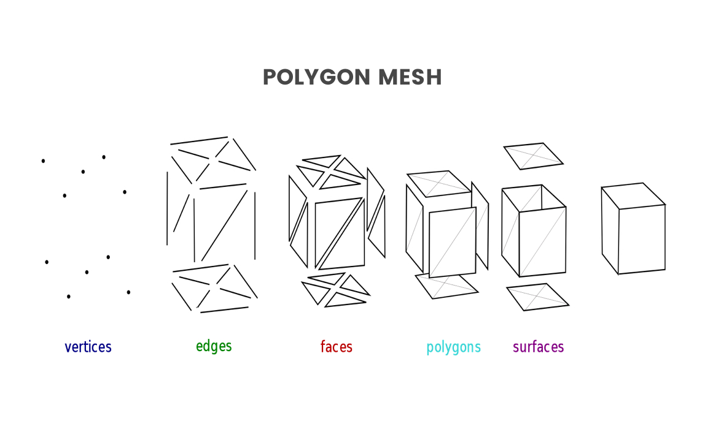

If you’re familiar with 3D printing and you use .STL files or .OBJ files then you work with mesh files all the time. A mesh file is a collection of vertices, edges, and faces that define a 3D dimensional shape. This great image from Wikipedia breaks down how a mesh is built. You’ll see that it shows that mesh files are created with vertices, edges, and faces, which all create the polygon sides or surfaces of the object.

One of the most important things to know about meshes is that they are surface models. Now to help you grasp this concept we can compare it to real-life Origami. If we [look at](https://productdesignonline.com/glossary/look-at/) Re-arranges screen to look at selected object. this object made out of paper we see all of the different surfaces that make up this overall shape. Yet, the object is still hollow on the inside, as its solely made up of surface geometry.

# STL vs OBJ Files

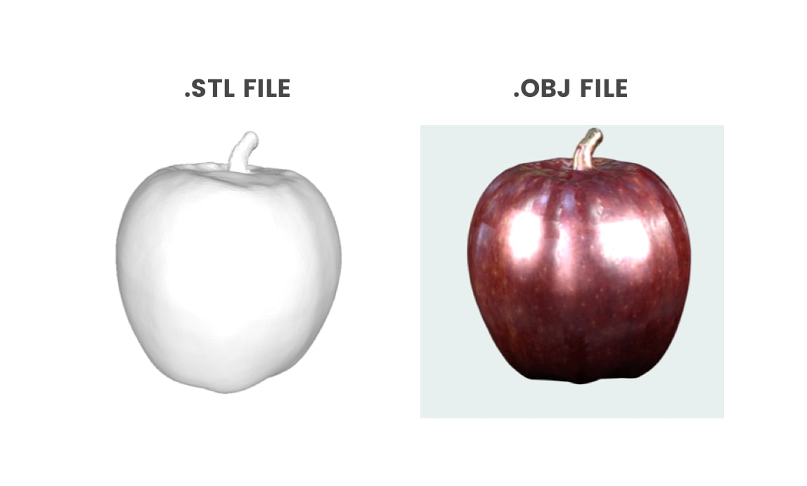

Now real quick let’s take a look at the difference between the two most common types of meshes, which are .STL and an .OBJ files.

An STL file is the native file format for stereolithography and it’s often referred to as the acronym that represents “Standard Triangle Language” OR “Standard Tessellation Language.” Put simply, an STL file is a type of mesh file created with unstructured triangular surfaces. Again, it’s just making up the outer surface of the model and its NOT a completely solid object.

On the other hand, we have .OBJ files. The only difference between an .STL file and a .OBJ file is that the .OBJ file displays some extra data on the surface. So you’ll see that .STL files are always gray, whereas .OBJ files can contain color and texture data, which are displayed on the surface. The color and texture map are most commonly captured by 3D scanners, which is why most 3D scanners are going to output your .OBJ file.

Now the last term that you’ll need to understand here before I walk through the steps to convert an STL to a solid body is the term “BREP.” Now, BREP stands for boundary representation and can be seen as the opposite of our mesh files, as it’s a completely solid and watertight model. A BREP file is made up of topological and geometric information.

Alrighty, so now that you’re familiar with some of the common terminology let’s take a look at how to use Fusion 360 to convert an .STL mesh file to a BREP solid body.

# Mesh Workspace

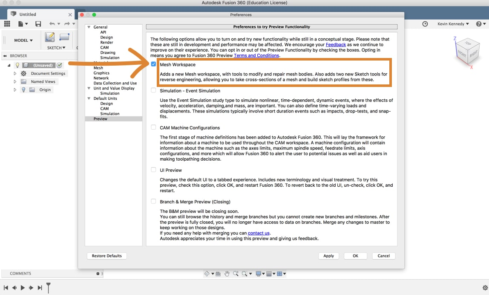

The first thing we’ll want to do is make sure that the mesh workspace is enabled. To do this [select](https://productdesignonline.com/glossary/select/) The selection mode controls how objects are select when you drag in the canvas. the preferences menu from the profile dropdown list and then select “preview” and you’ll see that you can toggle the mesh workspace on and off by clicking the checkbox. Now after clicking the checkbox, you’ll have to hit the apply button and then the okay button.

## 1. Insert Mesh (.STL) File into Fusion 360

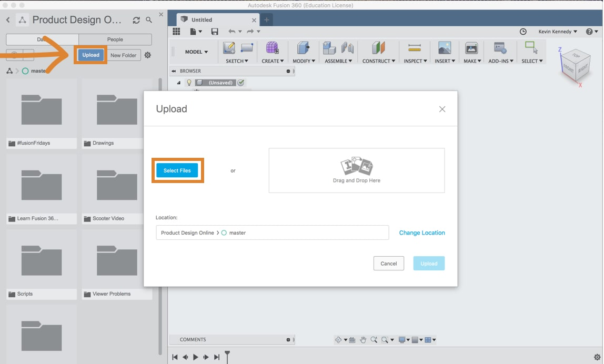

Now a lot of Fusion 360 users get .stl files from Thingiverse.com and they want to modify them to [fit](https://productdesignonline.com/glossary/fit/) (keyboard shortcut “f6”) Makes the current file fill the screen. their own needs or they simply want to customize them with their name or logo. For this demo, I’m going to use this downloaded phone stand Thingiverse file. The first thing you’ll have to do is import it into Fusion 360. There are two ways that you can import a mesh file into Fusion 360. The first way would be to open up the [data panel](https://productdesignonline.com/glossary/data-panel/) Opening The Data Panel gives you access to your Project Files and Folders. Click the Show Data Panel button in the upper left of the Fusion window. The Panel will expand on the left side and display the project folders. You can also add members to projects and Import data from other sources. and click the blue upload button. Then, If you select the file you can upload it. Once the file has been successfully uploaded, double-click on the file to open it.

> [Note: Click here for the phone stand STL file used in this demo.](https://www.thingiverse.com/thing:2120591)

The second way to insert a mesh file is to simply go to the insert menu. Select “[insert mesh](https://productdesignonline.com/glossary/insert-mesh/) Inserts the selected OBJ or STL mesh file into the active design. Choose an OBJ or STL file to insert, then use the options and manipulators to orient and position the mesh.” from the dropdown list. Then go ahead and select the file. You’ll see that before you can work on the file it allows you to change the orientation.

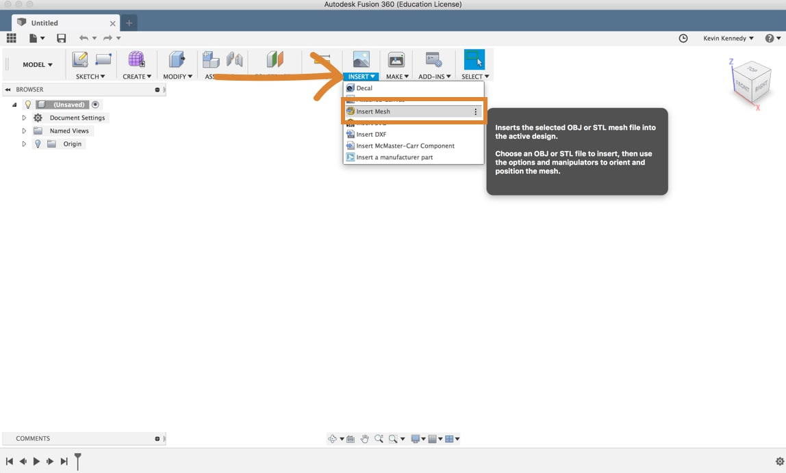

## 2. Changing Orientation of a Mesh File in Fusion 360

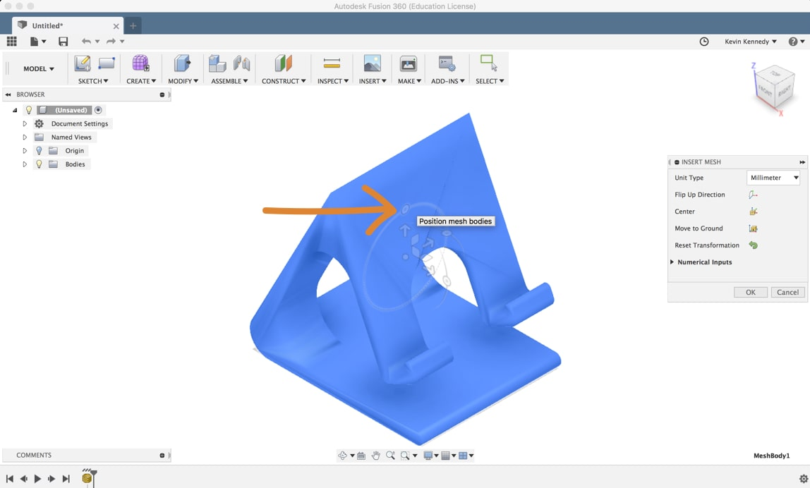

If I wanted the top of the phone stand to be the top of my orientation in the [viewcube](https://productdesignonline.com/glossary/viewcube/) Use the ViewCube to orbit your design or view the design from standard view positions. I could either drag the sliders around or I could select the “flip-up direction” in the insert mesh dialogue [box](https://productdesignonline.com/glossary/box/) Creates a solid box. Select a plane, draw a rectangle then specify the height of the box.. You can also hit “center” to move it to the center origin. If your file is floating in space for some reason, you can hit “move to ground” to move it to the XZ or XY plane, depending on how your orientation is set up. Lastly, be sure to click “okay” to confirm any orientation changes that you’ve made.

If you go to the workspaces menu and still can’t see the Mesh Workspace, it’s likely because of the design history. You’ll have to turn off the design history by right-clicking on the file in the [browser](https://productdesignonline.com/glossary/browser/) The browser lists objects in your design (everything from planes and sketches to parts and assemblies). Use the browser to make changes to objects and control visibility of objects. and select “Do Not Capture Design History” and click the continue button to confirm. Now if you go back to the workspace selection menu you’ll see that you can change to the Mesh Workspace.

At this [point](https://productdesignonline.com/glossary/point/) Creates a sketch point., I also recommend changing the visual style so it’s a bit easier to see all the triangles that make up the mesh. Under the [display settings](https://productdesignonline.com/glossary/display-settings/) Change display settings including the visual style, mesh display, environment, effects, object visibility, camera perspective, and ground planes. select “visual style,” and then select “shaded with visible edges only.” You’ll see that if you [zoom](https://productdesignonline.com/glossary/zoom/) Zooms in and out as the mouse is moved from left to right. in you can now see all of the vertices, edges, and faces that make up the mesh model (like I discussed above).

## 3. Converting the Mesh to Brep

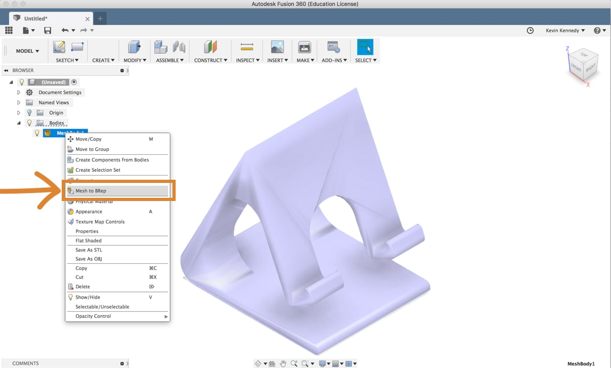

What confuses A LOT of Fusion 360 users is that you’ll actually need to be back in the [Model Workspace](https://productdesignonline.com/glossary/model-workspace/) Creates mechanical designs that contain mostly prismatic geometry. Access commands to create solid bodies. in order to convert a model. Select the Model Workspace and then to convert the mesh to a solid body all you’ll have to do is right click on the mesh and select “Mesh to BRep.” You’ll then see in the dialogue box that you can have it create a new body or a [new component](https://productdesignonline.com/glossary/new-component/) Creates a new empty component or converts existing bodies to components. When creating an empty component, enter a name and select the parent. When converting bodies, select the bodies to convert..

## 4. Too Many Facets (Triangles) Error

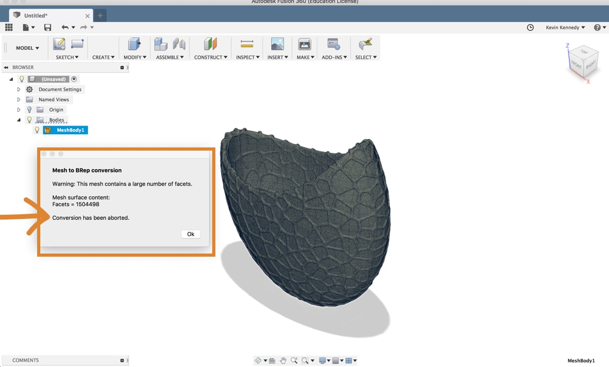

If you imported a fairly complex model then it’s likely you’ll get an error message at this point stating that there are too many facets or the number of faces for Fusion 360 to convert the model. In this pictured example here it looks like it has a little over 1.5 million faces… and Fusion 360 can really only compute approximately 50,000 facets. So before converting you’ll first have to reduce the number of facets.

To reduce the number of faces you’ll have to switch to the mesh workspace and then you can select “reduce” from the modify dropdown list. Now we’ll first have to select the mesh faces or a body. So in some scenarios, you’ll want to select only a certain area of faces and in others, we’ll want to go ahead and just select the entire body from the Fusion 360 browser. The next option you’ll see is the reduced type. Adaptive means that Fusion will adapt the surface triangles how it best fits the shapes or uniform will force them to all be uniform in shape and size. So for this complex object, I’ll leave it set to adaptive so it doesn’t totally skew the overall shape.

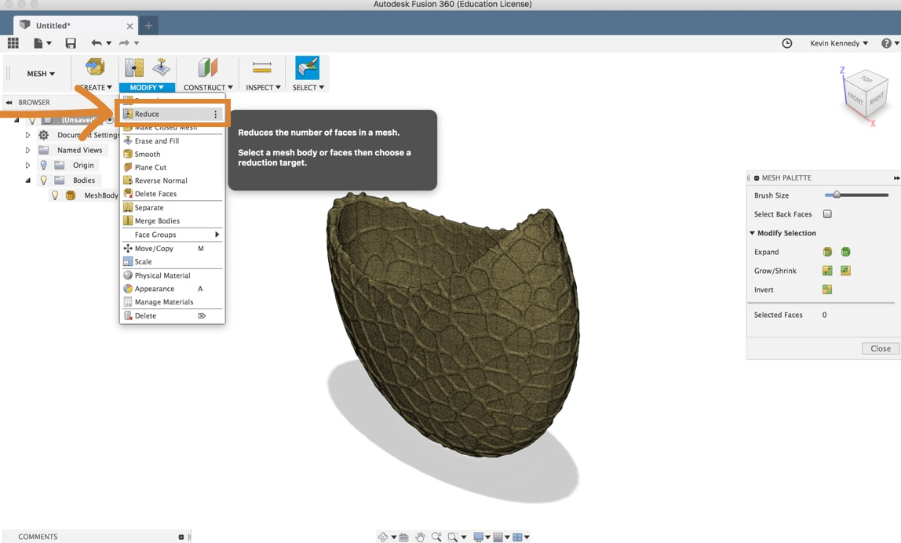

Now you’ll want to reduce the number of faces so you’ll have to select “face count” for the “reduce target.” Then, for the number of faces, you’ll have to have this under 50,000.

> *Note:* It’s a good idea to aim much lower than 50k faces as the more faces your model has, the more data Fusion 360 has to process. So your file will be much slower if you’re close to 50k faces.

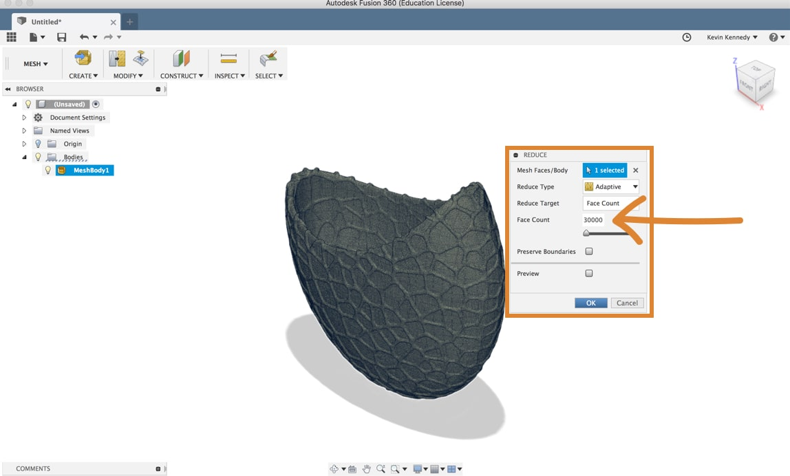

After your model has re-processed and reduced the number of faces, you’ll see that if you switch back to the model workspace you can right click on the mesh and select “Mesh to BRep.” Your model should convert at this point, but you may get another warning if there are still a lot of faces which may slow down the file quite a bit. Personally, I always recommend reducing the face count as much as you can without destroying your overall shape.

## 5. Cleaning Up Faces of an STL File in Fusion 360

Now Fusion 360 did a pretty good job of processing this file and turning it into a solid body, but you’ll see here in the picture that there are still A LOT of triangular surface faces that make up the solid body. Sometimes these faces can get in the way of altering the design to your specific needs. One thing you can do is reduce the number of faces by merging them together.

At this point, you could zoom in and select all of the faces one by one, but an easier way would be to use the [paint selection](https://productdesignonline.com/glossary/paint-selection/) (keyboard shortcut “3”) Selection by mouse down drag over targets. tool. The paint selection tool is going to allow you to click with your mouse and drag over all these faces to select them much faster. Before using the paint selection you’ll want to set the selection priority to “[select face priority](https://productdesignonline.com/glossary/select-face-priority/) Sets selection priority to faces. Click to select only faces in the model. Click again to remove priority and allow selection of all objects.” which will help ensure that you don’t select the entire component. If you go back up to the menu and look at the selection filters you’ll see that you can see that activating the “select face priority” feature turned all these other options off and only left the “body faces” turned on (which will help you select only the faces).

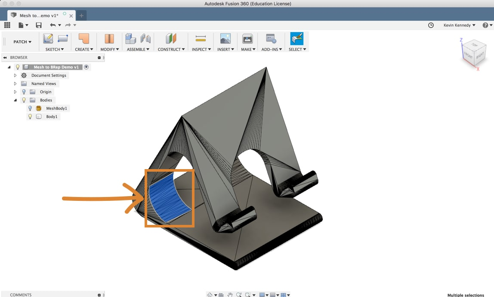

Now with the paint selection activated you can click and drag across a number of faces. If you miss any faces you’ll just hold down the shift key and select them.

Then, switch to the patch workspace and select “merge” from the modify dropdown list. And you’ll see that you can continue to select and merge faces to really clean up this solid body model so it doesn’t have so many faces.

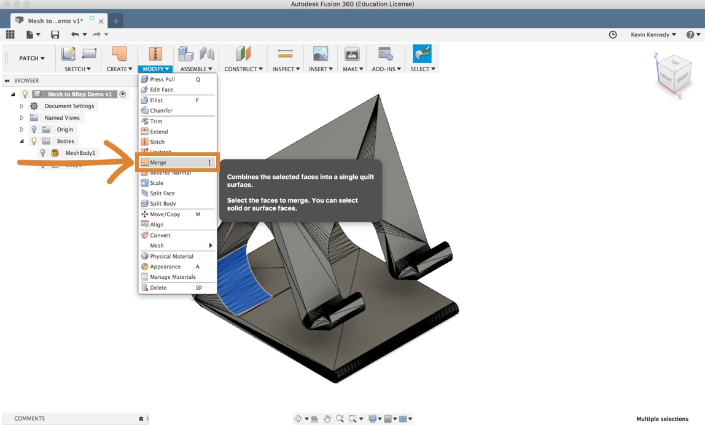

Having fewer faces will really allow you to focus on the tools in the model workspace and won’t restrict you as much as you try to modify your new solid body.

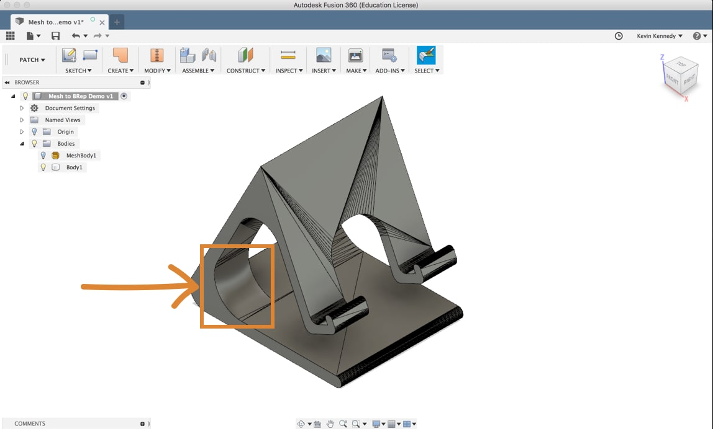

[How to Convert an .STL Mesh To a Solid Body](https://youtu.be/yO6hboYWnfM)

<iframe width="1280" height="720" src="https://www.youtube.com/embed/yO6hboYWnfM" title="How to Convert an .STL Mesh To a Solid Body - Learn Autodesk Fusion 360 in 30 Days: Day #18" frameborder="0" allow="accelerometer; autoplay; clipboard-write; encrypted-media; gyroscope; picture-in-picture; web-share" referrerpolicy="strict-origin-when-cross-origin" allowfullscreen></iframe>

# Reference

- [More STL file editing. How to customize files from Thingiverse for free using Fusion360 Step-by-step](https://youtu.be/vhlc2yJISN8)

  <iframe width="1280" height="720" src="https://www.youtube.com/embed/vhlc2yJISN8" title="More STL file editing. How to customize files from Thingiverse for free using Fusion360 Step-by-step" frameborder="0" allow="accelerometer; autoplay; clipboard-write; encrypted-media; gyroscope; picture-in-picture; web-share" referrerpolicy="strict-origin-when-cross-origin" allowfullscreen></iframe>
  
- [How to edit Thingiverse files for free using Fusion 360 Step-by-Step](https://youtu.be/BUAVAdAh65Q)

  <iframe width="1280" height="720" src="https://www.youtube.com/embed/BUAVAdAh65Q" title="How to edit Thingiverse files for free using Fusion 360 Step-by-Step" frameborder="0" allow="accelerometer; autoplay; clipboard-write; encrypted-media; gyroscope; picture-in-picture; web-share" referrerpolicy="strict-origin-when-cross-origin" allowfullscreen></iframe>
  
- [Import and Edit STL Files in Fusion 360 2024](https://youtu.be/CeMHqa9Pxn8)

  <iframe width="1280" height="720" src="https://www.youtube.com/embed/CeMHqa9Pxn8" title="Import and Edit STL Files in Fusion 360 2024" frameborder="0" allow="accelerometer; autoplay; clipboard-write; encrypted-media; gyroscope; picture-in-picture; web-share" referrerpolicy="strict-origin-when-cross-origin" allowfullscreen></iframe>
