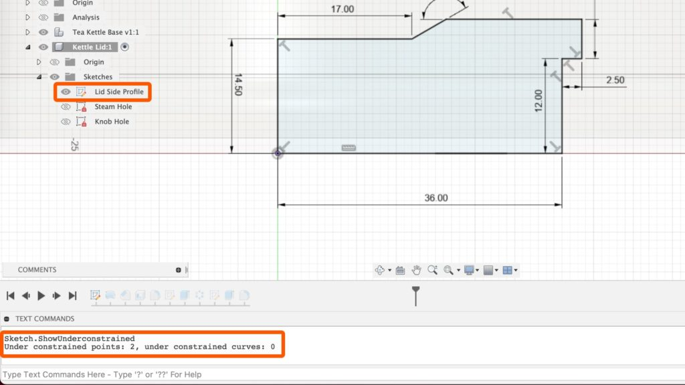

# Copy and Paste Sketches and Components in Fusion 360

[Copy and Paste Sketches and Components in Fusion 360](https://youtu.be/sCgr5WNt6RA)

<iframe width="1280" height="720" src="https://www.youtube.com/embed/sCgr5WNt6RA" title="Copy and Paste Sketches and Components in Fusion 360" frameborder="0" allow="accelerometer; autoplay; clipboard-write; encrypted-media; gyroscope; picture-in-picture; web-share" referrerpolicy="strict-origin-when-cross-origin" allowfullscreen></iframe>

# Find Unconstrained Elements in Fusion 360

- To open the command-line in Fusion 360, select **Show Text Commands** from the **View** dropdown menu. You can also use the keyboard shortcut `Option + CMD + C` on Mac OS or `ALT + CTRL + C` on Windows OS.

- Open the Text Commands pane. Then, copy/paste the following Text Command into the input of the command line:

  ```
  Sketch.ShowUnderconstrained 
  ```
  
  This text command will return a list of what’s yet to be fully defined. This is a great ‘secret’ way to figure out why your Fusion 360 sketch is yet to have the red lock icon. Remember, the red lock icon in the Fusion 360 Browser lets you know that a 2D sketch is not 100% fully defined.

  

  [Find Unconstrained Elements in Fusion 360](https://youtu.be/matqB8nGzQI)
  
  <iframe width="1280" height="720" src="https://www.youtube.com/embed/matqB8nGzQI" title="Find Unconstrained Elements in Fusion 360" frameborder="0" allow="accelerometer; autoplay; clipboard-write; encrypted-media; gyroscope; picture-in-picture; web-share" referrerpolicy="strict-origin-when-cross-origin" allowfullscreen></iframe>
  
# List of Fusion 360’s Command Line Tools

<iframe src="images/Available-tools-with-the-Fusion-360-Command-Line.pdf" width="100%" height="500" frameborder="0" />

