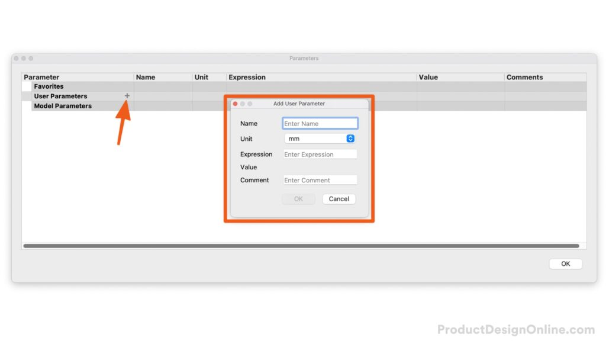
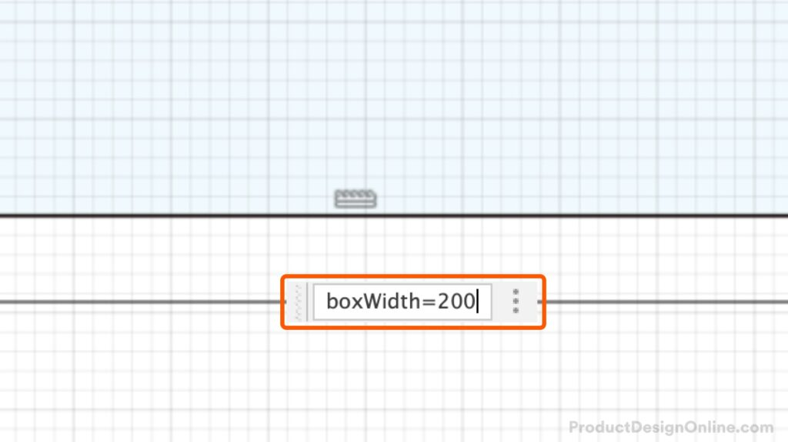

# Create New Parameters in Fusion 360

In Fusion 360, you can create user parameters at the beginning or while working on your design file.

1. Open the Parameters dialog. **Design** workspace > **Modify** > **Change Parameters**.
2. Select the plus (+) icon, loacted next to the “User Parameters” heading.
3. Define the Paramenter **Name**, **Unit**, **Expression Value**, and **Comment** (optional).
4. Click OK. You can now use the parameter value with Sketch Dimensions and Model features.

Create new user parameters in Autodesk Fusion 360.

# Create Users Parameters “On the Fly” in Fusion 360

Create parameters “on the fly” while you type values directly in the input fields. This helps you create parameters without the need to open the Change Parameters dialog. Fusion 360 automatically adds “on the fly” parameters to your favorites, so that it is easy to find in the Parameters dialog.

**Note**: Parameters created on the fly are considered “Model Parameters” and not “User Parameters.” That’s because they’re derived from the model itself.

In essence, you can use model parameters and user parameters in the same manner – calling the parameter name in both sketch dimensions and modeling features.

Define a parameter name, equal symbol, and define the parameter value without any spaces.

- Within a dimension input (Sketch or Model feature), define the parameter name.
- After the parameter name, use the equal symbol (=) and the desired value.

> **Note**: there are no spaces between the parameter name and equal symbol. You will also find that parameters created ‘on the fly’ do not show the parameter name after you save them. However, changing the original dimension will continue to update the parameter itself (and all areas you use the parameter).

# What Fusion 360 Parameters are available?

Fusion 360 user parameters are extremely powerful and allow a number of different operations, equations, and functions – or a combination of each. The following operations, equations, and functions are available to use with Fusion 360 user parameters.

## Order of Operations

| Operation                    | Symbol   | Example                                  |
|------------------------------|----------|------------------------------------------|
| Parenthesis                  | ( )      | (sin(15 deg))                            |
| Exponentiation               | ^        | width ^2                                 |
| Negation (unary subtraction) | –      | (-2.00 + length)                         |
| Multiplication or Division   | \* or /  | sin(PI/4 rad) or (0.5 \* base \* height) |
| Addition or Subtraction      | + or – | (-2.00 + height – 0.35 \* base)        |

## Mathematical Constants

| Operation | Symbol | Example       |
|-----------|--------|---------------|
| pi, π     | PI     | (100mm/2\*PI) |

## Functions

The following functions are all available in Autodesk Fusion 360 to use with User Parameters.

| Syntax            | Expected Types                                                                                                                                                 | Return Type                                                             |
|-------------------|----------------------------------------------------------------------------------------------------------------------------------------------------------------|-------------------------------------------------------------------------|
| cos(expr)         | angle                                                                                                                                                          | unitless                                                                |
| sin(expr)         | angle                                                                                                                                                          | unitless                                                                |
| tan(expr)         | angle                                                                                                                                                          | unitless                                                                |
| acos(expr)        | unitless                                                                                                                                                       | angle                                                                   |
| asin(expr)        | unitless                                                                                                                                                       | angle                                                                   |
| atan(expr)        | unitless                                                                                                                                                       | angle                                                                   |
| cosh(expr)        | angle                                                                                                                                                          | unitless                                                                |
| sinh(expr)        | angle                                                                                                                                                          | unitless                                                                |
| tanh(expr)        | angle                                                                                                                                                          | unitless                                                                |
| sqrt(expr)        | unitless                                                                                                                                                       | unit^1/2                                                                |
| sign(expr)        | unitless                                                                                                                                                       | any Return 0 if negative, 1 if positive                              |
| exp(expr)         | unitless                                                                                                                                                       | any Return exponential power. For example, returns 2.688E43 for 100. |
| floor(expr)       | unitless                                                                                                                                                       | unitless Next lowest whole number                                    |
| ceil(expr)        | unitless                                                                                                                                                       | unitless Next highest whole number                                   |
| round(expr)       | unitless                                                                                                                                                       | unitless Closest whole number                                        |
| abs(expr)         | any                                                                                                                                                            | any                                                                     |
| max(expr1;expr2)  | any                                                                                                                                                            | any                                                                     |
| min(expr1;expr2)  | any                                                                                                                                                            | any                                                                     |
| ln(expr)          | unitless                                                                                                                                                       | unitless                                                                |
| log(expr)         | unitless                                                                                                                                                       | unitless                                                                |
| pow(expr1; expr2) | any, and unitless respectively Can construct unit valid equation that can go invalid “pow(3.0; d12)”. Decimal powers round at the eighth decimal place. | unit^expr2                                                              |
| random()          | unitless                                                                                                                                                       | unitless                                                                |
# 3 Advanced Tricks with Fusion 360 User Parameters

Learn how to create minimum and maximum user parameters in Fusion 360. You’ll also learn to automate rounding up to the desired fraction, and how to create parameters “on the fly” in Fusion 360.

[The CORRECT Way: User Parameters in Fusion 360](https://youtu.be/nHsff9BRVgs)

<iframe width="1280" height="720" src="https://www.youtube.com/embed/nHsff9BRVgs" title="The CORRECT Way: User Parameters in Fusion 360" frameborder="0" allow="accelerometer; autoplay; clipboard-write; encrypted-media; gyroscope; picture-in-picture; web-share" referrerpolicy="strict-origin-when-cross-origin" allowfullscreen></iframe>

