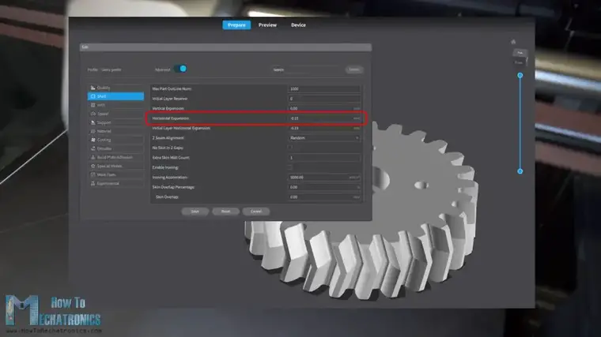

# How To 3D Print Gears – The Ultimate Guide

You can watch the following video or read the written tutorial below.

[3D Printing Gears – The Ultimate Guide](https://youtu.be/EhzCQHOy3yw)

<iframe width="1280" height="720" src="https://www.youtube.com/embed/EhzCQHOy3yw" title="3D Printing Gears – The Ultimate Guide" frameborder="0" allow="accelerometer; autoplay; clipboard-write; encrypted-media; gyroscope; picture-in-picture; web-share" referrerpolicy="strict-origin-when-cross-origin" allowfullscreen></iframe>

We will cover which type of gear is best suited for 3D printing, spur, helical or herringbone gear in terms of strength, efficiency and backlash.

How the module of the gear affects its performance, how the infill of the print affects the strength of the gear and what material is best for 3D printed gears.

I put six different materials to the tests, PLA, PLA-CF, ABS, PETG, ASA and Nylon. We will see which one is the strongest, by doing strength tests to failure.

## Spur vs Helical vs Herringbone Gears

All right, so first let’s compare the different types of gears, spur, helical and herringbone gears.

Spur gears are the simplest type of gears, featuring straight teeth mounted parallel to the gear’s axis. The teeth of helical gears, on the other hand, are set on an angle relative to the gear’s axis. Herringbone gears are a combination of two opposite helical gears with right and left helix.

In the real-world or in the industry, spur gears are usually the first choice when exploring gears option, because they are the easiest and cheapest to manufacture. Then come the helical gears as more difficult and expensive to manufacture. And lastly, the herringbone gears are the most complex and expensive to manufacture.

However, in the world of 3D printing, manufacturing or making or 3D printing any of these three types of gears is exactly same and as simple as it gets.

A 3D printer can easily print any tooth profile and layer by layer, form the gear. So, in this comparison, the manufacturing cost won’t be taken into consideration, but let’s take a look at the other advantages and disadvantages each gear type has.

Spur gears are the most efficient gear type because they have the least amount of contact surface when the gears are engaged. The contact surface is a straight line and occurs suddenly with each tееth engagement.

This sudden contact though, is the negative side of the spur gears, as it causes impact loading to the teeth. That affects the gear load capabilities and durability, as well as results in increased noise and vibration.

On the other hand, helical gears provide smoother and quieter operation, have better load carrying capacity, longer life and can be used at higher speeds. That’s so because the contact between the meshing teeth occurs gradually.

It starts as a point, and gradually becomes a line, and then lives as a point. On top of that, at any given point, they have more contact surface compared to spur gears. We can notice from this demo that three or two teeth are always engaged in the power transmission, whereas in case of spur gears, two or at some point only one tooth carries the whole load.

However, like most things in life, all these features of the helical gears come at a price, and that’s the introduction of axial force due to inclined teeth.

Depending on the helix angle which ranges from 15 to 25 degrees, a significant axial force can occur which must be taken into consideration when designing the gearing system. We can clearly notice that from this test.

As I apply radial force to the gear, an axial force occurs which tends to move the gear out of its place.

In order to avoid this axial force, there is the herringbone gear which is basically two opposite helical gears with left and right helix.

In this way the axial forces that occur cancel out, and so we have all the great features from the helical gears without any axial force acting on the gears. But then again, we get another disadvantage, and that’s difficulty in assembling the gearing system. With spur and helical gears, we can simply slide in the gears in place, and they will start meshing, even if one of them is rotating.

With herringbone gears, we cannot do that. We should first mesh the gears, and then put them in place on the shafts at the same time or insert the shafts afterwards.

## Designing Gears

Nevertheless, now let’s put the 3D printed gears to the test and see what results we will get from each type.

For designing the gears, I used Onshape. Onshape is a Professional grade CAD & PDM system, and they’re now offering up to [6 months free of the professional version to engineers and their companies](https://onshape.pro/HowtoMechatronics).

We can easily create gears with the custom FeatureScript called “Spur Gear”. We can choose the module of the gear, number of teeth, gear width, add chamfer and center bore. We can also choose the gear to be Helical and choose the Helix angle, and what orientation will be the gear, left or right.

For a herringbone gear, we just need to select the “Double Helix” option. There is also an option to add offset to the whole gear profile, which is very helpful when it comes to 3D printing.

I used my new Creality K1C 3D printer for printing all the gears for this video. When 3D printing gears, or anything else that we want to be dimensionally accurate, we need to use the Horizontal Expansion feature in our slicing software.

This feature compensates for the expansion of the filament and in my case, I used a value of -0.15mm, but you should do some test prints to see what value will suit your 3D printer.

Also, when 3D printing gears, it is particularly important to avoid the [Elephant foot effect](https://howtomechatronics.com/wp-content/uploads/2024/06/Measuring-backlash-on-3D-printed-gears.jpg). That happens when the bed leveling so not right. The nozzle is too close to the bed when printing the first layer, and so the material gets compressed and the part first couple of layers are not dimensionally accurate.

This directly affects the performance of the gears. In order to avoid this, we should adjust the bed leveling, or in the slicer adjust the Gcode offset value. Of course, we need to do some tests prints in order to find out what value will suit our printer. In my case that was a value of 0.1mm, and so the gears came out perfectly.

There is also another way to avoid the Elephant tooth effects, and that’s to print the gears with a raft underneath the part, but again you need to do test prints to find out the right settings. In case you cannot get them right, you can also chamfer the edges of the gear by hand.

## Test no.1 – Noise Level and Efficiency

Ok, so now let’s see how the gears performed. This is the first test setup. I have a 12V DC motor on which I attached a gear with 20 teeth and module of 2.5.  This gear will drive another gear with the same number of teeth, and from here we can observe two things, the noise levels the gears will produce and its efficiency. The voltage supplied to the DC motor will be the same for each gear type, and so we can track the power consumption required to run the gears and so their efficiency.

First, the spur gears produced noise levels of around 77dB, and the power consumption was from 5.36W to 5.61W. Next, the helical gears noise levels were around 75dB, and the power consumption from 5.61W to 5.85W. Lastly, the herringbone gears noise levels were around 74dB and the power consumption from 5.61W to 6.1W.

So, the results that we got match with what we talked earlier about each gear type. The spur gears used the least amount of power, which means they are the most efficient type, but also the loudest. The helical and the herringbone gears were less efficient but quieter.

## Test no.2 – Backlash

Next, for testing the backlash and strength of the gears, we will use the following setup. One gear will be fixed with 4 bolts, and the other will be able to rotate with two bearings attached to it. The gears have a module of 2.5 and they are all 3d printed with the same settings. 

First, I’m testing the backlash or how much play or gap there is between the two meshing spur gears. There was a total play in both directions of about 2.5mm at a distance of 10cm.

Next, the helical gears showed better results. There was a total play in both directions of about 1.5mm at 10cm. And at the herringbone gears there was a total play in both directions of about 1.8mm at 10cm.

Again, the results were as expected, they spur gear had greater backlash compared to the helical and the herringbone gears. 

However, I felt like these tests were too simple to make a proper comparison, so I decided to make another test setup. I made a four-stage gear reducer, with 16:1 reduction ratio, a more common scenario for gears usage.

## Test no.3 – 16:1 Speed Reducer

So, the idea here was to use a NEMA 17 stepper motor, and in four stages with 2:1 reduction ratio, make a total of 16:1 reduction ratio. The driving gears have 17 teeth, and the driven gears have 34 teeth. The module of the gears is 1.5.

The spur gears reducer had a free play of around 2.5mm on the output at a distance of 10cm. Or to be a bit more precise, I used the force meter to apply a particular amount of force on each side and capture the displacement at that point. I took a force of 5N as reference, and I will use it for the other gears type as well.

In this way, I got a total play on the bar of 4.4mm at a distance of 10cm. To express these measurements in backlash unit, arcminutes, first we can calculate the angle of displacement, alpha. We do that with the help of some simple trigonometry, and the angle comes out to be around 2.52 degrees. One arcminute is 1/60th of a degree. So, the backlash of this spur gearbox is around 151 arcminutes. 

The helical gearbox had total displacement of around 5.1mm, or translated into arcminutes, that’s 175 arcminutes. 

The herringbone gearbox had total displacement of around 4.9mm, or that’s around 168 arcminutes of backlash. 

Now these results came out opposite to the first tests. Here, the spur gears showed better backlash results than the other two types. I mean, I can tell a few reasons why that is so. We can notice how the shafts of the gearbox have a little displacement when the force is applied, because they are supported only on one side, and that affects the results.

Another thing is that there is some play between the bearings and the gears. It’s actually hard to 3D print parts that will fit perfectly with some mechanical parts. I tried adding some tape to the bearings to tighten that gab and reduce the play.

It helped; the gears got tighter but there is no guarantee they will be the same for each gear. Of course, we can make the holes for the bearings smaller and then insert the bearing into the gear with some force, but that might have a negative effect in terms of efficiency. There is no way the two bearings to be placed precisely on the same axis by using force, and that will cause more resistance when the gear rotates.

### Test no.4 – Reducer Efficiency

Anyway, for measuring the efficiencies of the gearbox, I measured how much force or torque the gearbox will produce at the same voltage level of the stepper motor.

With the spur gears, I got a maximum reading of around 32N of force. The helical gearbox maximum force reading was 28N, and for the herringbone gears, 30.4N of force. These results say that the spur gears are the most efficient type, but again, they are all too close.

## Which 3D printed gear type is stronger?

Next, for testing the strength of the gears, I’m using my Force meter to pull down a bar attached to the gear at a distance of 20cm and see when the gear will break.

The spur gear broke at 190N of force, or that’s 38Nm of torque. That’s quite a lot, but if we take a closer look at the gear, we can notice that it didn’t fail because of its tooth, rather the inside or the infill of the gear failed.

As I printed every gear with the same filament and slicing settings, I got similar results for each gear type.

The helical gear broke at 213N of force, or 42.6Nm, and the herringbone gear at 152N of force, or 30.4Nm of torque. 

So, in order to get more meaningful results and find out how really the gear type affects the strength of the gear, I had to make the gears teeth weaker. The strength of the gear is directly proportional to the width and the module of gear.  So, I 3D printed new gears with lower module of 2, and 12mm of width.

I also increased the distance from the axis of rotation to 30cm, so it will be easier for me to pull down.

Now the spur gear failed at the teeth, instead of breaking the whole gear, at a force of 116N, or 34.8Nm of torque.

We can notice here though, that the four bolts holding the fixed gear bent a little bit under the force, and so the central distance between the gears increased little bit. This caused the load contact to be at the very top of the teeth, which actually decreased the strength of teeth, but that ok, as the same scenario will be for the other gear types, and so the results will be comparable.

The helical gear failed at a force of 112N, or 34Nm of torque, which is quite similar to the spur gear. 

The herringbone gear, as expected, showed the best result in this test. It failed at a force of 120N, or 36Nm of torque.

So, the difference in strength between the three gear types is not that huge, but still it can be noticed. We can say that the herringbone gear is the strongest one.

Anyway, all three gears type are actually quite close with the results. The only difference that I could really notice between them was in the 16:1 reducer, and that’s the vibrations level.

Though, very subjectively, I could only tell this by touching the output bar when rotating at maximum speed. The spur gears had significantly higher vibration level. The helical and the herringbone gears were much smoother.

### Verdict

So, my final verdict on what’s the best gear type when it comes to 3D printing is as follows. Try to avoid spur gears, use herringbone gears whenever possible, and utilize ball bearings that can accept axial forces when using helical gears. That’s it!

## What module for 3D printed gears?

Now let’s see how the module affects the gear performance. The module of the gear defines the size of the teeth and the gear itself. Here I 3D printed gears with five different modules, from 1 to 2.5.

First to the test are the gears with module of 1, and 50 teeth. They are all herringbone gears and printed with the same settings. The gears failed at 98.3N of force, or 29.5Nm of torque. There were broken teeth on both gears.

Next are the gears with module of 1.25 and 40 teeth. I change the number of teeth so that the size of the gear change appropriately to match test rig which has fixed central distance between the gears. These gears failed at 126N of force, or 37.8Nm of torque.

The gears with module of 1.5 and 33 teeth, failed at 108N of force, or 32.4Nm of torque. Though, there was quite some displacement here on the fixed gear, and the pressure was moved to the very top of the teeth. That’s so because the bolts were already bent from the previous tests I was doing on this rig, the material strength tests that we will see later.

This rig is only for the gears with module of 1.5, as with this module I could get a central distance of 49.5mm, and with all other modules, 1, 1.25, 2 and 2.5, I could get fixed 50mm central distance by the change of the teeth number.

Next, the gears with module of 2 and 25 teeth, broke at 149N of force, or 44.7Nm of torque.

The gears with module of 2.5 and 20 teeth, failed at 121N of force or 36.3Nm of torque. Actually, here the whole gear broke instead of the teeth, because, I guess, the infill was 30% on this gear. I 3D printed another gear with 45% infill, and that one failed in similar manner, at a force of 124N.

Then I 3D printed another one, this time with 100% infill. Now it didn’t break the whole gear. It broke at the teeth, but at the exact same force of 124N.

That didn’t make sense, it should have been stronger, but the problem here I think was that I used an older spool of the same blue filament for this gear. That can make a difference depending on how old or humid the filament was when 3D printer. Also, every PLA filament brand has different strength, and even the same brand but different color makes a difference in the strength of the material. Therefore, I 3D printed another gear with 100% infill, this time with the Creality Hyper PLA filament. Now the gear broke at the teeth and at a force of 156.4N, or 47Nm of torque.

So, to sum up these tests, the bigger the module or the teeth of the gears, the stronger they are. I mean, that’s obvious and logical.

The same is for the width of the gear. If we want stronger gear, we can also increase the width of the gear.

The infill of the gear also contributes to strength of the gear. I recommend a minimum of 35% infill when 3D printing gears, and up to 100% infill if needed. Though, probably the more important setting is the wall line count, which I recommend to be 5 or more.

## What Material is Strongest for 3D Printed Gears?

Lastly, let’s find out what material is the strongest for 3D printing gears. For this test, I will use spur gears with module of 1.5.

First to the test goes PLA filament. The gears broke at a force of 116.9N, or 35Nm.

The next gear set is printed in PLA-Carbon-Fiber filament from Creality. These gears failed 111N.

Next, is ABS filament. This one failed at around 90N of force. However, it happened more gradually compared to PLA. The ABS can withstand some bending or deformation before it breaks, which is a good feature for some cases.

Then, the ASA filament gears broke at a force 120.9N. The ASA behaved like a combination of PLA and ABS, they were as strong as the PLA, even 4N stronger, but still had a little bit of bending or deformation before breaking like the ABS.

Next, the PETG filament gears failed at 87.2N of force. This one also had a little bit of deformation before breaking.

Lastly, I tried printing the gears with Nylon or PA. This material is the most difficult to print, but the Creality K1C managed to print it.

However, the results very really bed. The gears failed at a force of 66N, but I don’t think that’s the real strength of a proper Nylon filament. I had this bought like a year ago from an unknow source, it’s quite a bad one.

Overall, the results that I got from this test were quite accurate and matched with this [Filament Properties Table from Simplyfy3D](https://howtomechatronics.com/wp-content/uploads/2024/06/Two-opposite-helical-gears-forming-a-herringbone-gear.jpg).

The PLA gears had the greatest strength, but also the greatest stiffness. On the other hand, the ASA gears show the same strength as the PLA, while having lower stiffness, just like the ABS.

### Durability

Now as for the durability of the materials, I wanted to make a durability test with the 16:1 reducer setup, and see which material is the most durable for 3D printed gears, but I didn’t manage to do it.

I started doing the tests, but the gears were surprisingly good, and couldn’t fail the test even after like 1 hour of spinning, even with a significant load at the output bar. The test was too loud, and my current studio or workshop didn’t allow me to conduct this test properly, or long enough.

Anyhow, in future, I will try to make this durability test, and I will share the results in the description of this video and on the website article.

For now, you can use above mentioned table as a reference because it matched with my tests as well. I will put a link to in in the description as well.

