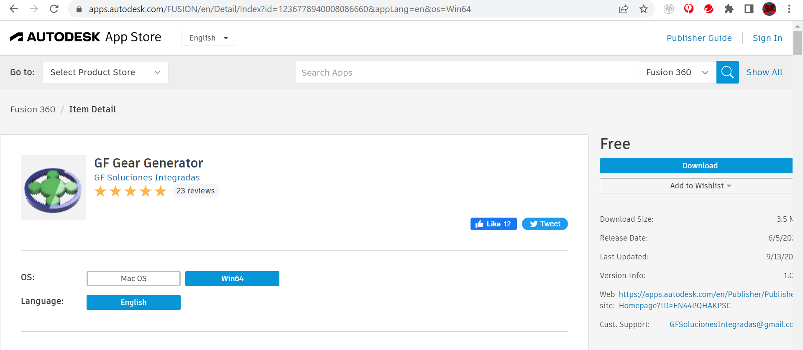
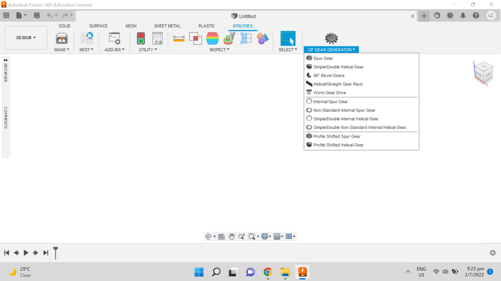
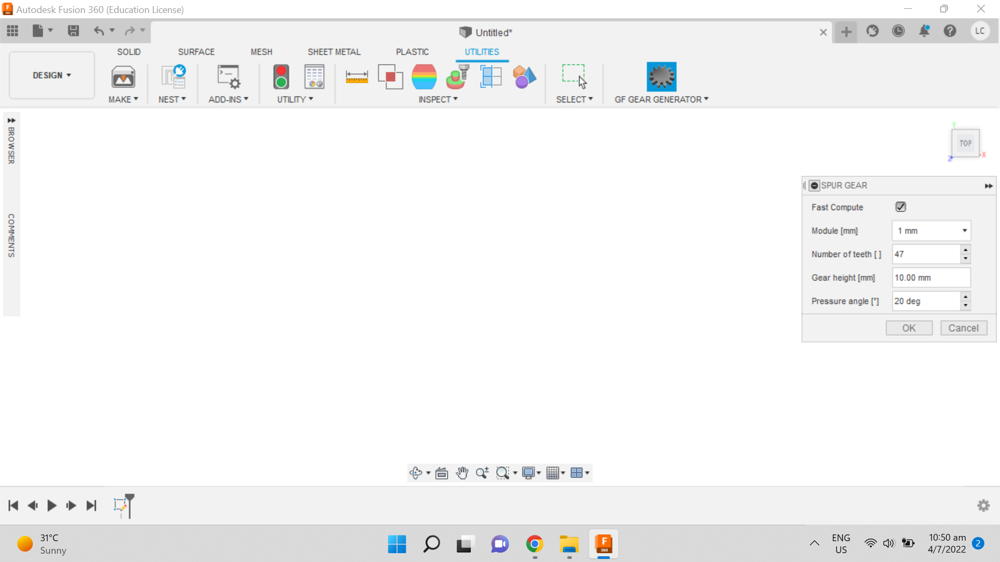
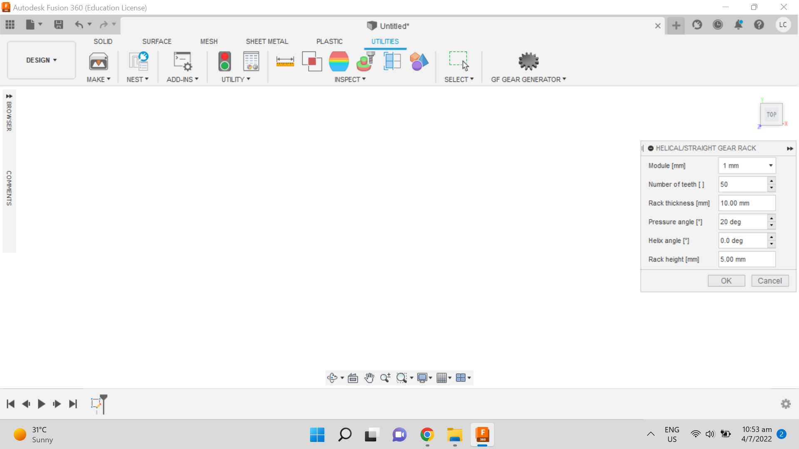
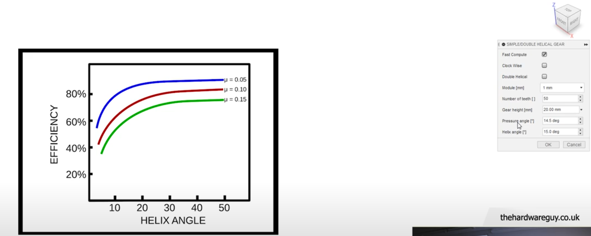
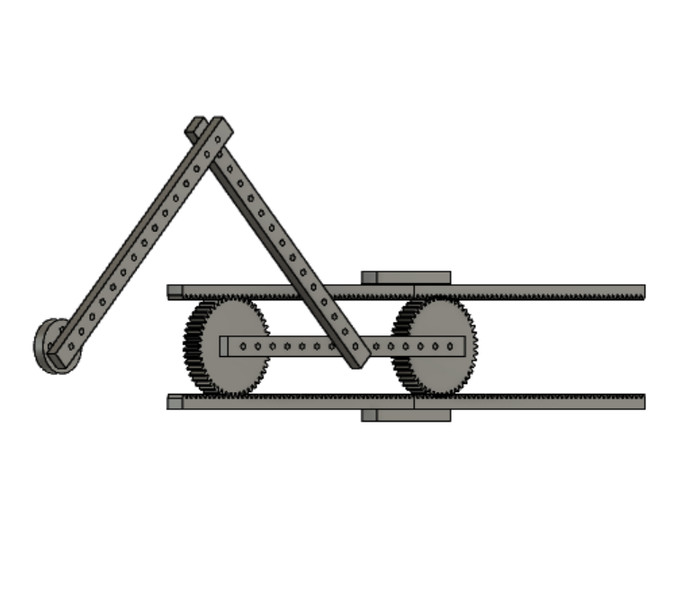

# Gear design using Fusion 360 GF Gear Generator

1. Download the Fusion 360 `GF Gear Generator` extension for Fusion 360 application from the browser.

   [](https://content.instructables.com/F20/211Q/L55BROTF/F20211QL55BROTF.png?auto=webp&frame=1&width=1024&fit=bounds&md=MjAyMi0wNy0wMyAxOTo0NzoyMS4w)

2. Open Fusion 360 application. Click on Utilities on the top of the Fusion 360 application. Select Spur Gear to make pinion gear. Select Helical / Straight Gear Rack to make rack.

   

3. Spur Gear Building

   [](https://content.instructables.com/F5A/A8V4/L55BROYL/F5AA8V4L55BROYL.png?auto=webp&frame=1&width=1024&height=1024&fit=bounds&md=MjAyMi0wNy0wMyAxOTo1MDo0OS4w)

   ```
   Select module = 1mm, Number of teeth = 47, Gear height = 10mm, Pressure angle = 20mm.
   Pitch diameter (d) = Module (m) x Number of teeth (z)
   47mm = 1mm x 47
   ```

- Helical / Straight Gear Rack Building

  [How to Create Gears in Fusion 360](https://youtu.be/MtK6yK0NRM0)
  
  <iframe width="1280" height="720" src="https://www.youtube.com/embed/MtK6yK0NRM0" title="How to Create Gears in Fusion 360" frameborder="0" allow="accelerometer; autoplay; clipboard-write; encrypted-media; gyroscope; picture-in-picture; web-share" referrerpolicy="strict-origin-when-cross-origin" allowfullscreen></iframe>

  [](https://content.instructables.com/FPE/IPHM/L55BRPCY/FPEIPHML55BRPCY.png?auto=webp&frame=1&width=1024&height=1024&fit=bounds&md=MjAyMi0wNy0wMyAxOTo1NDoyOC4w)

  ```
  Select module = 1mm, Number of teeth = 50, Rack thickness = 10mm, Pressure angle = 20mm, Rack height = 5mm.
  The overall rack height will give 72.5 mm and the overall rack length will give 156.439mm.
  ```
  
  

- Putting All Parts Together

  [](https://content.instructables.com/FPY/WUOK/L55BRPTB/FPYWUOKL55BRPTB.png?auto=webp&frame=1&fit=bounds&md=MjAyMi0wNy0wMyAxOTo1ODoxNS4w)


# Reference

- https://github.com/CenturySturgeon/GF-Gear-Generator
