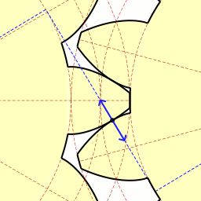

# Create Custom 3D Printable Gears in Fusion 360

[Create Custom 3D Printable Gears in Fusion 360](https://youtu.be/B8A_11o7QZ0)

<iframe width="1280" height="720" src="https://www.youtube.com/embed/B8A_11o7QZ0" title="Create Custom 3D Printable Gears in Fusion 360 | Practical Prints #1" frameborder="0" allow="accelerometer; autoplay; clipboard-write; encrypted-media; gyroscope; picture-in-picture; web-share" referrerpolicy="strict-origin-when-cross-origin" allowfullscreen></iframe>

# Overview

Each copy of Fusion 360 includes a few sample add-ins. Fortunately, one of the sample add-ins is a Spur Gear generator.

Select the `Tools tab > Scripts & Add-ins > Add-ins Tab > Scroll down` until you can see the `Spur Gear` generator. 

> Note: There are two samples. One written in C++ and one written in Python. Both work the same, so it doesn’t matter which one you choose.


Simply fill out the gear details and the add-in will automatically generate your gear.

You should be familiar with the gear terminology before 3D printing any gears. This will help you avoid common mistakes and errors that prevent the gears from working.

The following gear details are options that can be altered in Fusion 360 (Spur Gear plugin)


The dialog of Fusion 360’s Spur Gear add-in

# Parameters


- **Gear Standard**

  The standard option lets you choose from English or Metric units. This is a personal preference, but note that it will also change one of the options (as noted below).

- **Gear Pressure Angle** / **Pressure Angle**

  This is the angle between the normal of the tooth face and the pitch diameter. Teeth with larger pressure angles (more triangular) are stronger but are also less efficient at transferring torque. They are also easier to print, but in use they create larger radial loads on the supporting shafts, are more noisy and prone to backlash and slippage.

  For 3D printing a 25 deg angle is a good balance of chunkiness and efficient motion transfer on a palm sized gear.

  

  - The pressure angle of a gear tooth is the angle between the tooth face and the tangent gear wheel.
  - It is more precisely the *angle*  at a pitch point between the line of *pressure*  (which is normal to the tooth surface) and the plane tangent to the pitch surface.
  
  > Note: Module and pressure angle for a pair of gears need to be same.
  
- **Gear Module** / **Module**

  This does the same thing as diametral pitch, which is to describe the size of the teeth, but with metric units and as a ratio.  It is the number of millimeters of pitch diameter divided by the number of teeth.  
  
  > **LEGO Technic gears** have a module of 1.  So, the LEGO 24 tooth gear has a pitch diameter of 24mm.  I almost always design my gears with module instead of diaetral pitch, even though I design everything else in inches.  I have learned that the smallest consistently trouble-free teeth that I can 3D print are a module of 1. 

  
  $ \text{Pitch Diameter} = \text{Gear Module} \times \text{Number of Teeth} $
  
  $ \text{Outer Diameter} = \text{Gear Module} \times \left({\text{Number of Teeth} + 2}\right) $
  
  $ \text{Gear Module} = \left({\text{Number of Teeth} + 2}\right) \div \text{Outer Diameter} $
  
  If we have both gears assembled then
  
  $ \text{Gear Module} = \left({\text{Distance Between Axis}}\right) \div \left({\text{Number Of Teeth Of Gear1} + \text{Number Of Teeth Of Gear2}}\right) $
  
  - The gear module is the unit of size or ratio of the gear’s pitch diameter divided by the number of gear teeth.
  - The module is only available when the Standard is set to Metric.
  - this parameter approximate to tooth size, larger the value bigger the tooth
  - keep this value across the gears same, otherwise the teeth won't match
  
  > **Note** Like I said earlier, I make all of my gears using the module system of tooth sizing.  I am very happy with a module of 1mm for 3D printing.  Click the radio button under Size Type to make your choice.
  
  > Note: Module and pressure angle for a pair of gears need to be same.
  
  
  
  

- **Diametral Pitch**

  - The diametral pitch is, by definition, `the number of teeth / the pitch diameter`.
  - This option will only show up when the Standard is set to English.
  
  Diametral Pitch: This describes the size of the teeth.  The units are generally teeth per inch of pitch diameter.  The bigger this number is the smaller the teeth are.  Must be a whole number.  Common pitch sizes in radio controlled cars are 32, 48, and 64.  Both mating gears must have the same pitch.
  
- **Number of Teeth**
  
  - The number of teeth option lets you define how many teeth are placed around the gear.
  
  This is information that can be looked up in resources like the [Machinery Handbook](https://amzn.to/2Mhh3Lx).  13 is the minimum recommended for gears with a 20 deg pressure angle, and 9 is the minimum recommended for gears with a 25 deg pressure angle.
  
  One more thing to consider before picking the tooth count: *Prime numbers & factorization.*

  The 15 and 30 tooth gear pair are both divisible by 15 so the same teeth will meet up over and over again causing concentrated wear points.

  A better solution is to make the pair have 15 & 31 teeth.

  While this doesn’t produce exactly the same ratio, it will provide a consistent wear on the gear set. Grime and imperfections in the teeth will spread across the whole gear rather and distribute the wear.

  Also, it’s a good rule of thumb to keep the tooth ratio between be between 0.2 and 5.  If you need even more mechanical advantage it may be better to add an additional gear stack into the system, else you end up with a 1000 tooth monstrosity.

- **Backlash / clearance**

  This is how much a gear can rotate when the other gear is being held still.  If there is no backlash there will be excessive friction.  Backlash is important in 3D printed gears, because it is difficult to control if the parts are slightly oversized or undersized.  My 3D printer almost always makes my gear teeth just a hair too big, and I compensate by adjusting my backlash.

  - The Backlash option lets you define a clearance between teeth of the mating gear. This is critical to let the gears mesh without binding the gears.
  - The clearance prevents overheating and tooth damage. It also provides space or lubricating oil or grease to be applied between the teeth.
  - You will want to use a backlash if you’re planning on 3D printing the gears. I’ve found that `.15mm` works well, as that gives a total clearance of `.3mm` (when applied to both gears).
  
- **Root Fillet Radius**

  - The root fillet radius is the curvature between the tooth surface and the tooth root.
  - Your root fillet radius must not surpass the maximum value. You will get a warning message at the bottom of the dialog if your value is higher than allowed.
  - You will have to be cautious even when your root fillet radius does not surpass the maximum. **Too large of a radius will produce an undercut.**
  - An undercut will prevent the gear teeth from correctly meshing with each other.
  
- **Gear Thickness**

  - The gear thickness represents the extruded height of the gear. 
  - Thankfully, the height can still be altered after using the Spur Gear generator. Simply select the top face of the `gear > right-click > select “press pull” > drag or type out the desired dimensions`.
  
- **Hole Diameter**

  - The hole diameter is also straightforward. The value entered will determine the diameter of the hole.
  - It’s important to note, the hole size can be set to zero. This will omit the creation of the hole when the gear is generated. You can then create a hole with the hole command, which provides more options and makes it easier to alter later on.
  
- **Pitch Diameter**

  - The pitch diameter, which is read-only, is the diameter of the gear used for spacing the gears. This can be seen in the diagram within the Spur Gear dialog. 
  - It’s important to note, this is not the same as the outside diameter of the gear.
  
  This is the diameter of your gears if the gear teeth were infinitely small.  In other words, if your gears were perfect cylinders with perfect friction on each other, the diameter of these cylinders would be the pitch diameter.  
  
  
  
- **Center Distance** 

  Half of the pitch diameter of the first gear plus half of the pitch diameter of the second gear would give you the distance from the center of one gear to the other.  If you have two shafts, and you want to connect them with gears, the center distance is how far apart those shafts will be.
  
- **Outside Diameter**

  This is the diameter of the circle that makes up the tops of the teeth.  It isn't important in any of our calculations, but it is important if our gears are going to fit into a housing.

- **Pinion** 

  This is the name of the smaller of two mating gears.  The other one is just called the gear.
  
- **Involute**
  
  An involute shape is a part of a spiral.  Why is this important?  Because the sides of the teeth are actually not flat, like you might imagine, but rather curved in an involute shape.  This is a difficult shape to manually draw in a computer aided drafting program, but Inventor will take care of this for us.

  [](https://upload.wikimedia.org/wikipedia/commons/8/88/Animated_involute_of_circle.gif)

  It's not obvious, but if the sides of the teeth were flat, they would CLACK against each other when their faces met, and the tips of the faces would drag across the mating faces, causing excessive friction.  The beautiful thing about the involute shape as a tooth surface is that it causes the mating teeth faces to "roll" on each other instead of sliding.  This is absolutely critical in an actual working gear for mostly silent, nearly friction free operation.

  [](https://upload.wikimedia.org/wikipedia/commons/c/c2/Involute_wheel.gif)


- **Pressure Angle**

  This describes the angle that the teeth surfaces press against each other at.  There are two common options, 14.5 and 20.  I have always used 20°.  Mating gears should have the same pressure angle.

- **Helix Angle**

  Some gear teeth are not parallel to the axis of rotation, but rather wrap around the gear diameter at an angle, sort of like a slight spiral.

  [](https://upload.wikimedia.org/wikipedia/commons/e/ed/Anim_engrenages_helicoidaux.gif)

  The benefit of this is that it causes much less noise and friction.  Almost all automotive gears are helical these days, except for the reverse gear in manual transmissions, which is straight cut, and is why your gears sound like they are "whining" in reverse.  The drawback is that the gears want to "unscrew" from each other, which makes them push in opposite directions along their axis of rotation.  This makes it so that you need thrust bearings to keep them in place.  In 3D printed applications this is generally impractical. It is possible to put two opposite-angled helical gears together to form a single gear, which is called a herringbone gear. 

- **Herringbone**

  [.jpg)](https://upload.wikimedia.org/wikipedia/commons/0/0f/Herringbone_gears_(Bentley%2C_Sketches_of_Engine_and_Machine_Details).jpg)

  It has all of the benefits of a helical gear but none of the drawbacks.  They are very difficult and expensive to machine, but just as easy to 3D print as any other kind.  They have the additional benefit of keeping the gears aligned with each other, which can often be used to simplify other parts of the gear train design.

# Shaft Mounting Methods

- **Press Fit on Knurled Shaft**:  The easiest method to do but is not seen very often. Watch out for plastic creep which will reduce the torque capacity over time. Cannot be disassembled.

- **Set Screw on Shaft with Flat**: A setscrew is driven through the gear to contact a flat spot machined on the shaft. The set screw is usually threaded into the plastic gear directly or through a nut that is trapped inside the gear via a square hole. Each method has its own risks.

  Directly threading into the plastic runs the risk of stripping the delicate plastic threads. The nut trapping method solves this problem but if not done properly the hub breaks when you apply enough force to secure the shaft with the set screw. Make the hub Beefy!

- **Recessed Hex**– a hexagonal well which traps a hexagonal nut or the head of a hex-head bolt. Make sure to print lots of solid layers around the hex so that a mounted bolt cant strip through the plastic. Ive successfukky used set screws to secure nuts in place to prevent spinout at high torques.

- **Key & Keyway**– Not often seen in the hobby 3d printing world, but is the standard for metal sprockets.

  

# Special Tips by Gear Type

- **Helical & Herringbones (double helical)**
  
  Usually seen on printer extruders, these are annoying to use, but have their merits. They are useful for their ability to increase contact ratio,  self-center, and self-retain. (Self-retaining is the annoying property because it makes installation more work.) This type of gear also can’t be easily manufactured with conventional machining equipment like a gear hobbing machine. 3D printing is by far the easiest way to make them.

- **Worm & Worm gear**

  These can be difficult to 3D model so its very tempting to use a ger template for these. My tip here is that the gear ratio between the worm gear and worm is the number of teeth on the gear divided by the number of flutes in the worm. (Count flutes by looking at the end of the worm and see how many spirals start. Most have 1 to 3 spirals.)

- **Rack & Pinion**

  Converts rotary motion into linear motion & vice versa. Rather than rotations, the gear ratio determines the linear distance traveled by the rack with each rotation of the pinion. The tip here is that you can calculate the gear teeth per inch (tpi) of a rack all you do is multiple PI times the pitch diameter of the mating pinion gear. (Alternatively multiplying number of pinion teeth times circular pitch produces the same result.)

  


# Avoiding Undercut in Gear Teeth

- Undercutting is removing some material from the base of the gear tooth to avoid interference.
- Interference in gears causes material wear and removal during operation, so you can intentionally remove material by undercutting before the gear is used.
- Always make sure you have enough gear teeth. For gears with a 20-degree pressure angle, the minimum amount of recommended teeth is 13. For gears with a 25-degree pressure angle, the minimum amount of recommended teeth is 9.
- Fewer teeth are not recommended because it would produce undercut, which weakens the teeth. This will also make it harder to 3D Print gears that mesh without problems.
- To avoid undercutting you can increase the number of gear teeth or (sometimes) increase the thickness of the tooth.
- I recommend checking out the  [Machinery’s Handbook](https://amzn.to/30gTf1q)  if you have a lot of gear projects (or movable 3D Printing parts). The book has been dubbed the “holy grail” for Engineers and Machinist. There is so much valuable info that applies to not only gears, but clearances, threads, and more.

# 3 Rules When Creating Gears for 3D Printing

1. Never have fewer than 13 teeth on your smallest gear, or you’ll likely end up with an undercut on the gear teeth that will prevent proper rotation.
   
   The general rule is that you shouldn't have a spur gear with less than 12 or 14 teeth. If you try to make something with less teeth than that the motion is just too rough. 
   
   If you need to fit a big gear reduction into a small space then you need to lower the module - this will help you make a smaller pinion while still having enough teeth on it. 
   
   I think if you increase your pinion to 12 or 14 teeth you might find that it's quieter. 
   
2. Always include a backlash or tolerance or clearance, based on your 3D printers’ setup. You’ll likely need to print a few test gears to dial in the optimal tolerance.
3. Always consider the thickness and width of your gears, which greatly impacts the strength of the gear. When possible, consider adding a backing to strengthen the gear teeth.

# Figuring out the gear teethes


example we want around 40mm between our two gears. (see picture showing the PCD of both gears)

The calculation for the size of a spur gear is: $Module \times number of teeth = PCD (Pitch Circle Diameter)$

So, if we want 40mm between our 2 gear axles, we could either:

- Give both gears `20` teeth with a module of `2mm`,
- or what I ended up with; `24` Teeth on the SunShine-Gear, and `16` on the Lid-Gear, both with a module of `2mm`.

> **Note:** In my experience **a module of `2mm` is the smallest you can print easily and reliably** on common household 3d-printers.

- Another important parameter for print in place designs is the Backlash! **We will ad 0.6mm to get 0.3 mm of clearance when printing.**

we could do the easy thing and use the “_spur gear script_” that is included in fusion 360!

`(*Tools*>*Add-ins*>*Scripts and add-ins*>*Spur Gear*>*Run*)`

With this you can easily create spur gears very quickly! (If you would rather like to create Helical gears like I used in my design, you can download the [“helical gear creation” plugin here](https://apps.autodesk.com/FUSION/en/Detail/Index?id=9029586664984391977) created by community member Ross Korsky.)


# List of good Gear config for 3d print

- To get this Gear
  
  

  ```
  Pressure Angle = 14 1/2;
  Number of Teeth = 24;
  Pitch Diameter = 1"
  ```
  
- To get this Gear

  
  
  |||
  |----------------------------------------------------------------------------------------------------------------------------------------------------|----------------------------------------------------------------------------------------------------------------------------------------------------|
  |Big Gear|Small Gear|

- To get this Gear

  

  Now we can create gears. Create a spur gear under the “Create” tab. Set the “Standard” to metric. Set the Module to 7, Number of Teeth to 12, Backlash to 3 mm, Root Fillet Radius to 3 mm, hole diameter to 17mm, and leave the rest the same. Click “OK” and the gear should pop up.


- To get this Gear

  

  Module and Number of Teeth. If we want to create a set of gears that match one and the others, the module of them must match. 
  
  The number of teeth determine the rotation speed of a gear in a gear set. 
  
  I choose module "1" to create relatively small gears and number of teeth to be "20" and "40" to reduce the rotation speed of the legs to a half. 

# Reference

- [Learn how to create custom 3D Printable spur gears in Fusion 360](https://youtu.be/B8A_11o7QZ0)
- [3D Printed PLA Gear](https://www.youtube.com/watch?v=vuJmWKsCYcU)


