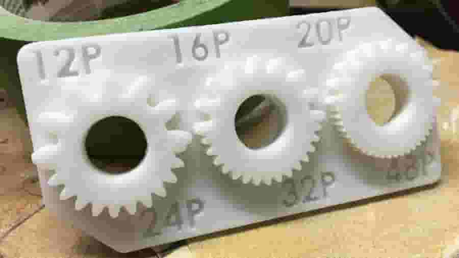
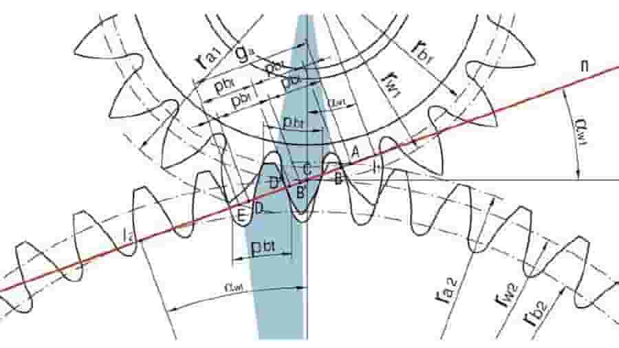
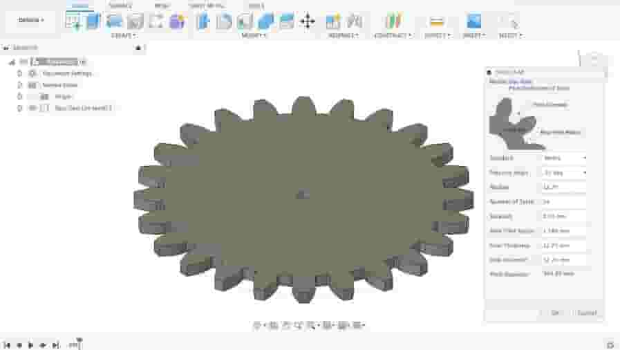
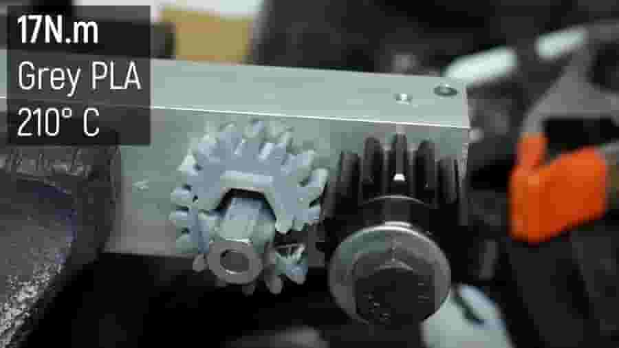
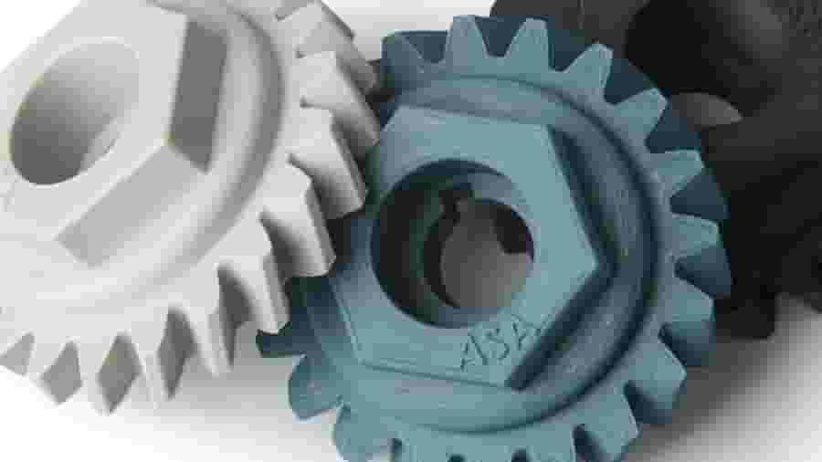
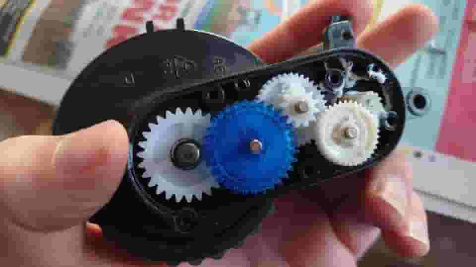

# Tips

# Tip 1: Plan Ahead

You can check how small your teeth can go by test printing some designs (Source: [dpechter via Thingiverse](https://www.thingiverse.com/thing:3211633))

In order to successfully make 3D printed gears from scratch, planning and testing are strongly advised.

First, you’ll need to define your goals. Where will these parts be installed? Will they be used for a short or long time? For part replacement, what materials were used for the original parts? All these aspects will affect both design and material choices further on and should be considered from the beginning.

## **Test Your Printer**

It’s very important to know your 3D printer’s limits with regard to tooth size. This [gear test print](https://www.thingiverse.com/thing:3211633) is a great starting point. Check for accuracy and remember to use the same material that you plan to use for the final gears.

## **Size Matters**

Once you know how small you can go, you should also figure out how big you can go. Larger gears allow larger teeth at the same ratio. Larger teeth are also stronger, can better handle tolerance errors, and are easier to post-process.

On that note, be aware of the face width, which is the “height” of a gear if it were laid flat on a table. Often defined using various [rules of thumb](https://www.geartechnology.com/blog/what-about-face-width/), the width relates directly to gear strength and should therefore be well considered.

## **Shaft Coupling**

Lastly, consider the shaft coupling. This is how the gears will be attached to whatever shaft you’ll use. This interface plays a major role in transferring motion and is very likely to be a point of failure in your design, since shafts are usually made from metal, especially in motors.

A non-round coupling, like a hexagon, is a good alternative, along with using ball bearings and other device mounts.

[gear_test_print_assy3.STL](resource/gear_test_print_assy3.STL)

# Tip 2: Design

The tooth profile of a spur gear is made from involutes of circles (Source: [Željko Kanović via Research Gate](https://www.researchgate.net/figure/Geometry-of-involute-HCR-gearing-10_fig2_272054201))

3D printed gears are easy to prototype, but well-functioning ones heavily depend on some key parameters. Modern gear design is a 100-year-old discipline that involves a lot of physics. And while there are plenty of gear systems, the [involute spur gear](https://en.wikipedia.org/wiki/Involute_gear) is by far the most common.

When designing a classic gear, important parameters include pitch diameters, pressure angles, face widths, center distances, modules – the list goes on. While we won’t be getting into fine details here, there are plenty of [online sources](design-gear-tips-tricks-readme/back-to-basics.pdf) and interactive tools out there.

Nevertheless, the most basic principle in involute gear design is that the mating surface between two teeth occurs at a single point. And this is only possible using a particular tooth profile made from involutes of a circle, hence the name.

You can easily make gear models with a Fusion 360 add-in (Source: Lucas Carolo via All3DP)
Designing a gear from scratch will require spending some time learning gear parameters and using tools like [Gear Generator](https://geargenerator.com/). This website creates spur gears based on dimensions inputted by the user. These details include the number of teeth, pitch diameter, diametral pitch, and pressure angle. Since these terms are a little specific, you’ll need some knowledge of gears to use Gear Generator successfully. However, if one parameter is changed, all of the related dimensions will be altered proportionally by the website, so a functioning gear will be produced no matter what. After gears are designed in Gear Generator, they can be downloaded as a DXF or SVG file.

Gear Generator is not the only convenient option you can use to help you generate gears. [Fusion 360](https://all3dp.com/topic/fusion-360/) has a Spur Gear add-in available, which requires knowing a few design parameters in addition to the ones mentioned for Gear Generator. Values for module, backlash, and root fillet radius are required, making the Spur Gear add-in versatile but a little more demanding to create gears with.

If you’re a beginner, Tinkercad can also be a worthwhile option. You can use the program to create spur gears, which are available in the Shapes Library. This is the simplest option we’ve mentioned, and considerably fewer parameters are required to create gears. Just keep in mind that testing may be needed to ensure that the product works properly, since the results are generally less precise. Otherwise, simple gear designs for new projects can be sourced through online repositories like [McMaster Carr](https://www.mcmaster.com/products/gears/), [3DContentCentral](https://www.3dcontentcentral.com/), and [GrabCAD](https://grabcad.com/library).

For those looking for replacement parts, Stephan from the [CNC Kitchen](https://www.youtube.com/channel/UCiczXOhGpvoQGhOL16EZiTg) YouTube channel has a video that covers [how to design a replacement gear](https://www.youtube.com/watch?v=vuJmWKsCYcU) using reverse engineering and a Fusion 360 add-in.

# Tip 3: Materials

3D printed gears can't stand the same loads as metallic or injection-molded gears (Source: [Maker's Muse via YouTube](https://www.youtube.com/watch?v=UtRJ4lnNAXY&amp;t=3s))

Let’s face it: 3D printed gears will never be as strong or durable as injection-molded or machined parts. However, considering the wide variety of plastics available for 3D printing, there are a lot of applications for which 3D printing can be adequate or even excel in functionality.

In terms of durability, [nylon](https://all3dp.com/2/nylon-3d-printing-how-to-get-nylon-3d-printed/) is the first choice, especially for operation without lubrication. Although relatively difficult to 3D print, nylon has the strength and flexibility required to make long-lasting plastic gears. You can check out our [nylon filament guide](https://all3dp.com/2/nylon-filament-pa-basics-best-brands/) for more info on printing settings and the best brands.

To cut the hassle, more common 3D printing materials, like PLA+ ABS, or PETG can also be good choices. These are recommended over the more popular PLA, a brittle material that snaps easily under stress. [PLA+](https://all3dp.com/2/pla-vs-pla-3d-printer-filament-compared/) is recommended because it offers improved toughness and flexibility, as well as can be used for functional parts. PLA+ parts tend to provide more flex and withstand pressure better than traditional PLA, making them preferable for 3D printing gears.

In fact, Angus from the [Maker’s Muse](https://www.youtube.com/channel/UCxQbYGpbdrh-b2ND-AfIybg) YouTube channel [tested several materials](https://www.youtube.com/watch?v=UtRJ4lnNAXY) for gear strength. His results showed a surprising lead by the PLA+ materials, especially [BASF Ultrafuse PLA Pro 1](https://www.ultrafusefff.com/product-category/innopro/pro1/). However, be aware that the static tests performed can’t evaluate durability. Although it didn’t exhibit results as good as PLA+ in Angus’s tests, [PETG](https://all3dp.com/2/petg-vs-pla-3d-printing-filaments-compared/#i-5-mechanical-properties) is a better option than PLA, as it will not snap as easily under pressure and it has good resistance to heat produced by friction.

# Tip 4: 3D Printing

The right 3D printing settings can guarantee strong and easy-to-assemble gears (Source: [Fillamentum via Plastic Portal](https://www.plasticportal.eu/en/podla-cinnosti/fillamentum-manufacturing-czech-sro/f/971/))

Finally, it’s time to materialize your gears. Here are a few things to consider with regard to 3D printing:

- **Orientation:** Print gears face-down. The way layers are deposited in this [orientation](https://all3dp.com/2/3d-print-orientation-troubleshooting/) will make the teeth stronger.
- **Part cooling:** Especially in the case of PETG, turning on the part cooling fan can actually weaken 3D prints. Turning it off allows layers to melt together and increases strength on the Z-axis.
- **Level bed:** Make sure to have a [perfectly leveled bed](https://all3dp.com/2/3d-printer-bed-leveling-step-by-step-tutorial/). When printing gears face-down, any unevenness in the bed will create distortions likely to affect functionality.
- **First layer height: **Adjusting the initial layer height is another way to improve the accuracy of parts. Increasing the initial layer height one step higher, for example to 0.25 mm for a 0.2 mm layer height, can reduce [elephant’s foot](https://all3dp.com/2/elephant-s-foot-3d-printing-problem-easy-fixes/) and improve functionality. If the nozzle is too close to the bed, the first layer will come out squished and generate deviations on the teeth that won’t allow for proper mating. Alternatively, consider using [rafts](https://all3dp.com/2/3d-printing-raft-when-should-you-use-it/).
- **Layer height:** Even though stress is put on the XY-axes (assuming the gear is printed face-down), [layer height](https://all3dp.com/2/3d-printer-layer-height-how-much-does-it-matter/) can still affect the overall strength of the part. Lower layer heights, such as 0.1 to 0.15 mm, will make for a stronger, more homogeneous structure.
- **Hot end temperature:** A higher hot end temperature will improve layer adhesion, similarly to how reducing the speed of the part cooling fan does. 210-220 °C is a good starting point for PLA, and 230-250 °C is good for PETG, although it’s important to consider that different brands have different recommended manufacturer settings.

Increasing the infill will make your gears stronger (Source: [andrew_whites via Reddit](https://www.reddit.com/r/3Dprinting/comments/mvoyzy/help_with_making_stronger_gears/))
- **Infill:** As one of the most important settings for printing gears, the right [infill](https://all3dp.com/2/infill-3d-printing-what-it-means-and-how-to-use-it/) will greatly improve part strength and potentially save a lot of frustration. It’s recommended to increase the percentage to 50-100% and to use cubic, [gyroid](https://all3dp.com/2/cura-gyroid-infill/), or some other [strong infill pattern](https://all3dp.com/2/strongest-infill-pattern/).
- **Print anomalies:** Eliminate [blobs](https://all3dp.com/2/3d-print-zits-tips-tricks-to-avoid-blobs/), [stringing](https://all3dp.com/2/3d-print-stringing-easy-ways-to-prevent-it/), and [over-extrusion](https://all3dp.com/2/over-extrusion-3d-printing-tips-and-tricks-to-solve-it/). These defects in the surfaces of teeth will cause the gears to mesh improperly.
- **Other slicer settings:** Choose [settings](https://all3dp.com/2/3d-slicer-settings-3d-printer/) that favor [part strength](https://all3dp.com/2/3d-printing-strength-strongest-infill/). For instance, higher [nozzle temperatures](https://all3dp.com/2/the-best-printing-temperature-for-different-filaments/) will make layers bond better.
- **Post-processing:** 3D printed gears will often require some [post-processing](https://all3dp.com/2/fdm-3d-printing-post-processing-an-overview-for-beginners/) to get them cleaned up and ready for use. You may need to use a knife to clean up the teeth, and it’s a good idea to sand parts with a file or sandpaper to remove inaccuracies and small defects.
- **Annealing:** While not a setting you can change in your slicer, annealing is a post-processing technique that can make 3D prints function more like injection-molded parts. By melting the plastic again, it’s possible to make a part more homogeneous and have uniform strength across all axes. This is especially effective for PETG, though it can make PLA+ parts more brittle.

Most of the tips above relate to the overall printer’s calibration. For detailed instruction on that subject, be sure to check out our [3D printer calibration guide](https://all3dp.com/2/how-to-calibrate-a-3d-printer-simply-explained/).

