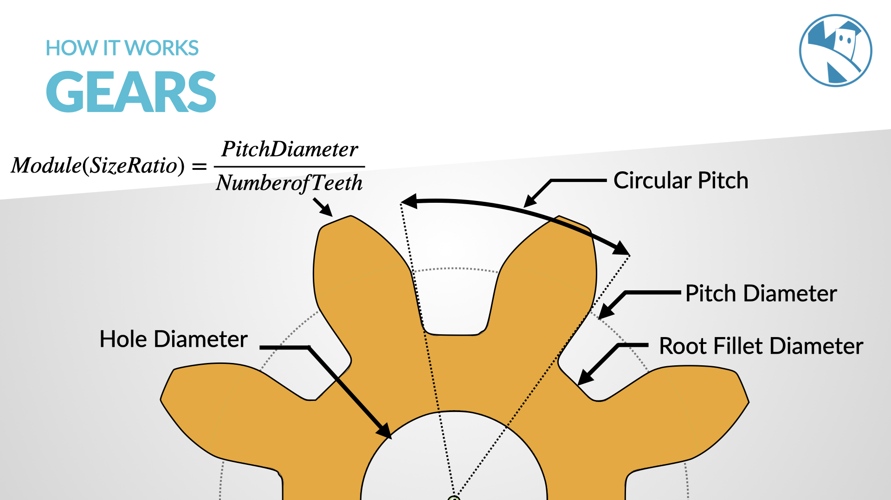
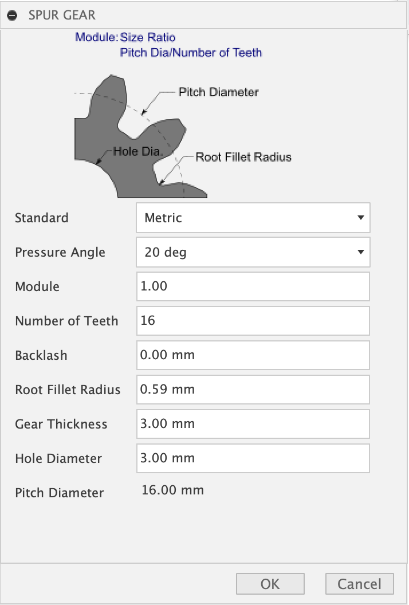

# Gears

`Gears` are among the oldest and most commonly used tools in the mechanical world. They transform energy from one device to another, adjust speed, and increase torque.

This article aims to demystify gears, gear ratios, key terms, and provide insights into designing them using Fusion 360.

# Gears: An Overview

A `gear` is a circular tool with `teeth` that meshes with another gear to transmit [`torque`](https://www.kevsrobots.com/resources/glossary#torque). Depending on their construction and positioning, gears can increase speed, torque, or change the direction of the driving force.

# Gear Ratios: What are they and how to calculate them?

The gear ratio is the relationship between the number of teeth on two gears that are meshed or connected. It determines the mechanical advantage of the system.

## Calculation

If Gear A has `A` teeth and is driving Gear B with `B` teeth, the gear ratio `R` is given by:

`R = B / A`

or written more Pythonically:

```
gear_ratio = gear_a / gear_b
```

For example, if Gear A has 10 teeth and Gear B has 20 teeth, the gear ratio is 2:1. This means Gear B will turn half as fast as Gear A, but with double the torque.

# Key Gear Terms

| Term                             | Description                                                                                                                                                                                          |
|----------------------------------|------------------------------------------------------------------------------------------------------------------------------------------------------------------------------------------------------|
| `Pitch Diameter`                 | The diameter of the circle on which the gear teeth are imagined to roll. It sits between the outer and root diameter. The pitch diameter determines how gears of different sizes will mesh together. |
| `Root Diameter (or Base Circle)` | The diameter of the circle that represents the base of the gear teeth.                                                                                                                               |
| `Circular Pitch`                 | The distance from one gear tooth to the next, measured along the pitch circle.                                                                                                                       |
| `Module`                         | A parameter that signifies the size of the gear tooth. It’s the ratio of the pitch diameter to the number of teeth.                                                                                |
| `Pressure Angle`                 | The angle between the line of action (how forces are transmitted between gears) and the tangent to the pitch circle. Common values are 14.5° and 20°.                                              |



# Designing Gears with Fusion 360

Fusion 360, an integrated CAD, CAM, and CAE software, is versatile in gear design. Here’s a basic walkthrough:

1. **Creating the Base Circle**: Start a new sketch. Using the Circle tool, draw the base circle which will represent the root diameter.
2. **Drawing the Gear Teeth**: Based on your module and desired number of teeth, calculate the pitch diameter. Use this to determine the height and width of each tooth. Use the Line and Arc tools to sketch out the profile of a gear tooth.
3. **Circular Pattern Tool**: Instead of drawing each tooth individually, use the Circular Pattern tool. Select the gear tooth profile and choose the center of the base circle as the rotation center. Specify the number of instances as the number of teeth you want.
4. **Extrusion**: Once satisfied with the 2D sketch, use the Extrude tool to give your gear depth.

	`Fillet`: Apply fillets to the gear teeth to smooth out sharp edges.
5. **Fine-Tuning and Assembly**: Once your gear is created, you can duplicate and adjust to create meshing gears. Make sure to consider gear ratios and positioning.
6. **Motion Study**: Fusion 360 allows you to study the motion of your gear assembly. Ensure they mesh well, without interference.

# Fusion Spur Gear ScriptFusion 360 also has a Utility script for creating Spur gears - to access this:

1. Click on the `Utilities` Menu, then `Add-Ins` -> `Scripts and Add-ins...`2. Scroll down to `Spurgear` and then click `Run`3. Enter the values then click `Done`

# Conclusion

Gears are fundamental in machines ranging from wristwatches to industrial mills. Understanding their basics, the intricacies of gear ratios, and leveraging tools like Fusion 360 can be incredibly empowering for designers and engineers alike. Whether you’re designing a simple two-gear system or a complex gearbox, this foundational knowledge will guide you through the process.


