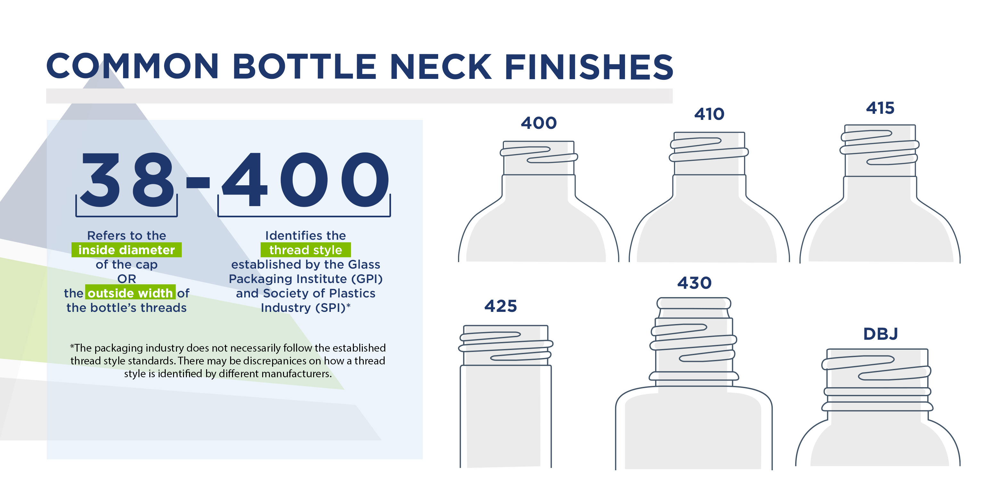
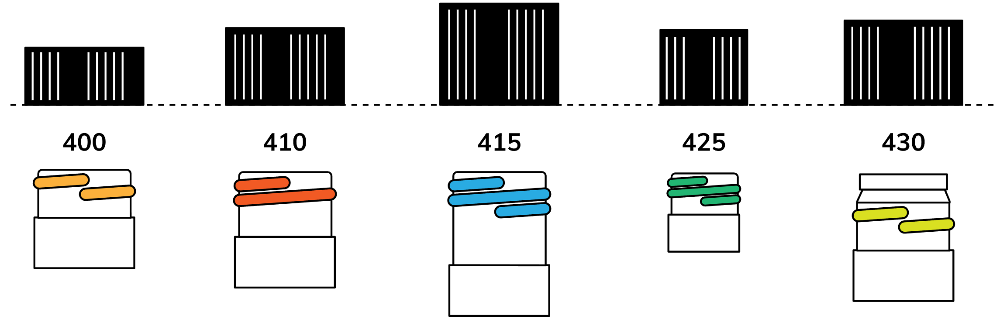
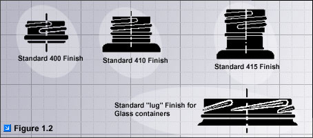
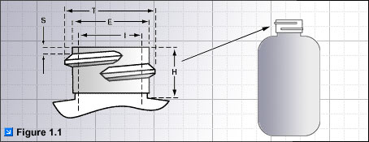
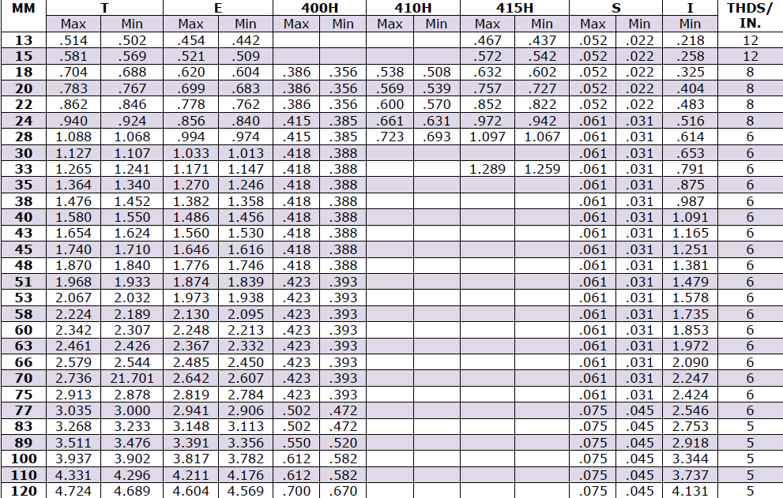
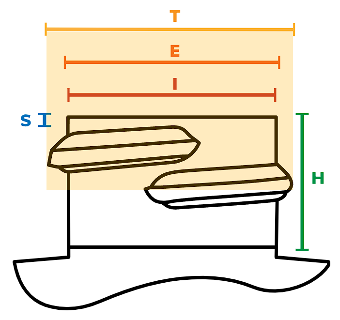
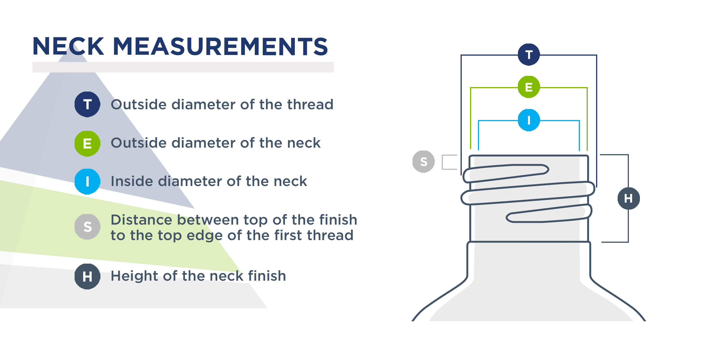
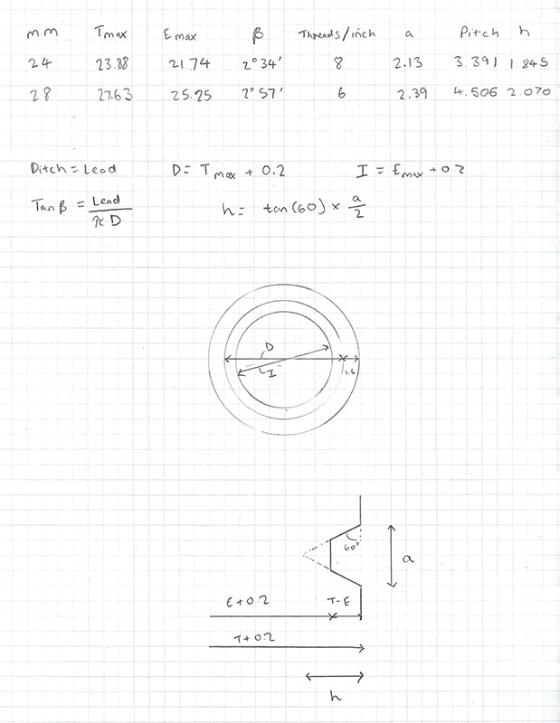

# Thread Descriptions

|||
|--------------------------------------------------------|---------------------------------------------------------------------------|
|Finish Types|S.P.I. Specifications|

- “T” Dimension – The outside diameter of the thread.
- “E” Dimension – The outside diameter of the neck finish.
- “I” Dimension – The inner diameter of the bottle neck.
- “H” Dimension – The height of the neck finish.
- “S” Dimension – Measured from the top of the finish to the top edge of the first thread.

## Neck Dimensions

| MM  | T (min | max)  | E (min | max)  | 400H (min | max)  | 410H (min | max)  | 415H (min | max)  | S (min | max)  | I     |
|-----|--------|-------|--------|-------|-----------|-------|-----------|-------|-----------|-------|--------|-------|-------|
| 13  | 0.514  | 0.502 | 0.454  | 0.442 | -         | -     | 0.457     | 0.437 | 0.052     | 0.022 | 0.218  |       |       |
| 15  | 0.581  | 0.569 | 0.521  | 0.509 | -         | -     | 0.572     | 0.542 | 0.052     | 0.022 | 0.258  |       |       |
| 18  | 0.704  | 0.688 | 0.620  | 0.604 | 0.385     | 0.355 | 0.536     | 0.508 | 0.632     | 0.602 | 0.052  | 0.022 | 0.325 |
| 20  | 0.783  | 0.767 | 0.699  | 0.683 | 0.386     | 0.356 | 0.569     | 0.539 | 0.757     | 0.727 | 0.052  | 0.022 | 0.404 |
| 22  | 0.862  | 0.846 | 0.778  | 0.762 | 0.386     | 0.356 | 0.600     | 0.570 | 0.852     | 0.822 | 0.052  | 0.022 | 0.483 |
| 24  | 0.940  | 0.924 | 0.856  | 0.840 | 0.415     | 0.385 | 0.661     | 0.631 | 0.972     | 0.942 | 0.061  | 0.031 | 0.516 |
| 28  | 1.088  | 1.058 | 0.994  | 0.974 | 0.415     | 0.385 | 0.723     | 0.693 | 1.097     | 0.067 | 0.061  | 0.031 | 0.614 |
| 30  | 1.127  | 1.107 | 1.033  | 1.013 | 0.418     | 0.388 | -         | -     | 0.061     | 0.031 | 0.653  |       |       |
| 33  | 1.265  | 1.241 | 1.171  | 1.147 | 0.418     | 0.388 | -         | 1.289 | 1.259     | 0.061 | 0.031  | 0.791 |       |
| 35  | 1.364  | 1.340 | 1.270  | 1.246 | 0.418     | 0.388 | -         | -     | 0.061     | 0.031 | 0.875  |       |       |
| 38  | 1.476  | 1.452 | 1.382  | 1.358 | 0.418     | 0.388 | -         | -     | 0.061     | 0.031 | 0.987  |       |       |
| 40  | 1.580  | 1.550 | 1.486  | 1.456 | 0.418     | 0.388 | -         | -     | 0.061     | 0.031 | 1.091  |       |       |
| 43  | 1.654  | 1.624 | 1.560  | 1.530 | 0.418     | 0.388 | -         | -     | 0.061     | 0.031 | 1.165  |       |       |
| 45  | 1.740  | 1.710 | 1.646  | 1.616 | 0.418     | 0.388 | -         | -     | 0.061     | 0.031 | 1.251  |       |       |
| 48  | 1.870  | 1.840 | 1.776  | 1.746 | 0.418     | 0.388 | -         | -     | 0.061     | 0.031 | 1.381  |       |       |
| 51  | 1.968  | 1.933 | 1.874  | 1.839 | 0.423     | 0.393 | -         | -     | 0.061     | 0.031 | 1.479  |       |       |
| 53  | 2.067  | 2.032 | 1.973  | 1.938 | 0.423     | 0.393 | -         | -     | 0.061     | 0.031 | 1.578  |       |       |
| 58  | 2.224  | 2.189 | 2.130  | 2.095 | 0.423     | 0.393 | -         | -     | 0.061     | 0.031 | 1.735  |       |       |
| 60  | 2.342  | 2.307 | 2.246  | 2.213 | 0.423     | 0.393 | -         | -     | 0.061     | 0.031 | 1.883  |       |       |
| 63  | 2.461  | 2.426 | 2.367  | 2.332 | 0.423     | 0.393 | -         | -     | 0.061     | 0.031 | 1.972  |       |       |
| 65  | 2.579  | 2.544 | 2.485  | 2.450 | 0.423     | 0.393 | -         | -     | 0.061     | 0.031 | 2.090  |       |       |
| 70  | 2.736  | 2.701 | 2.642  | 2.607 | 0.423     | 0.393 | -         | -     | 0.061     | 0.031 | 2.247  |       |       |
| 75  | 2.913  | 2.878 | 2.819  | 2.784 | 0.423     | 0.393 | -         | -     | 0.061     | 0.031 | 2.424  |       |       |
| 77  | 3.035  | 3.000 | 2.941  | 2.906 | 0.502     | 0.472 | -         | -     | 0.075     | 0.045 | 2.546  |       |       |
| 83  | 3.268  | 3.233 | 3.148  | 3.113 | 0.502     | 0.472 | -         | -     | 0.075     | 0.045 | 2.753  |       |       |
| 89  | 3.511  | 3.476 | 3.391  | 3.356 | 0.550     | 0.520 | -         | -     | 0.075     | 0.045 | 2.915  |       |       |
| 100 | 3.397  | 3.902 | 3.817  | 3.782 | 0.612     | 0.582 | -         | -     | 0.075     | 0.045 | 3.344  |       |       |
| 110 | 4.331  | 4.296 | 4.211  | 4.176 | 0.612     | 0.582 | -         | -     | 0.075     | 0.045 | 3.737  |       |       |
| 120 | 4.724  | 4.689 | 4.604  | 4.569 | 0.700     | 0.670 | -         | -     | 0.075     | 0.045 | 4.131  |       |       |

## Threads Per Inch

| MM  | Thread/Inch |
|-----|-------------|
| 13  | 12          |
| 15  | 12          |
| 18  | 8           |
| 20  | 8           |
| 22  | 8           |
| 24  | 8           |
| 28  | 6           |
| 30  | 6           |
| 33  | 6           |
| 35  | 6           |
| 38  | 6           |
| 40  | 6           |
| 43  | 6           |
| 45  | 6           |
| 48  | 6           |
| 51  | 6           |
| 53  | 6           |
| 58  | 6           |
| 60  | 6           |
| 63  | 6           |
| 65  | 6           |
| 70  | 6           |
| 75  | 6           |
| 77  | 6           |
| 83  | 5           |
| 89  | 5           |
| 100 | 5           |
| 110 | 5           |
| 120 | 5           |

## Select S.P.I. Neck Finish Specifications For Standard Closures

## Neck Finish Dimensions

|||
|------------------------------------------------------------------------------------------------------------|--------------------------------------------------------------------------------------------------|

- **"T" Dimension**

   The "T" dimensions refers to the outside diameter of the thread. The tolerance range of the "T" dimension will determine the fit between the bottle and closure.

- **"E" Dimension**

   The outside diameter of the neck. The difference between the "E" and "T" dimensions, divided by two, determines the thread depth.

- **"I" Dimension**

   The inner diameter of the bottle neck. Specifications require a minimum "I" to allow sufficient clearance for filling tubes. Liner-less closures, with a plug or land seal, and dispensing plugs and fitments require a controlled "I" dimension for a proper fit.

- **"S" Dimension**

   Measured from the top of the finish to the top edge of the first thread. The "S" dimension is the key factor which determines the orientation of the closure to the bottle and the amount of thread engagement between the bottle and cap.

- **"H" Dimension** 

  The height of the neck finish. Measured from the top of the neck to the point where the diameter "T", extended down, intersects the shoulder.

# How do I measure male and female threads?

.JPG)

For male thread measure the outside diameter of the largest portion of the thread (A). Find the actually inch size closest to what you get for A on the chart belowand then to the right of thatyou will see the pipe size.

For female thread measure the top of thread at B. Find the actual size closest to the measurement that you get for B and then to the right of that you will see the pipe size.

| Actual size in Inches | Pipe Thread Size |
|-----------------------|------------------|
| 0.675                 | 3/8              |
| 0.840                 | 1/2              |
| 1.050                 | 3/4              |
| 1.315                 | 1                |
| 1.660                 | 1-1/4            |
| 1.900                 | 1-1/2            |
| 2.375                 | 2                |
| 2.875                 | 2-1/2            |
| 3.5                   | 3                |
| 4.5                   | 4                |

## Math

## Continuous Thread Finishes

A continuous thread finish can be found on glass, metal, and plastic containers. This common thread type can be identified by the threads that wrap around the neck of the container continuously without any breaks in the thread.

### 400

A 400 neck finish indicates one thread turn.

### 410

A 410 neck finish indicates one and a half turns.

### 415

A 415 neck finish indicates two thread turns, but the threads are thinner and the neck is typically taller.

### 425

A 425 neck finish indicates two thread turns but is most commonly found on smaller-capacity containers such as vials.

### 430

A 430 neck finish indicates one or two thread turns. The threads are deeper than the uniform standard 400 and 415 neck finish. This unique neck shape is known as a buttress and is designed to help the user pour product with better accuracy.

### DBJ

A DBJ neck finish is a tamper-evident screw cap for dairy, beverage, and juice. This neck features a ring beneath the threads that catch on to a detachable ring of a DBJ cap. When the user unscrews the cap from the container for the first time, the ring will break off from the cap, making it tamper-evident. This closure is not recommended for carbonated products, hot-fill applications, nitrogen gas-injected applications, or freezing.

