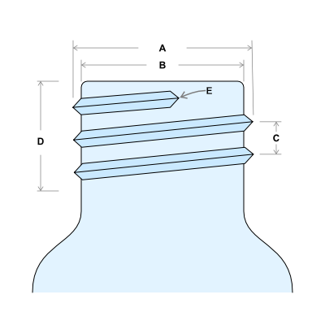
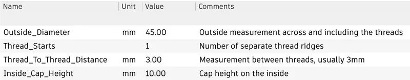
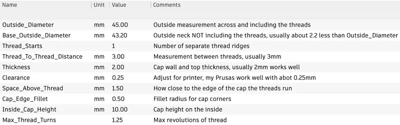
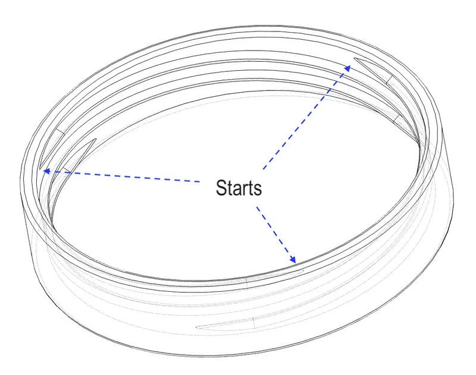

# Threaded Bottle or Jar Cap Generator for Fusion 360

I've needed screw on lids for bottles and jars several times since I started 3D printing, I've always created a one-off design each time. I've used my experience and knowledge about making lids along with my experience building robust parameterized designs in Fusion 360 to create this generator.

I gathered a bunch of plastic and glass bottles and discovered they are mostly very similar despite being different size. Firstly, the threads are usually 3mm apart, usually “one start” (a single line of thread) and almost always a bit under 1mm thread height. This design can make less common threads but *for the common case*, you only need one measurement, the ***Outside_Diameter***** **of the threads, **A** in this diagram. Make sure you measure from the tip of the thread on one side to the tip of the thread on the other, calipers work best.

I have a few bottles that have multiple ***Thread_Starts*** (**E**) but usually there's just one. You have to spin the bottle around and carefully examine it to count thread starts. *Thread_Starts* is the ***COUNT*** of thread starts, **not** a measurement of length or distance.

**C** is the ***Thread_To_Thread_Distance*** (pitch), it's a bit tricky to measure accurately, in my experience if it looks anywhere near to 3mm, you should assume 3.0mm. More than 90% of the bottles I've looked at use 3.0mm.

The ***Inside_Cap_Height*** (**D**) is 10mm by default which is ok for most caps, you can modify that for taller or shorter caps.

For bottle that have unusually thick or thin threads, you can input the **B** value for ***Base_Outside_Diameter***. It's the outside diameter of the neck of the bottle ***without ***the threads.

**Favorite Parameters**

**All Parameters**

**Using The Generator**

Required: Working Fusion 360 installation (free for personal use)

Steps:

- Download the f3d and open in FUsion 360
- Open the PARAMETERS window SHIFT-P or Modify > Change Parameters in the design workspace
- Click the *expression* column of the **Outside_Diameter** parameter (top line of favorites) and enter your measurement. You can enter a number in mm or inches by adding a double quote after the decimal value like **0.25"**
-  Edit any other parameters you need to change

**Examples: `<diameter>/<starts>/<pitch>`**

- Decorative Milk Bottle - 45.0mm/1/3.0mm 
- Glass Salt Shaker - 37.3mm/1/3.0mm
- Tree-Top Apple Juice 1 Gallon Jug - 47.2mm/3/3.0mm

**Three Start Lid Example (Tree-Top Apple Juice 1 Gallon Jug)**

If you are new to Fusion 360, here are instructions once you have the app (Win or Mac) installed, note you have to get a “free” license for Fusion 360 or start a trial which requires creating a AutoDesk account. 

1. Choose File > **Open…** 
2. Open the downloaded **.f3d** file
3. Open the ***Change Parameters*** dialog with **CTRL/CMD-P**
4. Edit the parameters measured (see diagram above)
5. Export a mesh from File > **Export…** 
6. Choose Type: of **3mf** or **stl** and press the **Export** button

# Sample Files

- [threaded-bottle-or-jar-cap-generator-for-fusion-360-model_files.zip](images/threaded-bottle-or-jar-cap-generator-for-fusion-360-model_files.zip)

- [parameterized-bottle-cap-v6.f3d](images/parameterized-bottle-cap-v6.f3d)

