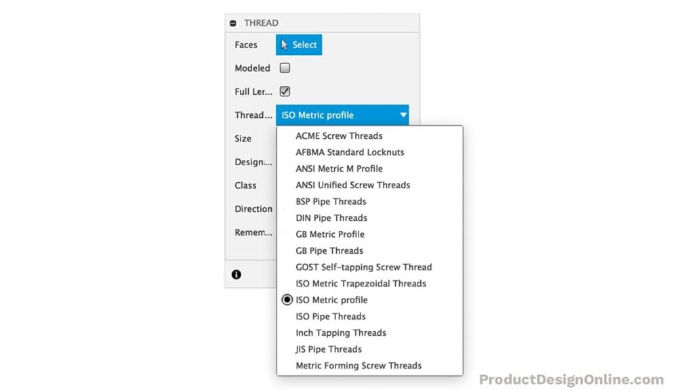
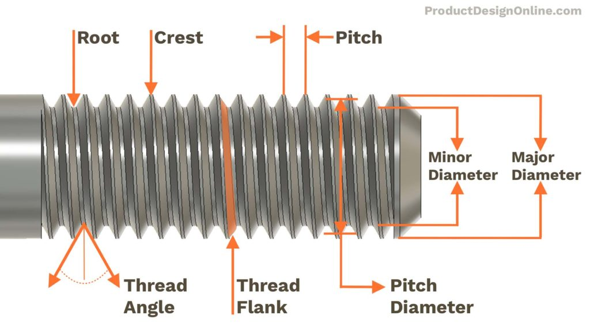
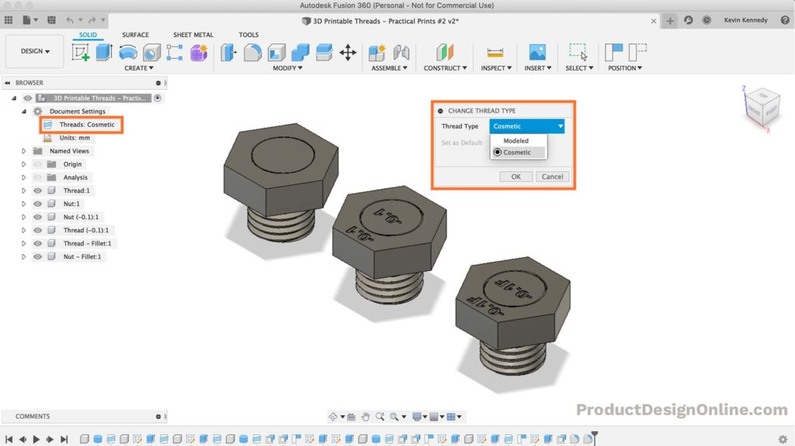
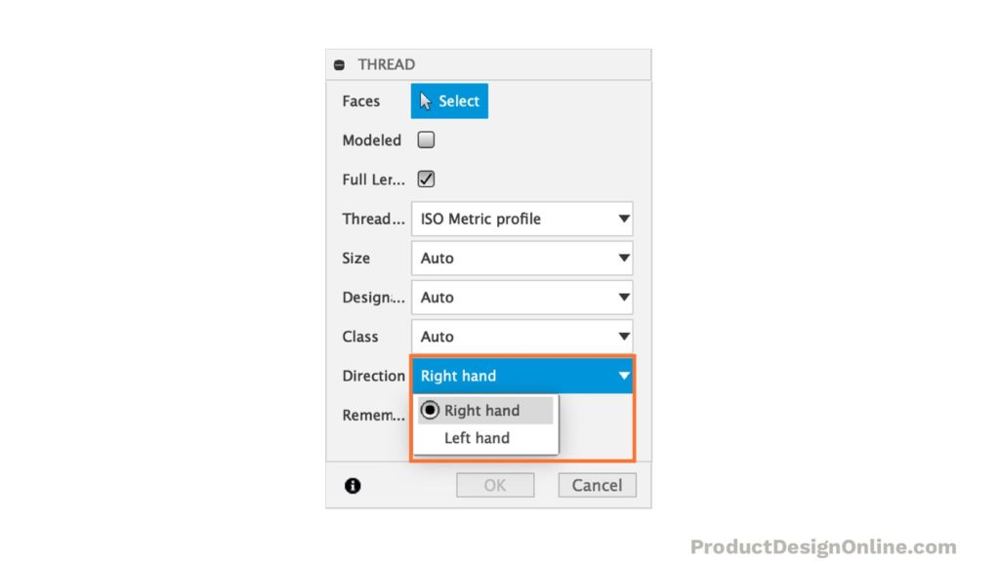

# 3D Printed Threads – Model Them in Fusion 360 | Practical Prints #2

Fusion 360 has a thread feature that lets users easily recreate realistic and working threads for their projects. These threads can be 3D Printed, milled, or used in 2D manufacturing drawings.

## Thread Types in Fusion 360

Fusion 360’s Thread feature offers several preset thread types. All of the thread types are based on industry and global standards that are produced for different product needs.

- **ACME Screw Threads** – most commonly used as lead screws because of their trapezoidal thread shape
- **AFBMA Standard Locknuts**
- **ANSI Metric M Profile**
- **ANSI Unified Screw Threads**
- **BSP Pipe Threads** – standard thread type that has been adopted internationally, and used all throughout Europe, for interconnecting and sealing pipe ends.
- **DIN Pipe Threads**
- **GB Metric Profile**
- **GB Pipe Threads**
- **GOST Self-tapping Screw Thread**
- **ISO Metric Trapezoidal Threads**
- **ISO Metric Profile** – one of the most common thread types worldwide. Typically used for general-purpose screws.
- **Inch Tapping Threads**
- **JIS Pipe Threads**
- **Metric Forming Screw Threads**

## Thread Terminology

- **Root** – the inner-most part of the thread
- **Crest** – the outer-most part of the thread
- **Pitch** – the distance from the crest of one thread to the next (typically measured in mm)
- **Thread Angle** – the angle between the flank of a screw thread and the perpendicular to the axis of the screw
- **Thread Flank** – the straight sides that connect the crest and the root
- **Pitch Diameter** – the distance of two opposite flanks or the distance of the centerline of the profile
- **Minor Diameter** – the diameter determined by the groove of the thread
- **Major Diameter** – the diameter determined by the thread tips

## Designation and Classes

The **designation** for a metric thread includes information on the thread diameter, pitch, and thread tolerance class.

For example, a thread designated as m12x1 – 5g6g indicated the thread has a nominal diameter of 12mm and a pitch of 1mm. The 5g indicated the tolerance class for the pitch diameter. The 6g is the tolerance class for the major diameter.

In Fusion 360, the **class** represents the tolerance class, or how much variance is allowed. A tolerance class is made up of two parts, a tolerance grade, and a tolerance position.

Tolerance grades are represented by numbers. The lower the number the smaller the tolerance.

Each preset thread type (in Fusion 360) may have different classes to choose from.

## Creating Clearance in Fusion 360

Fusion 360 will automatically add a very small clearance of .1mm to internal/external threads. This is great if you have a precisely machined product. However, this clearance is typically not enough with 3D printed threads.

To create additional clearance you can use the Offset Face command.

1. Select the top or bottom Flank of the thread
2. Hit the keyboard shortcut letter “Q” to activate the Offset Face command
3. Type out the new clearance value. Typically between -.15 and -.2 work well for 3D prints. (Remember this is only half the clearance as next you’ll repeat the steps to the opposite flank)
4. Repeat steps 1-3 on the opposite flank
5. Repeat the steps to the mated part. For example, if you added more clearance to a bolt, you’ll want to now add that to the nut.

## Clearance vs Tolerance

The words “Clearance” and “Tolerance” are often used interchangeably. Unfortunately, they shouldn’t be used in this manner.

**Clearance** refers to the distance between the adjacent surfaces of mating parts. In other words, how much (distance) the parts clear each other.

**Tolerance** refers to the allowable variation of a dimension from the desired value. In other words, the amount of error that you will tolerate.

For example, the clearance of a nut and bolt is the space between the (threads of the) two parts. The tolerance represents the size variances allowed when the nut and bolt are manufactured.

If you 3D Print threads, your 3D printer’s tolerance will influence how much clearance is required between the internal and external threads.

## Cosmetic vs Modeled

By default, Fusion 360 threads are solely cosmetic. They are simply a decal that wraps around a cylinder. This is because most CAD assemblies only need the thread types documented in the 2D drawing.

Having cosmetic (decal only) threads also improves Fusion 360 performance when you’re using hundreds of screws or parts with threads.

If you’re wanting to 3D print the threads then **you’ll need to check the “Modeled” checkbox** at the top of the Thread dialog.

**Pro Tip**: You can switch back and forth between modeled and cosmetic threads from the Fusion 360 Browser. **This will change all of your threads at once**. It’s a great way to switch to cosmetic while you work on other parts of your model.

1. Toggle open the document settings
2. Hover over the thread icon (Threads: Cosmetic) > select Change Thread Type
3. In the Change Thread Type dialog, Switch thread type to Cosmetic > OK

- **Note:** this will not work to threads that have been altered.

Change all thread types in the same file from cosmetic to modeled in Fusion 360.
Right Hand vs Left Hand Thread Direction

Right hand is the default thread direction in Fusion 360.
The direction of a threads helix will determine whether it is right hand or left hand. A right hand thread is one which is turned clockwise, while a left hand thread is one that advances when turned counter-clockwise.

The majority of screws are right hand screws. If a screw does not have an abbreviation LH, for left hand, then it should be considered a right hand one.

Left hand (reverse) threads are only used when the rotation of the object would gradually loosen with the applied torque. Some common examples include bicycle (left) pedals, turnbuckles, gas line parts, or parts of specific machinery.

## Tap and Die Set

Taps and dies are tools used to create screw threads, which is known as threading. They can be used with some materials they can create new threads. Other materials can be rethreaded (fixed) with the use of a tap and die.

A **die** is used to cut the male portion of the mating pair, such as a bolt. A **tap** is used to cut the female portion of the mating pair, such as a nut.

Tap and Die sets can be used to refine 3D printed threads. They are particularly useful for small 3D printed threads. Your 3D Printer’s tolerances can be “cleaned up” by running the tap or die through the thread, which takes away the variations in the plastic.

I recommend this great starter set for 3D Printed thread projects. The “[ABN Metric and SAE Standard Tap and Die 60-Piece Rethread Set](https://amzn.to/2NUymo7)” is affordable and comes with a nice hardshell case to keep the set organized and protected.

# Reference

- [3D Printed Threads - Model Them in Fusion 360](https://youtu.be/aGWrFeu8Hv0)

  <iframe width="730" height="410" src="https://www.youtube.com/embed/aGWrFeu8Hv0" title="3D Printed Threads - Model Them in Fusion 360 | Practical Prints #2" frameborder="0" allow="accelerometer; autoplay; clipboard-write; encrypted-media; gyroscope; picture-in-picture; web-share" referrerpolicy="strict-origin-when-cross-origin" allowfullscreen></iframe>