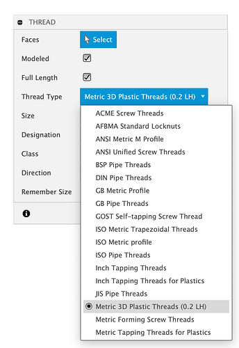
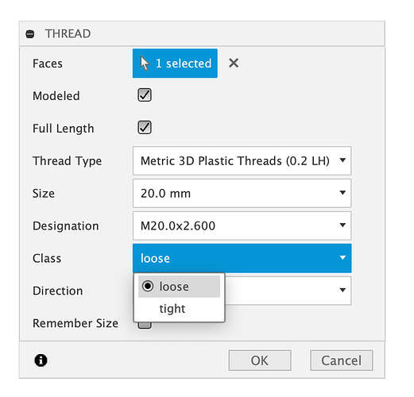
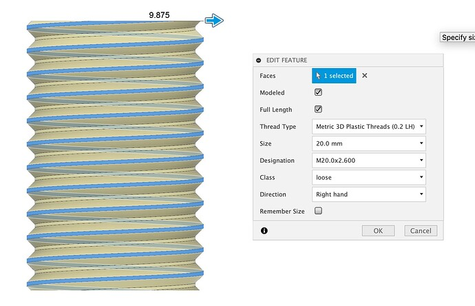
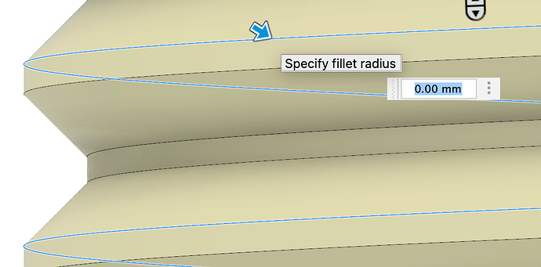
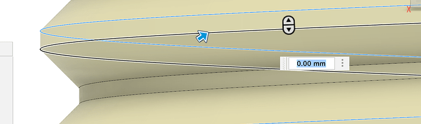
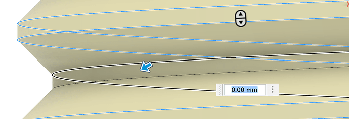
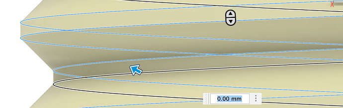
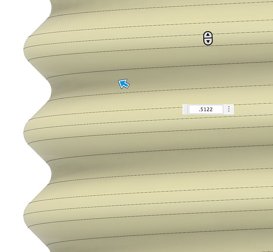

# Custom palstic fdm thread profile

The threads are made with a 45° angle instead of the standard 30° angle used for Fusion threads, and adjusted the pitch and diameters and tested printing to make it ideal for 3D printing, at least I think it is ideal. You can’t add a fillet in the Fusion Thread definition file, so I add a fillet after using the Thread tool. I will describe the steps I use for making the fillet later.

A link to the file and instructions on how to import it into Fusion are at the end of this post.

I created the file by first adjusting the parameters in the XML for the following sizes, M5, M10, M30, M50, M100, M500 (many more sizes are available in the file I am providing below). I went back and forth between the file and Fusion until the thread had the best proportions for 3D printing. There are both a tight and loose fitting thread options.

I successfully printed and tested tight and loose samples of the M5, M10, M30 and M50, but I didn’t try printing the M100 and M500.

I then enlisted the help of ChatGPT to interpolate the values to give a wide range of threads. The first time it generated the XML it made some mistakes, but after I pointed out the mistakes, it tried again and interpolated between my threads perfectly. The file has the following Thread sizes.

```
M5 - M30 every 0.1 mm  
M30 - M50 every 0.5mm  
M50 - M100 every 1mm  
M100 - M500 every 5mm
```

After importing the XML to the appropriate Fusion location, it will be available the next time you start the Thread tool, you don’t have to restart Fusion.

After starting the Thread tool, make sure “`Modeled`” is checked, or it doesn’t actually make the thread. Then select **`Metric 3D Plastic Threads (0.2 LH)`** from the Thread Type list. The `0.2LH` means its for a `0.2mm` layer height, but should work fine for other layer heights. For larger than `0.6` or `0.8` nozzle, some of the smallest threads may not be printable because the line width is to large.

[

If you click the cylinder model that you want to apply the Thread onto, the Thread tool will try to select the appropriate Size, but it is sometimes off a few tenths of a millimeter in the M5 - M30 range. Otherwise you can manually select the thread size in the Size, Designation and Class drop-downs.

In the Class drop-down, you have the option to choose a loose or tight tolerance for the fit of the thread.

[

After selecting the cylinder and thread settings, click OK to apply the thread.

|[|[|
|--------------------------------------------------------------------------------------------------------------------------------------------|-------------------------------------------------------------------------------------------------------------------------------------------|

Here is a close-up of the thread before the fillet is applied.

[

Open the fillet tool and select all four edges of the the thread. Select the edges, not the faces of the thread or the fillet won’t work as well. (I didn’t add the blue arrows to the images below, Fusion did and they are not always pointing to the right spot)

|[|[|[|[|
|-------------------------------------------------------------------------------------------------------------------------------------------|-------------------------------------------------------------------------------------------------------------------------------------------|-------------------------------------------------------------------------------------------------------------------------------------------|-------------------------------------------------------------------------------------------------------------------------------------------|

I try a few fillet values until it is just large enough to completely round the the edges without seeing the lines at the peak or valleys of the thread. The image below shows the lines I am talking about.

[

I don’t want to fillet any large than I have to, so there is pretty high precision in the decimal places. In the picture below you can see that the valley is rounded, but the peak still has a line.

[

Here is the minimum fillet value to completely round it for the M20 thread.

[

Here is a link to the XML file to import into Fusion. The 0.2LH means its for a 0.2mm layer height, but should work fine for other layer heights.

[Metric3DPrintedPlasticThreads0.2LH.xml](images/Metric3DPrintedPlasticThreads0.2LH.xml)

Here are the instructions for importing the XML into Fusion.

1. Allow access to hidden files and directories.

   - [How to turn on hidden files and folders on Windows 3](https://www.autodesk.com/support/technical/article/caas/sfdcarticles/sfdcarticles/How-to-enable-hidden-files-and-folders-on-Windows.html)
   - [How to Access Hidden User Library folder on macOS 5](https://www.autodesk.com/support/technical/article/caas/sfdcarticles/sfdcarticles/How-to-Access-Hidden-User-Library-folder-on-Mac-OS.html)

2. Browse to the following directory and copy the XML file I provided into the folder. The Thread type will be available the next time you start the Thread tool.

   > **Note:** Sort by: “Date-created” to find the most recent folder.

   **Windows:** `%localappdata%\\Autodesk\\webdeploy\\Production<version ID>\\Fusion\\Server\\Fusion\\Configuration\\ThreadData`

   **macOS:**
   
   `Macintosh HD> Users> [Username] > Library > Application Support > Autodesk > Webdeploy > production > [Version ID] > Then right click “Autodesk Fusion 360” and choose Show Package Contents > Contents > Libraries > Applications > Fusion > Fusion > Server > Fusion > Configuration >ThreadData`
   
   [A video showing how to find this location in Finder is linked here. 2](https://cdn-forum.bambulab.com/original/3X/e/b/ebd32b5aee797fd30f71569916416f76764f6cc9.png)

   The instructions above are from this Autodesk link.

   [Importing Custom Thread into Fusion 2](https://cdn-forum.bambulab.com/original/3X/e/b/ebd32b5aee797fd30f71569916416f76764f6cc9.png)

   > **IMPORTANT:** For the Mac location, there will likely be multiple [Version ID] folders. Like shown below:

   [

   The right [Version ID] folder to select is the one that contains both the Fusion .app file and the CONFIG, folder, the other ones only contain the Fusion .app file. But if you don’t see it after selecting the Thread tool, you might have to try in the other [Version ID] folders.

   [

   If you save an alias to the threads folder, it may not be the right folder in the future. I learned that through my own attempts to make an Alias to the folder.

   > **IMPORTANT:** If the thread tool is already open in Fusion when you add the XML file, you have to cancel the Fusion Thread tool and start it again to see **Metric 3D Plastic Threads (0.2 LH)** in the Thread Type drop down.

