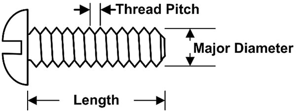
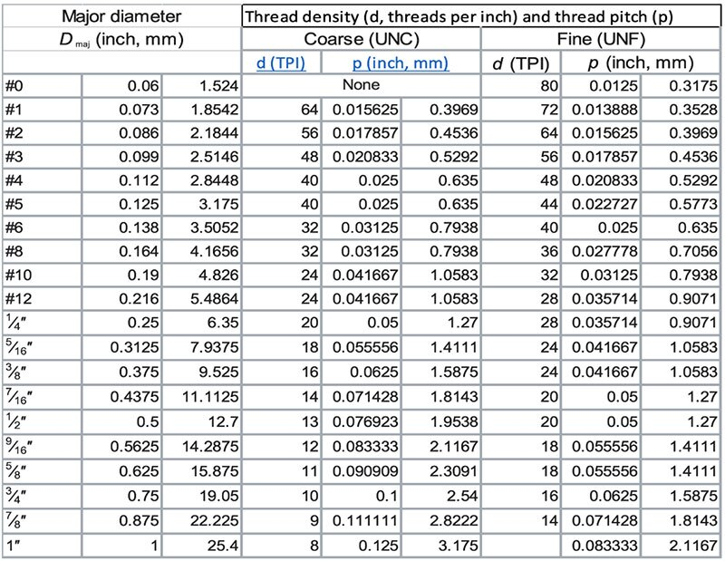
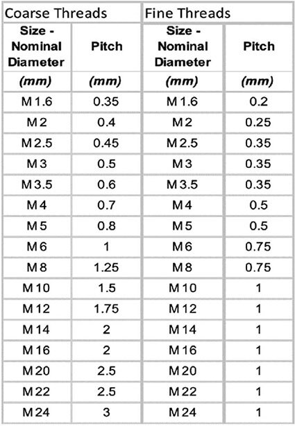
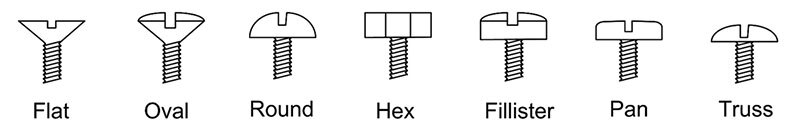
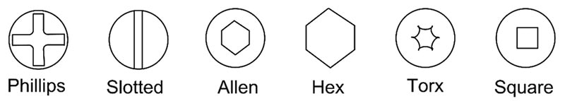
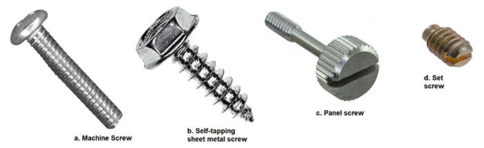

# The Basics of Screws and Types of Screws

Though widely used, screws are often among the least considered components in electronics. Still, there’s a reason [DigiKey](https://www.digikey.com/) offers over 13,000 different types of screws. They are used to hold circuit boards down, attach cover panels, and mount connectors. Unlike electronic components, screws come unmarked, and you have to develop an eye for identifying them.

In junior high school, while I was learning the resistor color code, my father, a machinist, was teaching me what a #6-32 machine screw was. It proved to be a really useful talent. If you’ve forgotten, or otherwise don’t know anything about screws, this post will give you the basics.

## The basics of screws

The screw is a fastener that uses a helical groove, called a thread, cut into the outside of a cylindrical rod. It mates with a reverse helical groove cut into the inside of a cylindrical hole, either in a solid body or a small object called a nut. Turning the screw into the mating threaded hole advances the screw into the mating surface. If the screw is first passed through an object, turning the screw until the object and the mounting surface are joined mounts the object to the surface (Figure 1).

||
|----------------------------------------------------------------------------------------------------------------------------------------------|
|Figure 1: A drawing of a typical round head machine screw showing its primary specifications. (Image source: Art Pini)|

The key specifications for a screw are its major diameter, thread pitch (or its reciprocal thread count per unit length), and length. The major diameter is the diameter measured at the outside of the screw threads. The thread pitch is the distance the screw advances in one turn, or the distance between peaks of adjacent threads. The reciprocal of the thread pitch is the thread count per unit length. For the US and Canada, the unit length is the inch (in.). In countries using metric screw specifications, it is millimeters (mm). The screw length is the distance from the bottom of the screw to the reference plane. The reference plane is where the screw contacts the mating surface. For round head and similar screws, it is at the base of the screw head, as shown. For a flat head screw, which sits in a counter sunk hole, it is at the top of the screw head.

## Screw thread standards

The thread standard most commonly used in North America is the Unified Thread Standard (UTS). UTS screws are specified by their nominal diameter and thread count. For example, a ¼-20 is a screw with a diameter of ¼ of an inch and a thread count of 20 threads/in. Screws with diameters less than ¼ inch are specified by an integer number, 0-16. Screws with diameters less than 0 are described by the numbers 00, 000, and 0000. As an example, the screws used in eyeglasses are typically 00-72.

UTS supports multiple thread counts for each screw diameter. The lower or coarser thread counts are specified as Unified Coarse Thread (UNC). The screws with a finer pitch are described as Unified Fine Thread (UNF) (Table 1).

||
|------------------------------------------------------------------------------------------------------------------------------------------|
|Table 1: The dimensions of screws under the UTS screw standard. (Table source: Art Pini)|

Referring to Table 1, note that for each screw diameter there are two possible thread counts, so a #10 screw is available with thread counts of 24 or 32 threads/in.

The absolute diameters of the screws using gauge number integers can be calculated by multiplying the gauge number by 0.013 and adding the product to 0.060 inches. Thus, a #6 screw has a diameter of (6 x 0.013) + 0.060 = 0.138 in.

There is also a metric screw standard. These are designated by the letter M, followed by the screw’s major diameter in mm, then the thread pitch also in mm (Table 2).

||
|----------------------------------------------------------------------------------------------------------------------------------------------|
|Table 2: Metric screw diameters and thread pitches for both the coarse and fine thread series. (Table source: Art Pini)|

The fine pitch threads offer more choices of screw diameters than the coarse series, but only the overlapping diameters are shown in Table 2. As in the case of the UTS screws, metric screws are available in two thread pitches for each diameter. Remember that the screw pitch is the reciprocal of the thread count per mm.

## Screw head shapes and drive types

Screws are manufactured with a variety of head shapes. Each head shape provides specific advantages. For example, a flathead screw is generally countersunk so that the head is completely below the surface into which the screw is driven. This keeps the surface free of projections. The most common screw head types used in electronics assembly are shown below in Figure 2.

||
|----------------------------------------------------------------------------------------------------------------------------------------------|
|Figure 2: Example of some typical screw head types. The application generally determines the type of screw head used. (Image source: Art Pini)|

In addition to the shape of the screw head, screws are described by the drive type. The drive type determines the nature of the tool used to turn the screw (Figure 3).

||
|----------------------------------------------------------------------------------------------------------------------------------------------|
|Figure 3: The screw drive type determines the maximum torque that can be applied to the screw head. It also determines the type of tool used to turn the screw. Some of the most commonly used drive types are shown. (Image source: Art Pini)|

All of the drive types shown, except for the hex head, require an appropriate screwdriver. The hex head screws use a wrench or nut driver. The application determines the selection of the drive type.

Most screws advance when rotated in a clockwise direction. This is called a right-hand thread. A less commonly used thread is the left-hand thread, where the screw advances when turned counterclockwise.

## Types of screws encountered in electronics

Given the large number of subassemblies used in electronics, it should be obvious that there are a large number of screw types required to hold them all together (Figure 4).

||
|----------------------------------------------------------------------------------------------------------------------------------------------|
|Figure 4: Commonly used types of screws employed in electronic assemblies. (Image sources: B&F Fastener Supply, RAF electronic-hardware, and Pomona Electronics)|

*The machine screw:* As the name indicates, these screws are used to attach components mechanically in machines, vehicles, electronics, and appliances. An example would be to hold a circuit board onto a threaded spacer. [B&F Fastener Supply’s](https://www.digikey.com/en/supplier-centers/bf-fastener-supply) [PMS-632-0075-PH](https://www.digikey.com/en/products/detail/b-f-fastener-supply/PMS-632-0075-PH/51486) shown in Figure 4 (left), is a pan head, Phillips drive, #6-32 machine screw that is ¾ in. long.

The self-tapping sheet metal screw, second from the left, is a B&F Fastener Supply [6X1/2 HHSMS](https://www.digikey.com/en/products/detail/b-f-fastener-supply/6X1-2-HHSMS/333062). This is a #6 hex head screw with a length of ½ in. Sheet metal screws are used to join sheet metal components like chassis or enclosures. They are inserted into sheet metal elements with only small pilot holes. The screws cut their own internal threads as they are screwed in.

The panel screw, third from left, is intended to hold a removable panel in place. It is a form of shoulder screw. The upper part of the screw, called a shank, is not threaded as it is intended to pass through a hole in the panel and turn freely as the threaded portion secures the panel to the threaded mounting hole. The screw shown is [RAF Electronic Hardware’s](https://www.digikey.com/en/supplier-centers/raf) [0100-SS](https://www.digikey.com/en/products/detail/raf-electronic-hardware/0100-SS/7681333) slotted head #4-40 panel screw with a length of 21/32 in.

The final example is a set screw. Set screws are used to secure rotating components like knobs, gears, and cams to a shaft. They are headless screws that typically use slotted or Allen drives. A good example is [Pomona Electronics’](https://www.digikey.com/en/supplier-centers/pomona-electronics) [4914](https://www.digikey.com/en/products/detail/pomona-electronics/4914/737044) #8-32 slotted head set screw on the far right.

## Conclusion

These are just of few of the available screw types. I hope this serves as a handy guide to identifying screws and will get you started on the right path toward selecting the right mechanical screw for your next design project.

