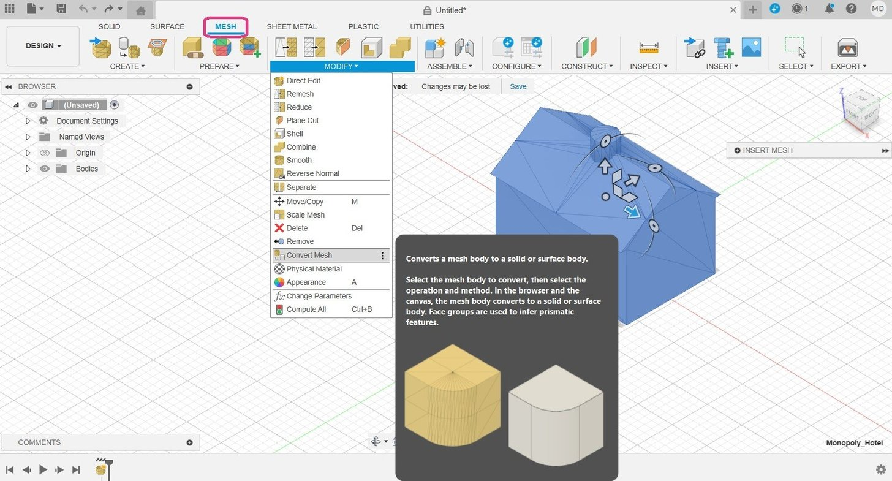
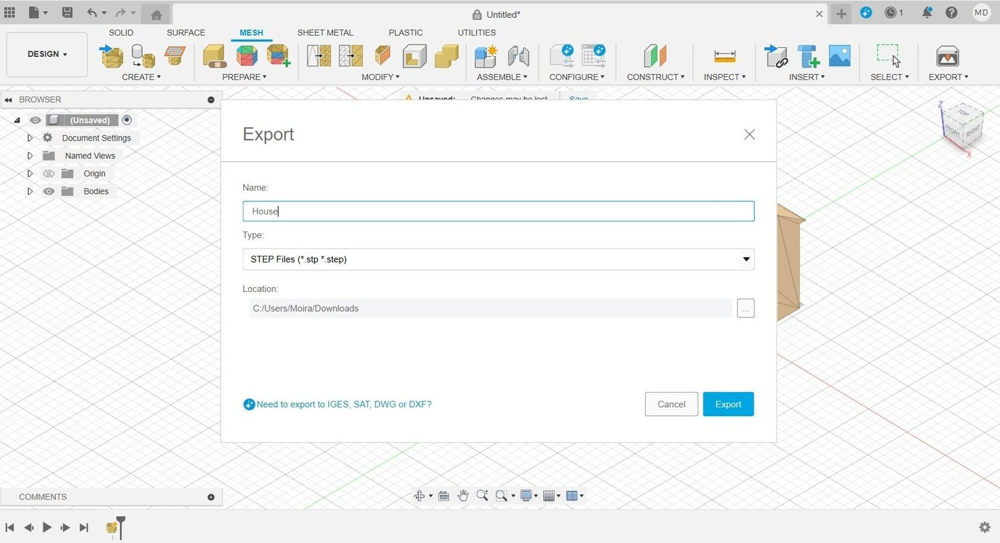
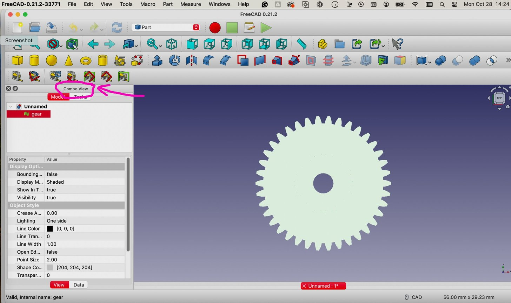
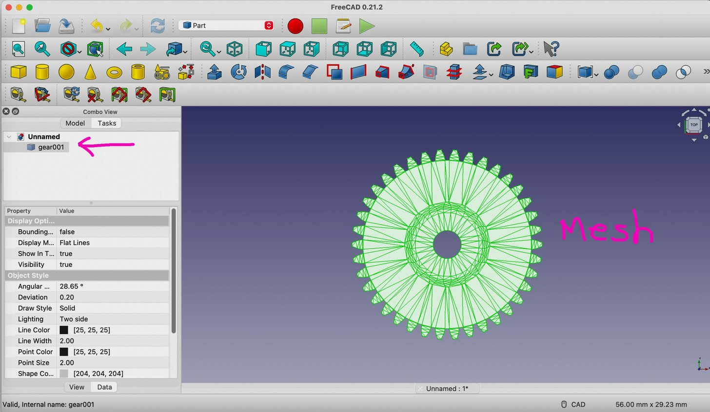
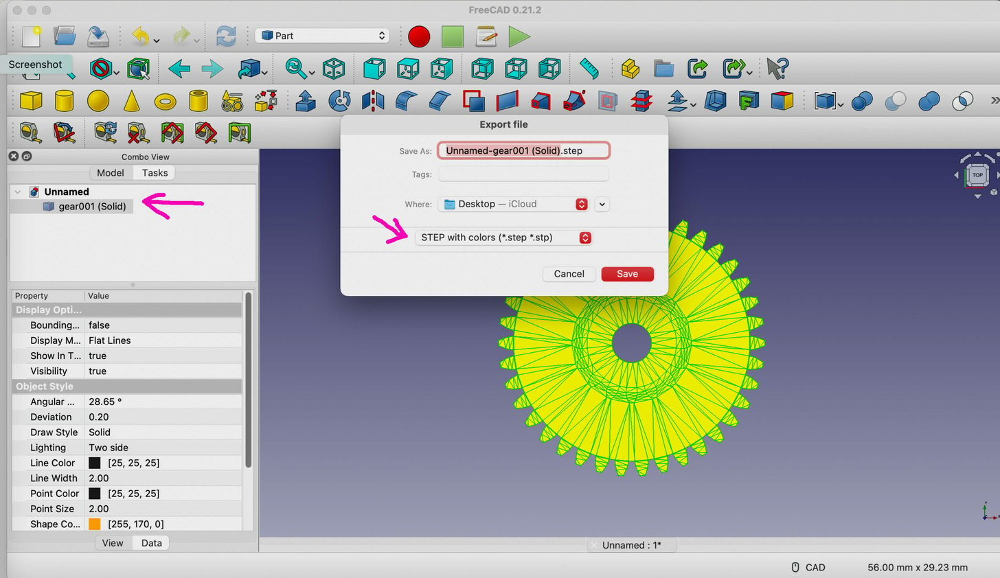

# Convert STL to STEP (Fusion 360)

The steps:

**For Personal Use License (Faceted Option)**

1. Open Fusion.
2. Go to **Insert** > **Insert Mesh**.
3. Select and open your STL file.
4. Navigate to the **Mesh** tab.
5. Click **Modify** > **Convert Mesh**.
6. Choose the **Faceted** option.\*
7. Click **OK** to complete the conversion.
8. `File > Export > STEP`

Faceted is the only option on the free Personal Use license. Faceted leaves you with mesh triangles ('facets'). You can clean them up [using many techniques](https://youtu.be/CeMHqa9Pxn8?si=UA9uyLIhWd6IuQfI).

**For Commercial, EDU, Startup Licenses (Prismatic Option)**

1. Open Fusion.
2. Go to **Insert** > **Insert Mesh**.
3. Select and open your STL file.
4. Navigate to the **Mesh** tab.
5. **Generate Face Groups** (use accurate option)
6. Join Face groups, if needed. (Face groups should be colored the same on each flat surface)
7. Click **Modify** > **Convert Mesh**.
8. Choose the **Prismatic** option.\*\*
9. Click **OK** to complete the conversion.
10. `File > Export > STEP`

> The Prismatic option in Fusion's mesh conversion process refers to converting the mesh (STL file) into a solid body with prismatic (sharp, angular) features. This option is useful for models with primarily flat surfaces and sharp edges, as it aims to create precise, editable solid bodies from the mesh data.

With both of these workflows, you may end up with a surface body. That means there is a hole or opening somewhere. Sometimes it's as simple as patching the surface, which fully closes it and makes it a solid body. Other times, there are too many holes/openings and you need to go back and fix it before converting.

# Solution #1: Autodesk Fusion (Prismatic Option)

A straightforward method of converting STL files to STEP files is to use Autodesk’s [Fusion](https://all3dp.com/topic/fusion-360/). As an STL file is fundamentally a mesh, it’s important to note that Fusion supports three different methods of working with meshes, but simply inserting one is the most straightforward. In its latest versions, Fusion also includes some mesh operations that are recorded in the operations timeline.

To follow this first method, you need to be in the Design Workspace, which is the default workspace when you open Fusion.

## Step 1: Insert the mesh

1. Go to `Insert > Insert Mesh`.

2. Select the file you’d like to insert. Even though this tutorial is for STL, it’s worth noting that Fusion can also import meshes in [OBJ](https://all3dp.com/1/obj-file-format-3d-printing-cad/) and [3MF](https://all3dp.com/1/3mf-file-format-all-you-need-to-know/) file formats.

3. Once the mesh loads, you have to set up some options in the “Insert Mesh” menu.

   - **Unit Type:** You can set the units to millimeter, centimeter, meter, inch, or foot.
   - **Flip Up Direction:** This is useful if your model happens to be inserted in the wrong direction, although that’s usually not the case.
   - **Position:** You can choose to locate your model centered at the origin point or have the bottom touching the horizontal plane.
   - **Numerical Inputs:** This field lets you more precisely set up the position of the model.

## Step 2: Convert the Mesh to a Solid

1. To convert the mesh to a solid body, still in the Design Workspace, go to the Mesh tab (pink), then open the Modify menu for the complete set of options.

2. Select “Convert Mesh”. This opens another menu where you have to select some options.

   - **Body:** You can select the body in the browser or directly in the viewport.
   - **Operation:** This has two options, Parametric and Base Feature. Parametric records the operation in the timeline and allows you to make changes directly to the existing relations that will result from the conversion. Base Feature doesn’t record parametric relationships, and it’s not recorded in the timeline, but you can still perform operations to the obtained object.
   - **Method:** There are two options, Faceted and Prismatic. Faceted is the original method Fusion has always had, which takes the mesh as is and makes it solid. Prismatic is a newer option that aims to merge adjacent faces of the mesh, to form a singular face of a solid body. We recommend the Prismatic method for better results because the object will have the geometry of a STEP file and be easier to work with. However, this option isn’t available with the free, personal-use version of Fusion.
   
3. If your program has trouble deciding which faces to merge, under the **“Prepare”** menu, the “Generate Face Groups” tool can be used before converting the mesh.

## Step 3: Save as STEP

With your file converted to a solid, all that’s left to do is export it as a STEP file. The resulting file is a solid object that you can modify using operations and features in any parametric modeling software.

1. Go to the File menu on the top left and select Export.
2. Choose a file name and select STEP as the Type.
3. Click on the Export button.

And that’s it! Just remember that exporting saves the file to your computer, while using “Save as” saves it in Fusion’s cloud storage.

# Solution #2: FreeCAD

A free alternative for converting STL files to STEP files is [FreeCAD](https://www.freecad.org/), a downloadable CAD program. Even if you’ve never used FreeCAD before, you can download it and start converting files in just minutes.

FreeCAD is available for Windows, Mac, and Linux, so you’re covered. As of this writing, we’re using 0.21.2 version of FreeCAD. Once you’ve downloaded the program, open it and follow this workflow:

1. Select “**File**” from the top-most menu, then “**Open**” and select your STL file from your computer.
2. Be sure to have the “**Combo View**” panel visible if it isn’t on by default. To show this view, select “**View**” from the top-most menu, then select “**Panels**” on the drop-down menu, then “**Combo View**”. The Combo View Panel shows your file name with a green icon next to it.
3. You’ll need to ensure that you’re working on your file in the “**Part**” workbench, which displays unique menu bars compared to other workbenches. To select the “**Part**” workbench, go to the top-most menu and click on “**View**”, then select “**Workbench**,” then select “**Part**”.
4. Click on your file name in the Combo View to select it. Then, in the top-most menu, select “**Part**”, then “Create shape from mesh.” Note that this option won’t appear under the “**Part**” menu unless you’ve selected your part name in the Combo View.
5. When the “**Shape from mesh**” box pops up, simply click “**OK**”.

   

6. Now, in your Combo View box you should have a new mesh file under your original STL file named “filename**001**” (or something similar). Delete your original STL file since you won’t need it anymore by selecting it, right-clicking, and then select “**Delete**”.
7. Select your new mesh file (“filename**001**”) in the Combo View. Then click on “**Part**” in the top-most menu and pull down to “**Convert to Solid**”.
8. You’ll now have a “**solid**” file in the Combo View below your “**mesh**” file. You can now delete the mesh file.

   

9. You’re not done yet. Now you need to change the appearance. Select your solid file in the Combo View, then right-click on it. In the menu that appears, select “**Appearance**”. This brings up a new view in the Combo View under the Tasks tab.

10. In the Appearance view, select a color in “**Shape color**”, preferably something bright, like orange. Don’t change anything else in this Appearance Task menu, then click on the “**Close**” button in this menu box. You should now be back to your usual view of the Combo View.

    > **Note:** It isn’t strictly necessary to color the solid model. This step is often included to improve visual differentiation of the converted geometry, as mesh models in STL files usually do not retain any color or material properties. Coloring the solid model helps in distinguishing the solid from the original mesh, which is especially useful when comparing and validating the converted solid model against the mesh. It’s also useful when working with assemblies.

11. Again, with the solid file selected in Combo View, go to the top-most menu, and click “_File \> Export_”. When the Export file box pops up, name your file, select the location where you want it saved to, and, in the file type drop-down menu, select “**STEP with colors**”. A STEP pop-up box will appear. Here units for export of STEP should be default to millimeter (only change if appropriate). If not already check-marked, select the first option: “_Write out curves in parametric space of surface_”. Scheme should default to “**AP214 International Standard**”. Only change this if appropriate.

12. Click “**OK**”.

> **Note:** that FreeCAD doesn’t have the option to unite adjacent mesh elements like Fusion does, so this process is similar to using the Faceted option in that program. The mesh becomes a solid, but its surfaces are subdivided. That said, you can still perform parametric operations to your new solid body.

It’s worth keeping in mind that choosing “**Save As**” instead of “**Export**” comes with complications. In this case, the file can only be saved as a FreeCAD document, which somewhat defeats the purpose of the STEP conversion, unless you plan to continue modeling exclusively in FreeCAD.

13. After converting to the STEP then import into Fusion360 then try splitting the object and try to smooth the curves etc.

# Convert STL to STEP (Fusion 360 Manual work)

This is older approach and fits for **For Personal Use License**

- [Modify an STL file — Fusion 360 Tutorial](https://youtu.be/pgWWVcM5YJY)

  <iframe width="1280" height="720" src="https://www.youtube.com/embed/pgWWVcM5YJY" title="Modify an STL file — Fusion 360 Tutorial" frameborder="0" allow="accelerometer; autoplay; clipboard-write; encrypted-media; gyroscope; picture-in-picture; web-share" referrerpolicy="strict-origin-when-cross-origin" allowfullscreen></iframe>

- [Import and Edit STL Files in Fusion 360 2024](https://youtu.be/CeMHqa9Pxn8)

  <iframe width="1280" height="720" src="https://www.youtube.com/embed/CeMHqa9Pxn8" title="Import and Edit STL Files in Fusion 360 2024" frameborder="0" allow="accelerometer; autoplay; clipboard-write; encrypted-media; gyroscope; picture-in-picture; web-share" referrerpolicy="strict-origin-when-cross-origin" allowfullscreen></iframe>

- [Convert STL Mesh to a Solid Body in Fusion 360 (2023)](https://youtu.be/tVGtG-UjlYg)

  <iframe width="1280" height="720" src="https://www.youtube.com/embed/tVGtG-UjlYg" title="Convert STL Mesh to a Solid Body in Fusion 360 (2023)" frameborder="0" allow="accelerometer; autoplay; clipboard-write; encrypted-media; gyroscope; picture-in-picture; web-share" referrerpolicy="strict-origin-when-cross-origin" allowfullscreen></iframe>

