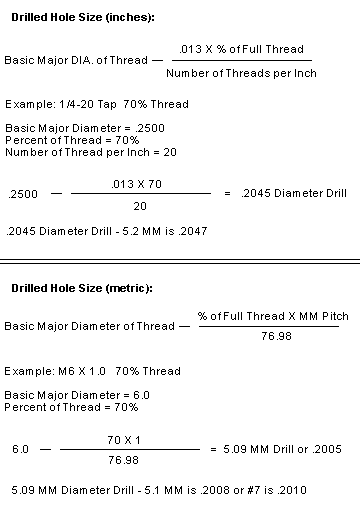
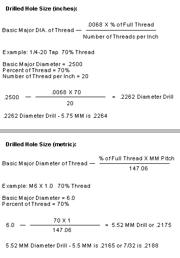

# Tapping

## Tap Chart - Metric Threads

| Tap size | Basic major (mm) | Basic major dia (inch) | mm per thread | Drill size (mm) | Drill size (inch) |
|----------|------------------|------------------------|---------------|-----------------|-------------------|
| M1.6 x 0.35 | 1.6mm | 0.063 | 0.35 | 1.25mm | #55 |
| M2 x 0.4 | 2mm | 0.0787 | 0.4 | 1.6mm | #52 |
| M2.5 x 0.45 | 2.5mm | 0.0984 | 0.45 | 2.05mm | #46 |
| M3 x 0.5 | 3mm | 0.1181 | 0.5 | 2.5mm | #39 |
| M3.5 x 0.6 | 3.5mm | 0.1378 | 0.6 | 2.9mm | #32 |
| M4 x 0.7 | 4mm | 0.1575 | 0.7 | 3.3mm | #30 |
| M5 x 0.8 | 5mm | 0.1969 | 0.8 | 4.2mm | #19 |
| M6 x 1 | 6mm | 0.2362 | 1 | 5mm | #8 |
| M8 x 1.25 | 8mm | 0.315 | 1.25 | 6.8mm | H |
| M8 x 1 | 8mm | 0.315 | 1 | 7mm | J |
| M10 x 1.5 | 10mm | 0.3937 | 1.5 | 8.5mm | R |
| M10 x 1.25 | 10mm | 0.3937 | 1.25 | 8.8mm | 11/32 |
| M12 x 1.75 | 12mm | 0.4724 | 1.75 | 10.2mm | 13/32 |
| M12 x 1.25 | 12mm | 0.4724 | 1.25 | 10.8mm | 27/64 |
| M14 x 2 | 14mm | 0.5512 | 2 | 12mm | 15/32 |
| M14 x 1.5 | 14mm | 0.5512 | 1.5 | 12.5mm | 1/2 |
| M16 x 2 | 16mm | 0.6299 | 2 | 14mm | 35/64 |
| M16 x 1.5 | 16mm | 0.6299 | 1.5 | 14.5mm | 37/64 |
| M18 x 2.5 | 18mm | 0.7087 | 2.5 | 15.5mm | 39/64 |
| M18 x 1.5 | 18mm | 0.7087 | 1.5 | 16.5mm | 21/32 |
| M20 x 2.5 | 20mm | 0.7874 | 2.5 | 17.5mm | 11/16 |
| M20 x 1.5 | 20mm | 0.7874 | 1.5 | 18.5mm | 47/64 |
| M22 x 2.5 | 22mm | 0.8661 | 2.5 | 19.5mm | 49/64 |
| M22 x 1.5 | 22mm | 0.8661 | 1.5 | 20.5mm | 13/16 |
| M24 x 3 | 24mm | 0.9449 | 3 | 21mm | 53/64 |
| M24 x 2 | 24mm | 0.9449 | 2 | 22mm | 7/8 |
| M27 x 3 | 27mm | 1.063 | 3 | 24mm | 15/16 |
| M27 x 2 | 27mm | 1.063 | 2 | 25mm | 1 |

## Tap Chart - UNC, Unified Coarse Threads

| Major Diameter(in) | Threads per inch(tpi) | Major Diameter (in) | Major Diameter (mm) | Tap Drill Size (mm) | Pitch (mm) |
|--------------------|-----------------------|---------------------|---------------------|---------------------|------------|
| #1 - 64 | 64 | 0.073 | 1.854 | 1.50 | 0.397 |
| #2 - 56 | 56 | 0.086 | 2.184 | 1.80 | 0.453 |
| #3 - 48 | 48 | 0.099 | 2.515 | 2.10 | 0.529 |
| #4 - 40 | 40 | 0.112 | 2.845 | 2.35 | 0.635 |
| #5 - 40 | 40 | 0.125 | 3.175 | 2.65 | 0.635 |
| #6 - 32 | 32 | 0.138 | 3.505 | 2.85 | 0.794 |
| #8 - 32 | 32 | 0.164 | 4.166 | 3.50 | 0.794 |
| #10 - 24 | 24 | 0.190 | 4.826 | 4.00 | 1.058 |
| #12 - 24 | 24 | 0.216 | 5.486 | 4.65 | 1.058 |
| 1/4" - 20 | 20 | 0.250 | 6.350 | 5.35 | 1.270 |
| 5/16" - 18 | 18 | 0.313 | 7.938 | 6.80 | 1.411 |
| 3/8" - 16 | 16 | 0.375 | 9.525 | 8.25 | 1.587 |
| 7/16" - 14 | 14 | 0.438 | 11.112 | 9.65 | 1.814 |
| 1/2" - 13 | 13 | 0.500 | 12.700 | 11.15 | 1.954 |
| 9/16" - 12 | 12 | 0.563 | 14.288 | 12.60 | 2.117 |
| 5/8" - 11 | 11 | 0.625 | 15.875 | 14.05 | 2.309 |
| 3/4" - 10 | 10 | 0.750 | 19.050 | 17.00 | 2.540 |
| 7/8" - 9 | 9 | 0.875 | 22.225 | 20.00 | 2.822 |
| 1" - 8 | 8 | 1.000 | 25.400 | 22.85 | 3.175 |
| 1 1/8" - 7 | 7 | 1.125 | 28.575 | 25.65 | 3.628 |
| 1 1/4" - 7 | 7 | 1.250 | 31.750 | 28.85 | 3.628 |
| 1 3/8" - 6 | 6 | 1.375 | 34.925 | 31.55 | 4.233 |
| 1 1/2" - 6 | 6 | 1.500 | 38.100 | 34.70 | 4.233 |
| 1 3/4" - 5 | 5 | 1.750 | 44.450 | 40.40 | 5.080 |
| 2" - 4 1/2 | 4 1/2 | 2.000 | 50.800 | 46.30 | 5.644 |
| 2 1/4" - 4 1/2 | 4 1/2 | 2.250 | 57.150 | 52.65 | 5.644 |
| 2 1/2" - 4 | 4 | 2.500 | 63.500 | 58.50 | 6.350 |
| 2 3/4" - 4 | 4 | 2.750 | 69.850 | 64.75 | 6.350 |
| 3" - 4 | 4 | 3.000 | 76.200 | 71.10 | 6.350 |
| 3 1/4" - 4 | 4 | 3.250 | 82.550 | 77.45 | 6.350 |
| 3 1/2" - 4 | 4 | 3.500 | 88.900 | 83.80 | 6.350 |
| 3 3/4" - 4 | 4 | 3.750 | 95.250 | 90.15 | 6.350 |
| 4" - 4 | 4 | 4.000 | 101.600 | 96.50 | 6.350 |

## Tap Chart - UNF, Unified National Fine Threads

| Major Diameter (in) | Threads per inch (tpi) | Major Diameter (in) | Major Diameter (mm) | Tap Drill Size (mm) | Pitch (mm) |
|---------------------|------------------------|---------------------|---------------------|---------------------|------------|
| #0 - 80 | 80 | 0.060 | 1.524 | 1.25 | 0.317 |
| #1 - 72 | 72 | 0.073 | 1.854 | 1.55 | 0.353 |
| #2 - 64 | 64 | 0.086 | 2.184 | 1.90 | 0.397 |
| #3 - 56 | 56 | 0.099 | 2.515 | 2.15 | 0.453 |
| #4 - 48 | 48 | 0.112 | 2.845 | 2.40 | 0.529 |
| #5 - 44 | 44 | 0.125 | 3.175 | 2.70 | 0.577 |
| #6 - 40 | 40 | 0.138 | 3.505 | 2.95 | 0.635 |
| #8 - 36 | 36 | 0.164 | 4.166 | 3.50 | 0.705 |
| #10 - 32 | 32 | 0.190 | 4.826 | 4.10 | 0.794 |
| #12 - 28 | 28 | 0.216 | 5.486 | 4.70 | 0.907 |
| 1/4" - 28 | 28 | 0.250 | 6.350 | 5.50 | 0.907 |
| 5/16" - 24 | 24 | 0.313 | 7.938 | 6.90 | 1.058 |
| 3/8" - 24 | 24 | 0.375 | 9.525 | 8.50 | 1.058 |
| 7/16" - 20 | 20 | 0.438 | 11.112 | 9.90 | 1.270 |
| 1/2" - 20 | 20 | 0.500 | 12.700 | 11.50 | 1.270 |
| 9/16" - 18 | 18 | 0.563 | 14.288 | 12.90 | 1.411 |
| 5/8" - 18 | 18 | 0.625 | 15.875 | 14.50 | 1.411 |
| 3/4" - 16 | 16 | 0.750 | 19.050 | 17.50 | 1.587 |
| 7/8" - 14 | 14 | 0.875 | 22.225 | 20.40 | 1.814 |
| 1" - 12 | 12 | 1.000 | 25.400 | 23.25 | 2.117 |
| 1 1/8" - 12 | 12 | 1.125 | 28.575 | 26.50 | 2.117 |
| 1 1/4" - 12 | 12 | 1.250 | 31.750 | 29.50 | 2.117 |
| 1 3/8" - 12 | 12 | 1.375 | 34.925 | 32.75 | 2.117 |
| 1 1/2" - 12 | 12 | 1.500 | 38.100 | 36.00 | 2.117 |

## Tapping Formulas

### Cutting

### Forming

