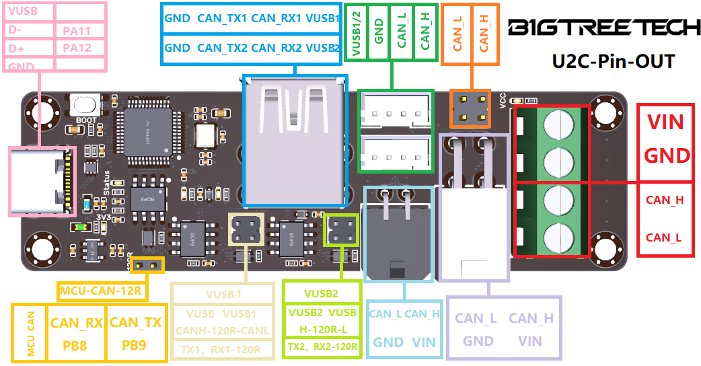

# BigTreeTech U2C v1.x

This is an instruction to set up the BTT U2C with Klipper. There are two possible variants. Use the board as a pure CANBUS adapter (candlelight FW) or a Klipper USB-to-CAN adapter.


This guide is tested with the following boards:

- BigTreeTech U2C v1.1

This guide was verified on a Pi running  [MainsailOS](https://github.com/mainsail-crew/MainsailOS)

There are multiple solutions to run the U2C with Klipper:

- [CandleLight_FW (recommended)](https://docs.meteyou.wtf/btt-u2c-v1.x/candlelight/)
- [Klipper USB-to-CAN adapter](https://docs.meteyou.wtf/btt-u2c-v1.x/klipper-usb-to-can/)

The straightforward variant to use the U2C is the candlelight firmware. With this, very little has to be configured, and you don't have to update it with Klipper MCU updates. With the U2C, there are few advantages through the Klipper firmware since no freely assignable pins are available on the board.

### Links

- [official Repository for the U2C v1.x](https://github.com/bigtreetech/u2c) - [Schematic v1.0](https://github.com/bigtreetech/U2C/blob/master/BIGTREETECH%20U2C%20V1.0.pdf)
- [Schematic v1.1](https://github.com/bigtreetech/U2C/blob/master/BIGTREETECH%20U2C%20V1.1.pdf)
- [User Manual](https://github.com/bigtreetech/U2C/blob/master/BIGTREETECH%20U2C%20V1.0%26V1.1%20User%20Manual.pdf)

### Pinout



# CandleLight_FW (U2C v1.x)

CandleLight_FW is a firmware for STM32F042x/STM32F072xB based USB-CAN adapters.

Github:  [github.com/candle-usb/candleLight_fw](https://github.com/candle-usb/candleLight_fw)

## Compile CandleLight_FW

```bash
# install requirements
sudo apt-get install cmake gcc-arm-none-eabi

cd ~
# clone git repo
git clone --depth=1 https://github.com/candle-usb/candleLight_fw
cd ~/candleLight_fw

# create cmake toolchain
mkdir build
cd build
cmake .. -DCMAKE_TOOLCHAIN_FILE=../cmake/gcc-arm-none-eabi-8-2019-q3-update.cmake

# compile firmware
make candleLight_fw
```

## Flash CandleLight_FW

First, the adapter must boot in DFU mode. Please press the boot button and then connect the USB cable. With `dfu-util -l`, you can check whether the adapter is booted in DFU mode. This should look like this:

If dfu-util can discover a board in DFU mode it should then look like this: 


If the BTT U2C has booted in DFU mode, you can flash it with this command:

```bash
make flash-candleLight_fw

```

It should then look like this: 


## Add can0 interface

Now you only have to create the interface in the OS. to do this, create the file `/etc/network/interfaces.d/can0`  and fill it with the following content.

```bash
# open file with nano
sudo nano /etc/network/interfaces.d/can0
```

`/etc/network/interfaces.d/can0`

```output
allow-hotplug can0
iface can0 can static
    bitrate 500000
    up ifconfig $IFACE txqueuelen 128

```

To save and close the nano editor:  
`ctrl+s`  => save file  
`ctrl+x`  => close editor

After a reboot, the can interface should be ready.

# CanBoot bootloader (optional)

[Canboot](https://github.com/Arksine/CanBoot)  is a bootloader for MCUs to be able to update/flash them via CANBUS. With CanBoot there is no physical intervention (e.g. pressing the boot button) required to flash/update firmware to the MCUs.


This guide is tested with the following boards:

- BigTreeTech U2C v1.1

This guide was verified on a Pi running  [MainsailOS](https://github.com/mainsail-crew/MainsailOS)

## Download CanBoot

Clone the CanBoot repository:

```bash
cd ~
git clone https://github.com/Arksine/CanBoot

```

To add CanBoot to your moonraker update manager, add this section to your config (optional):

`moonraker.conf`

```ini
[update_manager canboot]
type: git_repo
origin: https://github.com/Arksine/CanBoot.git
path: ~/CanBoot
is_system_service: False

```

## Configure CanBoot

Open the config dialog with the following commands:

```bash
cd ~/CanBoot
make menuconfig
```

and use following config settings:

- Micro-controller Architecture: **STMicroelectronics STM32**
- Processor model: **STM32F072**
- Build CanBoot deployment application: **8KiB bootloader**
- Clock Reference: **8 MHz crystal**
- Communication interface: **USB (on PA11/PA12)**
- Application start offset: **8KiB offset**
- Support bootloader entry on rapid double click of reset button: **check**
- Enable Status LED: **check**
- Status LED GPIO Pin: **PA14**

this should then look like this:

```output
    Micro-controller Architecture (STMicroelectronics STM32)  --->
    Processor model (STM32F072)  --->
    Build CanBoot deployment application (8KiB bootloader)  --->
    Clock Reference (8 MHz crystal)  --->
    Communication interface (USB (on PA11/PA12))  --->
    Application start offset (8KiB offset)  --->
    USB ids  --->
()  GPIO pins to set on bootloader entry
[*] Support bootloader entry on rapid double click of reset button
[ ] Enable bootloader entry on button (or gpio) state
[*] Enable Status LED
(PA14)  Status LED GPIO Pin
```

CanBoot config for U2C v1.x
use `q`  for exit and `y`  for save these settings.

These lines just clear the cache and compile the CanBoot bootloader:

```bash
make clean
make
```

## Flash CanBoot

First, you have to put the board into DFU mode. To do this, press and hold the boot button and then disconnect and reconnect the power supply. With the command `dfu-util -l`, you can check if the board is in DFU mode.

If dfu-util can discover a board in DFU mode it should then look like this:

```bash
dfu-util -l
```

 
If this is not the case, repeat the boot/restart process and test it again.

If your board is in DFU mode, you can flash CanBoot with the following command:

```bash
dfu-util -a 0 -D ~/CanBoot/out/canboot.bin -s 0x08000000:mass-erase:force:leave

```

 

Now press the reset button and if the flash process was successfully one LED should blink now.


## Update CanBoot

If you want to update CanBoot, you have multiple possible ways to do this.

### Update CanBoot via USB

If you want to update CanBoot via USB, you have to plug in a USB cable and continue with the "old" guide here:  [Flash CanBoot via USB](https://docs.meteyou.wtf/btt-u2c-v1.x/canboot/#flash-canboot)

### Update CanBoot via CAN

Since the board can only be addressed via CAN, further CanBoot updates must also be flashed to the board via CAN. This is very easy with the CanBoot bootloader:

```bash
python3 ~/CanBoot/scripts/flash_can.py -f ~/CanBoot/out/canboot.bin -i can0 -u <uuid>

```


# Klipper USB-to-CAN bus bridge

Klipper has also the posibillity to use the U2C as a USB-to-CAN bus bridge. This is a good solution if you want to use the board as a CANBUS adapter for your printer and an MCU at the same time.  
In the case of the BigTreeTech U2C, this solution has no advantages over the candlelight firmware, since no freely usable pins are available on the board.


This guide is tested with the following boards:

- BigTreeTech U2C v1.1

This guide was verified on a Pi running  [MainsailOS](https://github.com/mainsail-crew/MainsailOS)

## Configure Klipper firmware

Open the config interface of the Klipper firmware with following commands:

```bash
cd ~/klipper
make menuconfig
```

and set the following settings:

- Enable extra low-level configuration options: **check**
- Micro-controller Architecture: **STMicroelectronics STM32**
- Processor model: **STM32F072**
- Bootloader offset: **No bootloader**  *(without CanBoot)*
- Bootloader offset: **8KiB bootloader**  *(with CanBoot)*
- Clock Reference: **8 MHz crystal**
- Communication interface: **USB to CAN bus bridge (USB on PA11/PA12)**
- CAN bus interface: **CAN bus (on PB8/PB9)**
- CAN bus speed: **500000**

The result should look like this:

```bash
[*] Enable extra low-level configuration options
    Micro-controller Architecture (STMicroelectronics STM32)  --->
    Processor model (STM32F072)  --->
    Bootloader offset (8KiB bootloader)  --->
    Clock Reference (8 MHz crystal)  --->
    Communication interface (USB to CAN bus bridge (USB on PA11/PA12))  --->
    CAN bus interface (CAN bus (on PB8/PB9))  --->
    USB ids  --->
(250000) CAN bus speed
()  GPIO pins to set at micro-controller startup
```

Klipper config for U2C v1.x in bridge mode
use `q`  for exit and `y`  for save these settings.

Now clear the cache and compile the Klipper firmware:

```bash
make clean
make
```

## Flash Klipper

### Flash Klipper via USB

This is the classic way to flash the firmware to the board.

First, you have to put the board into DFU mode. To do this, press and hold the boot button and then disconnect and reconnect the power supply. With the command `dfu-util -l`, you can check if the board is in DFU mode.

It should then look like this: 


If your board is in DFU mode, you can flash Klipper with the following command:

```bash
dfu-util -a 0 -D ~/klipper/out/klipper.bin -s 0x08000000:mass-erase:force:leave

```


### Flash Klipper via CAN

This is the recommended way to flash the firmware, when you use CanBoot on your board.


The U2C must be in the bootloader mode

The status LED should blink in the bootloader mode. If not, double press the reset button to enter the bootloader mode.

Find the UUID of your U2C:

```bash
python3 ~/CanBoot/scripts/flash_can.py -i can0 -q

```

The output should look like this: 


With the UUID you have just read, you can now flash the board with:

```bash
python3 ~/CanBoot/scripts/flash_can.py -f ~/klipper/out/klipper.bin -i can0 -u <uuid>

```


## Add can0 interface

Now you only have to create the interface in the OS. to do this, create the file `/etc/network/interfaces.d/can0`  and fill it with the following content.

```bash
# open file with nano
sudo nano /etc/network/interfaces.d/can0

```

`/etc/network/interfaces.d/can0`

```output
allow-hotplug can0
iface can0 can static
    bitrate 500000
    up ifconfig $IFACE txqueuelen 128

```

To save and close the nano editor:  
`ctrl+s`  => save file  
`ctrl+x`  => close editor

After a reboot, the can interface should be ready.

## Add the MCU in Klipper (optional)

Finally, you can add the board to your Klipper `printer.cfg`  with its UUID:

`printer.cfg`

```ini
[mcu U2C]
canbus_uuid: <uuid>

# embedded temperature sensor
[temperature_sensor U2C]
sensor_type: temperature_mcu
sensor_mcu: U2C
min_temp: 0
max_temp: 100

```

If you don't know the UUID of your U2C, you can read it out with the following command:

```bash
~/klippy-env/bin/python ~/klipper/scripts/canbus_query.py can0

```

The output should look like this: 


