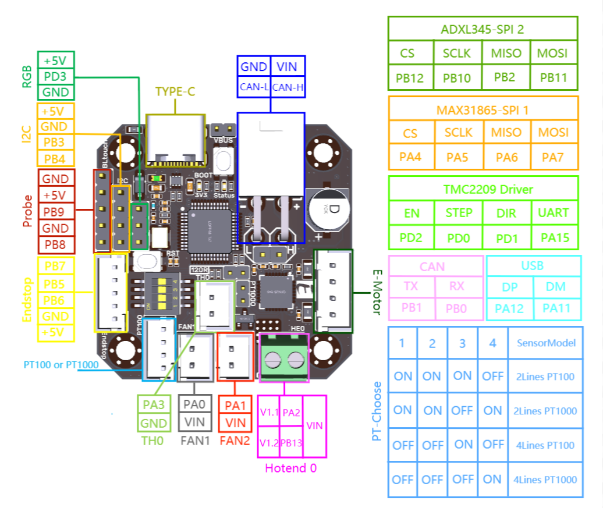

# BigTreeTech EBB - BTT EBB36 & 42 v1.2

### Hardware

- **MCU:**  ARM Cortex-M0+ STM32G0B1CBT6 64MHz whit FDCAN bus
- **Stepper Dirver:**  Onboard TMC2209 in UART mode, UART address: 00, Rsense: 0.11R
- **Onboard Accelerometer Sensor:**  ADXL345
- **Onboard Temperature IC:**  Max31865 Select 2 / 4 lines PT100 / PT1000 by DIP switch (no Max31865 verson have not this feature)
- **Input Voltage:**  DC12V-DC24V 6A
- **Logic Voltage:**  DC 3.3V
- **Heating Interface:**  Hotend (E0), maximum output current: 5A
- **Fan Interfaces:**  two CNC fans (FAN0, FAN1)
- **Maximum Output Current of Fan Interface:**  1A, Peak Value 1.5A
- **Expansion Interfaces:**  EndStop, I2C, Probe, RGB, PT100/PT1000, USB interface, CAN Interface
- **Temperature Sensor Interface Optional:**  1 Channel 100K NTC or PT1000(TH0), 1 Channel PT100/PT1000
- **USB Communication Interface:**  USB-Type-C
- **DC 5V Maximum Output Current:**  1A

### Pinout EBB42 v1.1 & v1.2



# CanBoot bootloader (optional)

[Canboot](https://github.com/Arksine/CanBoot)  is a bootloader for MCUs to be able to update/flash them via CANBUS. With CanBoot there is no physical intervention (e.g. pressing the boot button) required to flash/update firmware to the MCUs.

## Download CanBoot

Clone the CanBoot repository:

```bash
cd ~
git clone https://github.com/Arksine/CanBoot

```


To add CanBoot to your moonraker update manager, add this section to your config (optional):

`moonraker.conf`

```ini
[update_manager canboot]
type: git_repo
origin: https://github.com/Arksine/CanBoot.git
path: ~/CanBoot
is_system_service: False
```

## Configure CanBoot

Open the config dialog with the following commands:

```bash
cd ~/CanBoot
make menuconfig
```
and use following config settings:

- Micro-controller Architecture: **STMicroelectronics STM32**
- Processor model: **STM32G0B1**
- Build CanBoot deployment application: **8KiB bootloader**
- Clock Reference: **8 MHz crystal**
- Communication interface: **CAN bus (on PB0/PB1)**
- Application start offset: **8KiB offset**
- CAN bus speed: **250000**
- Support bootloader entry on rapid double click of reset button: **check**  *(optional but recommend)*
- Enable Status LED: **check**
- Status LED GPIO Pin: **PA13**

this should then look like this:

```output
    Select Micro-controller Architecture (STMicroelectronics STM32)
    Select Processor model (STM32G0B1)
    Select Build Canboot deployment application (Do not build)
    Select Clock Reference (8 MHz crystal)
    Select Comunication interface (CAN bus (on PB0/PB1))
    Select Application start offset (8KiB offset)
(250000) CAN bus speed
() GPIO pins to set an bootloader entry
[*] Support bootloader entry on rapid double click of reset button 
[ ] Enable bootloader entry on button (or gpio) state
[ ] Enable status LED
```
  
CanBoot config for EBB devices
use `q`  for exit and `y`  for save these settings.

These lines just clear the cache and compile the CanBoot bootloader:

```bash
make clean
make
```

## Flash CanBoot

> Note: Before you start the flashing process, disconnect the heater from the board!

First, you have to put the board into DFU mode. To do this, press and hold the ***boot*** button and then disconnect and reconnect the power supply, or press the ***reset*** button on the board. 

With the command `dfu-util -l`, you can check if the board is in DFU mode.

If `dfu-util` can discover a board in DFU mode it should then look like this: 

 

If this is not the case, repeat the boot/restart process and test it again.

If your board is in DFU mode, you can flash CanBoot with the following command:

```bash
dfu-util -a 0 -D ~/CanBoot/out/canboot.bin -s 0x08000000:mass-erase:force:leave
```

 

Now press the reset button and if the flash process was successfully one LED should blink now.

## Update CanBoot

If you want to update CanBoot, you have multiple possible ways to do this.

### Update CanBoot via USB

If you want to update CanBoot via USB, you have to plug in a USB cable and continue with the "old" guide here:  [Flash CanBoot to the EBB](#flash-canboot)

### Update CanBoot via CAN

Since the board can only be addressed via CAN, further CanBoot updates must also be flashed to the board via CAN. This is very easy with the CanBoot bootloader:

```bash
python3 ~/CanBoot/scripts/flash_can.py -f ~/CanBoot/out/canboot.bin -i can0 -u <uuid>

```


# Klipper Firmware for BigTreeTech EBB

The BigTreeTech EBB series is a toolhead board series that can communicate via CAN. This guide explains which settings you need, to flash your EBB boards with Klipper.

> Info: Use at least a Klipper version of v0.10.0-531 to use the board safely!  
> In  [this commit](https://github.com/Klipper3d/klipper/commit/3796a319599e84b58886ec6f733277bfe4f1a747), Kevin fixed a bug in the ADC calculation of the STM32G0.

## Configure Klipper firmware

Open the config interface of the Klipper firmware with following commands:

```bash
cd ~/klipper
make menuconfig
```

and set the following settings:

- Enable extra low-level configuration options: **check**
- Micro-controller Architecture: **STMicroelectronics STM32**
- Processor model: **STM32G0B1**
- Bootloader offset: **8KiB bootloader**  *(with CanBoot)*
- Clock Reference: **8 MHz crystal**
- Communication interface: **CAN bus (on PB0/PB1)**
- CAN bus speed: **250000**

The result should look like this:

```output
[*] Enable extra low-level configuration options
    Micro-controller Architecture (STMicroelectronics STM32)  --->
    Processor model (STM32G0B1)  --->
    Bootloader offset (8KiB bootloader)  --->
    Clock Reference (8 MHz crystal)  --->
    Communication interface (CAN bus (on PD0/PD1))  --->
(250000) CAN bus speed
()  GPIO pins to set at micro-controller startup
```
Klipper config for EBB devices

use `q`  for exit and `y`  for save these settings.

Now clear the cache and compile the Klipper firmware:

```bash
make clean
make
```

## Flash Klipper

There are two ways to flash the Klipper firmware to the EBB.

- [Flash the firmware via USB](#flash-klipper-via-usb)
- [Flash the firmware via CAN](#flash-klipper-via-can)  (recommended) (only with CanBoot)

### Flash Klipper via USB

This is the classic way to flash the firmware to the EBB.

> Note: Before you start the flashing process, disconnect the heater from the board!

First, you have to put the board into DFU mode. To do this, press and hold the ***boot*** button and then disconnect and reconnect the power supply, or press the ***reset*** button on the board. 

With the command `dfu-util -l`, you can check if the board is in DFU mode.

It should then look like this: 


If your board is in DFU mode, you can flash Klipper with the following command:

```bash
dfu-util -a 0 -D ~/klipper/out/klipper.bin -s 0x08000000:mass-erase:force:leave
```


### Flash Klipper via CAN

This is the recommended way to flash the firmware, when you use CanBoot on your board.

Find the UUID of your board:

```bash
python3 ~/CanBoot/scripts/flash_can.py -i can0 -q
```

The output should look like this: 


With the UUID you have just read, you can now flash the board with:

```bash
python3 ~/CanBoot/scripts/flash_can.py -f ~/klipper/out/klipper.bin -i can0 -u <uuid>
```


## Add the MCU in Klipper

Finally, you can add the board to your Klipper `printer.cfg`  with its UUID:

`printer.cfg`

```ini
[mcu EBB]
canbus_uuid: <uuid>

# embedded temperature sensor
[temperature_sensor EBB]
sensor_type: temperature_mcu
sensor_mcu: EBB
min_temp: 0
max_temp: 100

```

If you don't know the UUID of your EBB, you can read it out with the following command:

```bash
~/klippy-env/bin/python ~/klipper/scripts/canbus_query.py can0
```

The output should look like this: 


