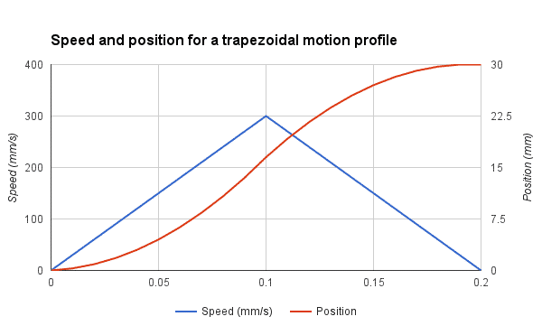
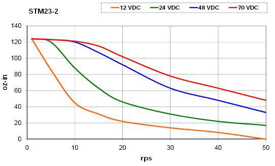

## Motion
As we have previously seen the relation between speed, acceleration, and jerk, we will now explore these parameters in our goal to achieve 300 mm/s. Let’s consider our printer have an acceleration setting at 3000 mm/s^2. Remember that most printers have lower settings.

**<center>TimeToAccelerate = Speed / Acceleration = 300mm/s / 3000mm/s = 0.1s</center>**

Knowing that our printer takes 0.1 second to reach its full speed isn’t very useful. However, we can find the minimum distance for maximum speed easily.

**<center>MinimumDistance = (1/2) * Acceleration * Time<sup>2</sup> = (1/2) * 3000 * 0.1<sup>2</sup> = 15mm</center>**

15mm is quite long for a single edge. Remember that this distance is for **accelerating only**. The worst case, like a square edge, will require decelerating too, so the same length will be required. In short, we need to print a **30mm square** if we want to reach 300 mm/s during a fraction of a second. In this case, the average speed will be about half of the max speed, so 150mm/s .



## Hotend
As you’ve seen in part 1, we have determined that the maximum output flow using a 0.40mm nozzle is about 15 mm^3/s at 250°C. The optimal line width is between 1.1 and 1.5 times the nozzle diameter, so between 0.44mm and 0.60mm. Let’s consider a line width of 0.50mm for this example. We can now determine the maximum layer height:

**<center>LayerHeight = Flow / (LineWidth * Speed) = 15mm<sup>3</sup>/s / (0.5mm * 300mm/s) = 0.10mm</center>**

0.1mm layer is a good setting for printing great quality prints. We will see later if we can obtain a quality print with these settings!

## Extruder
Based on the hotend maximum flow, you can determine the filament speed and your motor rotation speed.

**<center>FilamentSpeed = (4 * Flow) / (π * FilamentDiameter<sup>2</sup>)</center>**

**<center>= (4*15mm<sup>3</sup>/s) / (π * (1.75mm<sup>2</sup>)<sup>2</sup>) = 6.23mm/s</center>**

To measure the rotation speed, it is better to use the firmware steps/mm than measuring the outer diameter of the driving wheel. The teeth penetration in the filament is important to consider. We will consider the values for the DyzeXtruder GT, and we will compare the result with the motor specs later.

**<center>RPM = ((FilamentSpeed * MotorSteps * GearRatio) / (steps/mm * μStepping)) * 60</center>**

**<center>((6.23mm/s * 200steps/turn * 5.65) / 742steps/mm * 16 ) * 60 = 35.6RPM</center>**

Stepper motors are rated from 800 up to 5000 RPM, depending on the motor, voltage, and driver. 35 RPM is nothing to worry about.

## Motors

Steppers have a unique torque-RPM curve due to the way they work. They start with a high torque which slowly decreases with speed. Depending on the parameters, some motors will be able to maintain their maximum torque for a wide range of speeds.

If we take the 0.9° stepper motor from the previous example, we can easily find the maximum RPM for maximum torque using the following formula:

**<center>MaxRPM = (Voltage / (Inductance * 2 * Current * Steps)) * 60</center>**

**<center>= (12v / (0.004H * 2 * 1.68A * 400steps/rev)) * 60 = 133.9RPM</center>**

133.9 RPM may sound low, but remember that it is the maximum speed at maximum torque. The maximum speed with lower torque is determined by experimentation and torque curves should be consulted.The torque is lower because the voltage applied is reduced by the back electromotive force (back EMF), thus each coil can’t reach the full magnetic force. Back EMF increases with motor rotation speed.



## Extruder Motor
As you can see, the previous motor has no problem driving a 5.65:1 geared extruder for a 300 mm/s print. The actual motor inside the DyzeXtruder GT is much smaller and requires a lower current thus increasing the maximum RPM at maximum torque to 310 RPM. The specs are 1A, 200 steps and 0.0058mH. This motor can still run faster while maintaining its output torque.

## Axis motor
Accelerating at 3000 mm/s^2 requires strong axis steppers. Depending on the driving mechanism, higher speed or higher torque will be required. The methodology is very simple:

- Calculate the total mass
- Find the equivalent in moment of inertia
- Determine the required torque
- Compare with motor

## Belt
A general note regarding the belt is the pulley pitch diameter. It is the effective diameter where linear and angular motion are linked. We will often use the pitch radius for torque and speed calculation. For a 20 teeth GT2 2mm pitch pulley:

**<center>PulleyRadius = (Teeth * Pitch) / (2 * π)</center>**

**<center>= (20 * 2mm) / (2 * π) = 6.36mm</center>**

The length moved by a full pulley turn can be determined by the following formula:

**<center>PulleyTurn = Teeth * Pitch = 10 * 2mm = 40mm</center>**

#### X Axis
Belt drive is very common and very well suited for 3D printers. The belt mass is pretty negligible and the cost is low. However, the belt requires tensioning and can act as a spring and vibrate, or “ring”, especially at corners. The most common pulley size is 2mm pitch GT2 with 20 teeth.

<center><b>MaxRPM = (Speed / PulleyTurn) * 60</b></center>

<center><b>=(300mm/s / 40mm) * 60 = 450RPM</b></center>

As we previously checked with two different motors, the maximum speed is currently higher than the results we had. It means simply that we cannot consider the maximum torque when the printer is running at 300 mm/s. The torque requirement will depend on acceleration and carriage mass. The extruder is often the heaviest mass to move on the X axis due to the big motor driving it. Most NEMA17 used in extruders can weight between 350 grams and 450 grams alone. The extruder with all its components can weight as much as 500 grams, which is a lot. The DyzeXtruder GT uses a custom geared reduction to lower the motor mass while maintaining a high torque output. The extruder weight only 275 grams, less than most extruder on the market.

To calculate the torque, we will first need  to find the moment of inertia of our carriage. It depends on its mass and the pulley diameter. It also depends on the motor rotor inertia. Other components such as the belt, pulley and bearing have a negligible role in inertia.

<center><b>MomentOfInertia = CarriageMass * PulleyRadius<sup>2</sup> + RotorInertia</b></center>

If you have a DyzeXtruder GT with a DyzEnd and a printed carriage, the mass will be around 350 grams.

For a generic extruder with a powerful motor, a generic hotend and a printed carriage, the mass will be about 650 grams.

A genera NEMA17 stepper motor will have a rotor inertia of about 6.8 kg.mm^2 (68 g.cm^2)

<b><center>MomentOfInertia = 0.35kg * (6.36mm)<sup>2</sup> + 6.8kg.mm<sup>2</sup> = 20.98kg.mm<sup>2</sup></center></b>

We also need to convert our linear acceleration to angular acceleration:

**<center>AngularAcceleration = LinearAcceleration / PulleyRadius</center>**

**<center>3000mm/s<sup>2</sup> / 6.36mm = 471rads/s<sup>2</sup></center>**

Now we can calculate the acceleration torque:

**<center>AccelerationTorque = MomentOfInertia * AngularAcceleration = 20.98kg.mm<sup>2</sup> * 471rads/s<sup>2</sup> = 9889kg.mm<sup>2</sup>/s<sup>2</sup> = 9.889mN.m</center>**

As you can see on Laser 2000 NEMA17 motor, this stepper should be able to offer the required torque for our acceleration and carriage without trouble. However, with a heavier carriage as explained earlier, this motor might not be able to accelerate the carriage and would skip steps. The acceleration should be reduced, or a lighter extruder should be chosen.

## Y Axis
The same methodology applies to the Y axis. for a 200mm x 200mm print bed, here are the components weight:

Glass: 350 grams
PCB heated bed: 125 grams
Y axis Frame: 215 grams
Hardware: 25 grams
Printed part: 300 grams
For a total of 1015 grams. As you can see, this is a lot more than the X carriage total mass. You need to include a big printed part mass because you don’t want your printer to start skipping at the end.

With the same pulley and motor, we end up with an inertia of:

**<center>MomentOfInertia = 412.8kg.mm<sup>2</sup> + 6.8kg.mm<sup>2</sup> = 47.94kg.mm<sup>2</sup></center>**

The required torque would then be:

<b><center>AccelerationTorque = 47.94kg.mm<sup>2</sup> * 75rads/s<sup>2</sup> = 22589kg.mm<sup>2</sup>/s<sup>2</sup> = 22.589mN.m</center></b>

The Y axis motor has a bigger load than the X axis for a moving bed. It can result in more pronounced flaws on a printed part on this axis.

## Ball Screw
Ball screws are less common in 3D printers but more common in CNC. It has a higher mass, thus a higher inertia, and might be bottlenecking a 3D printer. Let’s see what would happen on a Y axis.

Most economic ball screws are 12mm in diameter and have a pitch of 4mm.

Since these kind of screw are very efficient, the torque required to move a mass of 1015 grams can be quite low.

**<center>LoadTorque = (Pitch * Friction * Mass * Gravity) / (2 * π)</center>**

**<center>= (4mm * 0.10 * 1.015kg * 9807m/s^2) / (2 * π) = 633kg.mm^2/s^2 = 0.633mN.m</center>**

The rolling balls generate very little friction and the lead pitch act as a reduction ratio compared to a belt system. For a full turn, the ball screw will rotate 4mm, compared to 40mm with a 20 teeth pulley.

The most important factor with ball screw is the inertia. This reduction ratio will require the motor to accelerate about 10 times faster than a belt system. Added the inertia of the long screw, it can generate quite a lot of torque. To accelerate to 3000 mm/s^2 as required, we can determine the rotation acceleration with the following formula:

**<center>AngularAcceleration = LinearAcceleration / Pitch = 750revs/s^2 = 4712rads/s^2</center>**

The moment of inertia will be slightly different than before because the inertia of the screw is important compared to an aluminum pulley, we will add it to our inertia calculation.

**<center>MomentOfInertia = CarriageInertia + ScrewInertia + RotorInertia</center>**

**<center>CarriageInertia = Mass * (Pitch / 2*π)^2 = 1.015kg * (4mm / 2*π)^2 = 0.41kg.mm^2</center>**

<b><center>ScrewInertia = (Mass * Radius^2) / 2 = ((π * Radius^2 * Length * Density) * Radius^2) / 2</center></b>

<b><center>= (π * Length * Density * Radius^4) / 2 = (π * 350mm * 0.00785g/mm^3 * 6mm^4) / 2 = 5.59kg.mm^2</center></b>

**<center>MomentOfInertia = 0.41kg.mm^2 + 5.59kg.mm^2 + 6.8kg.mm^2 = 12.8kg.mm2</center>**

Even if the low friction and the low advance per motor turn reduce the effective inertia for the bed, the screw has the biggest impact on inertia.

<b><p align="center">AccelerationTorque = 12.8kg.mm^2 * 4712rads/s^2 = 60319kg.mm^2/s^2 = 60.319mN.m</p></b>

The torque required to drive a bed with a screw is more than three times higher than with a belt. However, keep in mind that the rotational speed for the pulley is about 10 times lower than with the ball screw ( 4500 RPM ). The stepper motors aren’t designed for such speed, thus the ball screw shouldn’t be able to move faster than around 100 mm/s with this set-up. A higher pitch screw could help. For small and affordable 3D printers, belts are the way to go. On larger and heavier ones, ball screw will be the best choice.

## Step Frequency
300mm/s is very fast and we need to make sure our microcontroller can handle this speed. Let’s consider we have the following configuration:

1.8° Stepper motor (200 full steps per rotation)
Stepper drivers configured at 16 µsteps
80 steps per mm ( very common GT2 20 teeth pulley )
We can check the stepper driver input pulse frequency based on our setup:

**<center>StepperFrequency = StepsPerMm x MaximumSpeed</center>**

**<center>80steps/mm x 300mm/s = 24000steps/s</center>**

24 000 is quite a lot of steps per second. The theoretical limit for 8 bit based microcontrollers is around 40 000. However, at this speed, there is no more room for computation. The clever firmware programmer uses tricks such as the:
```cpp
#define STEP_DOUBLER_FREQUENCY 10000
```
Or
```cpp
#define ALLOW_QUADSTEPPING 1
```
Starting from 10 000 steps per second, the program will double the steps, and reduce its computation by half. The same logic applies to quad stepping. At 300mm/s, we are in quad stepping. Make sure it is enabled, or your microcontroller will have a bad time moving your printer at 300 mm/s.